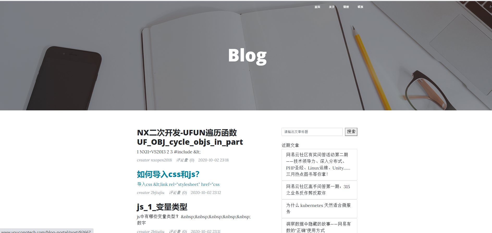
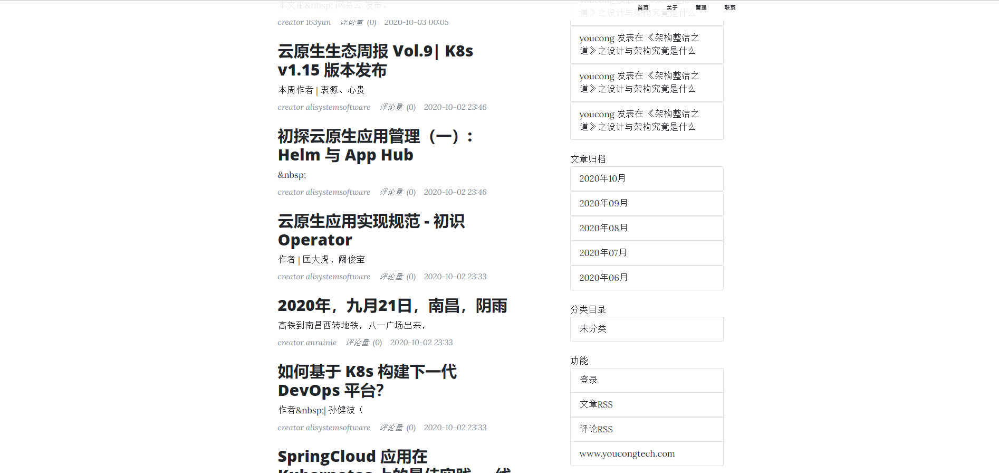
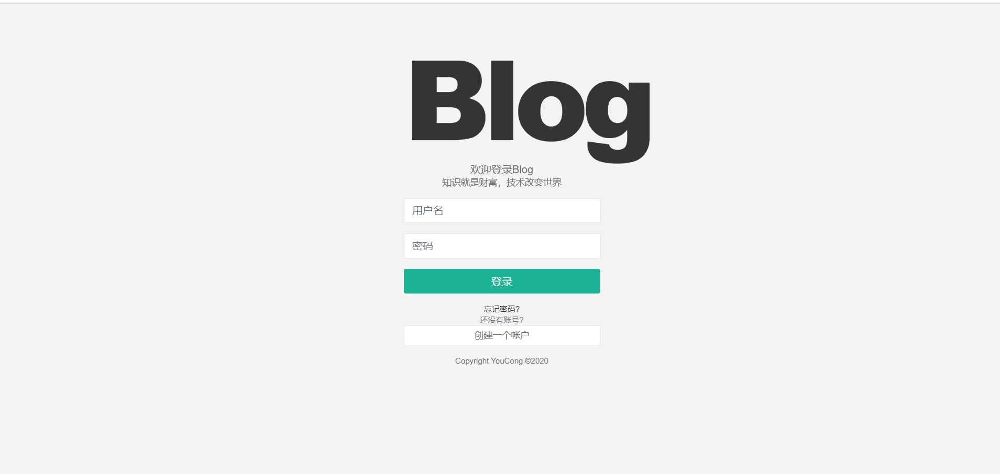
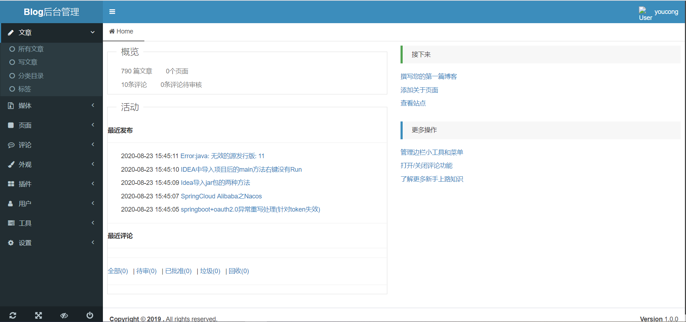
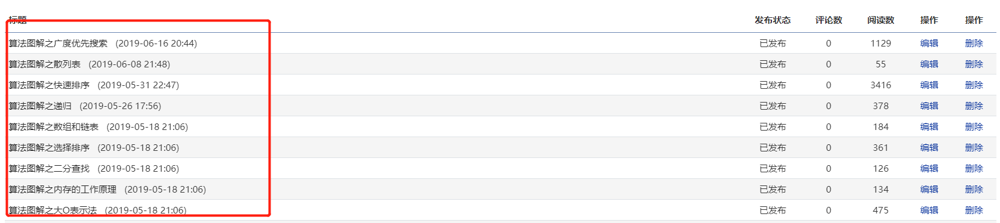

首先这篇文章不等于"2020年总结"，因为2020年还没有完全结束，还有近两个多月的时间。通常来说，我的2020年总结会在2021年初以及2020年末写的，内容格式都是今年计划完成情况+来年计划制定等。

国庆假期游山玩水了四五天，该玩的都玩了，没玩的，等有时间了再计划。

每年在某个特定的时候，总感觉要写些什么东西。

就像在2018年的时候，感触非常深，写下了这篇[作为程序员的思考与反省](https://www.cnblogs.com/youcong/p/9862712.html)，
再然后创业公司近两年的经历，写下了这么几篇关键性的文章(对于我挺关键的):
[创业公司这两年](https://www.cnblogs.com/youcong/p/12153262.html)

[致所有的开发者们](https://www.cnblogs.com/youcong/p/10933433.html)

[如何成为一名全栈开发工程师](https://www.cnblogs.com/youcong/p/10162609.html)

[谈谈在创业公司的几点感触](https://www.cnblogs.com/youcong/p/10016594.html)

至于其它关于技术方面的，感兴趣的，可以在我这个博客地址上搜索:
https://www.cnblogs.com/youcong/

我的文笔并不那么好，有的时候写起来有点题内不符合(标题和内容不一样，当然了，我也尝试过不断改进，还是有效果的)，但都是我的真情实感的流露和一些痛定思痛的经历。

前文稍微啰嗦了一些，接下来进入正题:
<!--more-->

## 一、我对技术的思考
记得在第一家公司的时候，我的技术栈是单薄的，就会前端(写一些简单的HTML、CSS、javascript等)，再加主攻Java后端(Spring+SpringMVC+MyBatis+JSP),再加数据库(MySQL)。
基本上能干一些活，但这些活又不能太核心关键，太核心关键的写不了。
那个时候我的思维比较狭隘，信奉"唯技术论"(技术高于业务，技术高于一切)，那个时候之所以如此，关键在于接触的太少，经历的太少。

第一家公司是一家外包公司，专做CRM、ERP等之类的解决方案。在这家公司我做过运维、测试、项目实施等(其实间接也为我在第二家公司，也就是创业公司做准备)。那个时候，在我眼里还是技术始终是第一位(只想埋头弄技术写代码，其它都不管)。

而后来到创业公司后，这个时候，全栈就是我的目标，因为创业公司资金有限，各方面都不是很完善，一个人常常身兼多职，就拿开发人员为例，我是做Java后端开发的，但在创业公司就要求我必须会写前端，再然后，项目第一个版本发布，为了确保领导试用时不出差错，这个时候我们编写好测试用例，然后按照业务流程一个个功能性测试和业务性测试，再然后发布到公网环境对外开放(实际是对老板那边的员工开放，让其体验使用)。

在创业公司，我是开发、运维、测试、产品都做。但仍然有所偏重，技术仍然是第一位的，对于我来说，技术是产品的基石，没有技术，产品仅仅是蓝图(**其实后来想想，并非如此,业务才是基础(包含商业模式等)->产品蓝图或原型->技术手段实现**)。

在创业公司我做过物联网平台(智能酒店、智能门锁、共享洗浴间等)、电商二次开发(类似淘宝、京东)、教育产品(编程教育为主)等三个领域的项目，除了教育产品稍有起色之外，其它全部死掉了。那个时候对我的打击很大(不仅仅是我，整个团队的士气也很低下，大家对未来一切迷茫)，一年零九个月的时间，没有一个项目(除教育项目外)真正的实现盈利(**盈利也意味着成功验证商业模式的可行性**)。

最初的时候，哪怕我身兼多职，我给自己的定位仍然是一名埋头写代码的程序员，而非产品的创造者(从产品的创造者角度来看，一方面如何让产品更完善，另外一方面如何更好的提高用户粘性，这需要不断思考和实践)。于是我放弃了对产品的思考，那个时候我觉得这是高层的事情(领导的事情)，与我无关，拿一份工资，干一份活(更何况做这么多事情，还只拿一份工资)(大家可以思考这个问题，接下来下面的内容的可能会给出答案)。

再回到这个主题来，**"我对技术的思考核心两点"**:

**1. 业务是基础，产品是蓝图，而技术是将蓝图变成现实的手段；**
**2. 技术的本质在于解决问题(回顾人类历史，很多技术创新发明都是在某个领域解决了什么样的问题，或者是在多个领域解决类似的问题)。**

经过三家关键性公司的磨练，更加坚定了上述两点(因为这两点，让一家创业公司(前教育saas公司)从弱小走向强大(年盈利几十万几百万到上千万，有上市的潜力),也让一家公司从有到无，从无到有，危机重重)。

因为上述列出的核心两点(我对技术的思考):
使我不再刻意的去追求新的技术，当然了，作为一名技术工程师而言，我会不断去学习新的技术，学习新的思想和理念。但在学习的过程中，我不再像过去那样，因为学习一个新技术，就觉得自己很牛逼，沾沾自喜，似乎超过了N多人，我会更关注新技术优点特性(适应的业务场景是什么)、缺点(没有技术是完美的，都有缺点(包含局限性)、设计理念和思想等。

简单概括这几年的项目技术架构经历:
单体应用(外包、创业)->前后端分离实践(创业)->变相微服务实践(创业）->分布式微服务实践初级(教育saas)->分布式微服务实践全权把控(当前所在公司)

总的来说，走了很多弯路，填了很多坑。走弯路和填坑的原因，有很多。虽然都说，成长就是经历，有些坑是无法避免的。但其实有不少是我自己的独断专制造成的，这一点我至今仍要反思(虽然目前没有犯类似的错误，但我仍要反思，反思的目的，在于不能再走老路了，同时也是为了让新路更加通顺)。

## 二、我对学习的思考
人从出生就开始不断学习，从走路到识字，再到独立生活和工作，再到生儿育女等。

我在博客园写了800多篇的博客文章，最开始我没想写这个:
1. 觉得没时间(最大的理由是工作太累不想写，懒惰)；
2. 觉得没意义没价值(最大的理由是有很多现成的，人家写好了，我为什么还要写呢，不想重复造轮子)。

一切源于我的导师，他当初给我说过这样的话(导师说过话很多，我也记不清，但核心的意思是这样的):
**写作的目的，不仅仅在培养形成解决问题的良性循环，同时更关键在于培养自己深度思考和善于总结的能力。**

我的写作和我的学习历程很相近。我的博客写了800多篇文章，大多是技术学习和问题解决等内容，少部分是一些职业思考、读书新的/笔记等内容。

我的写作间接反映出我是一个持之以恒且热爱技术、热爱学习的人，但同样也反映出我在学习过程中的很多不足。

以下是写作中暴露的问题(这里就不谈写的语句通顺方面的问题):
**1. 欠缺较为深度的文章；**
**2. 刻意练习过于简单；**
**3. 读书笔记欠缺自己的思考；**
**4. 解决问题类问题欠缺较为详细的错误原因分析(为什么会报错，原因是什么等，缺乏对错误原因的深究)。**

#### 1.欠缺较为深度的文章
深度的文章在于思考，思考的关键在于提问。
爱因斯坦曾说过，提出问题比解决问题更重要。
我觉得原因应该是因为提出问题能让思维更加发散，思维发散能让视野更加广阔(因为它可以让人从多个角度来看问题)。

深度的文章在于深度思考(思考的关键在于多提问)。

我的导师曾用《论语》中一句话，来概述我目前所存在的问题，**"学而不思则罔，思而不学则殆"**。

这句话的解释如下:
**指的是一味读书而不思考，就会因为不能深刻理解书本的意义而不能合理有效利用书本的知识，甚至会陷入迷茫。而如果一味空想而不去进行实实在在地学习和钻研，则终究是沙上建塔，一无所得。告诫我们只有把学习和思考结合起来，才能学到切实有用的知识，否则就会收效甚微。**

关于学习提问，很多人不知道提出什么样的问题才是好的问题，我个人觉得刚刚开始不应该执着于这个，越是执着，越难以落地。刚刚开始，应该在于做。**就像我当初写博客那样，如果我一昧的以高质量作为前提的话(而忽略自身实际情况)，恐怕很难坚持到现在，任何事情都是一个循序渐进的过程，不能揠苗助长。**

在写的过程中，每天一点一滴的积累，有读者朋友会提出一些问题启发我思考，也有像我导师这样的，指出我写作欠缺深度。

#### 2.刻意练习过于简单
《异类》的作者马尔科姆·格拉德威尔说过这样的话:
**"人们眼中的天才之所以卓越不凡，并非天资超人一等，而是付出了持续不断的努力。只要经过1万小时的锤炼，任何人都能从平凡变成超凡。**

以写博客文章为例，当初我在写学习类的教程文章时，不乏有这样的意识，**"只要我将例子正常运行并写出相应的步骤来，加上笔记记录，我就能充分地掌握这门技术框架。"**

**但事实真的如此吗？**
然而并不是这样。基于上述这种意识，我学习了Python和Node.js，我的学习步骤很简单，例子敲一遍，正常运行出来，然后记点笔记，遇到错误，记录错误。经过这样的步骤，然后我觉得我掌握了。
当初没被打脸，是因为当时没人知道我会Node.js和Python，后来呢，因为要做一个在线测评(OJ),当时参考的OJ是一个青岛大学的开源项目，于是我开始接触，起初运行起来还是比较简单的，用Docker一键就能启动。但后来了，领导发话，要对其二次开发，二次开发意味着不仅仅要弄懂它的一些关键核心代码，同时也要加上我们自己写的功能，当时我就懵逼了，这个该怎么弄啊，于是只好翻看文档，原来这个青岛OJ用的技术框架，主要还是Python的Django。也正是因为研究过程中，我才发现我对Python仅仅还是个小白，并没有因为把教程敲了2~3遍就成了专家非常熟练和精通。

由此我发现我缺乏一个东西将新学的技术串起来，人的记忆是有限的，今天学过的东西，可能明天还记得一半，过了几个礼拜不用，可能就全部忘光了。

于是我想起了导师当年对我说的一句话(还是跟博客有关，但与写文章没有直接关系)，**做一个博客系统**。

做一个博客系统，不仅仅能让你将知识串起来，更能让你在实践中不断熟练和提高(实践中需要大量动手，更能加深印象，遇到问题并解决问题，不仅使你深刻理解该语言的特性，同样也能提高解决问题的能力)。

而后我更能深刻体会到这一点，就像当初没有接触过微服务框架那样，我通过博客系统来驱动学习，让我更能深刻的理解该框架技术，同样更能贴近实际应用场景，解决实际的问题。

博客系统让我的刻意练习更加精确，博客系统其实说简单也简单，说难也难。简单在于你可以仅仅写个CRUD(增删改查),难的在于按照企业级产品应用来做(就像著名的WordPress那样，虽然它看起来仅仅是一个CMS，但它丰富的插件扩展，让其可以是电商，也可以是视频、论坛等，只有想不到没有做不到)。

在做一个企业级应用产品的过程中，它是很令人痛苦的，因为你作为一个产品的创造者而言，你必须要想清楚它做出来之后是什么样的，同样你也必须关注跟你所做的类似的东西(但已经面向C端用户)有哪些可以参考借鉴的(就像现在有很多电商平台，难保他们不彼此借鉴彼此的优劣来改进产品)。

我的博客系统断断续续做了好几年了，从单体到分布式微服务，能用的技术都用了，我不否认当初有段时期仅仅是为了技术而技术。

**另外说说我的博客系统断断续续做了好几年的原因**:
- 模块单一，拆分为多模块；
- 技术太过单一，实践新的技术；
- 业务大而全，写不下去，没有把握好博客系统的本质，即CMS；
- 代码质量太差，中间断层太多，牵一发动其余，改的太痛苦不如重构;
- 找到几个参考对象，最后改成了一个四不像。

今年有段相对空闲的时间，于是进行了改造，以WordPress作为参考对象(不再追求大而全，把握核心本质)，

访问地址:
http://www.youcongtech.com/blog-portal
效果图如下:

最近因工作繁忙，目前还不能面向广大朋友们。目前该网站文章题材均是通过爬虫技术获取。

因为这个博客系统，我在技术上的刻意练习不再是简单、单一。随着博客的面世，我需要考虑用户体验、数据隔离稳定性、大数据量、类似于WordPress的丰富插件和主题等，当然了，这并非一朝一夕的事情，需要一个循序渐进的过程，这个事情我会长期坚持下来的。

#### 3.读书笔记欠缺自己的思考
前面我说过，思考的关键在于提问。人在读一本书的时候，通常会带一些疑问，读专业书籍如此，读小说也是如此。即便刚读的时候没有疑问，但随着越来越多的时候，就有了疑问，这个疑问比分说是故事人物之间的关系、专业书籍中抛出问题等。

有段时间我感觉我即便读了很多书，但所知甚少。就像我在博客里写了大量的读书笔记，就像如图所示:

《算法图解》我读了近一个月的时间，做了一些笔记，但仍觉得还是不知道。
最近总结了两点原因:
**- 没有真正的思考(记录书中关键话，然后一些术语名词通过搜索来记录，没有就关键话语展开疑问)；**
**- 没有把理论同实践充分的结合起来(这需要实践，后来在LeetCode刷题实践才方觉有些收获，知行合一)。**

#### 4.解决问题类问题欠缺较为详细的错误原因分析(为什么会报错，原因是什么等，缺乏对错误原因的深究)
800多篇博客，有半数是关于遇到问题怎么解决的。刚开始时，是照搬照抄，而后就是就错误信息展开(错误原因、解决步骤/方案、参考链接等)。但后来发现解决问题的效率有些提高(比方说，公司小伙伴们遇到一些技术问题时，我对那些问题有些印象，然后我就让小伙伴去我的博客上搜索即可，或者是有些技术小伙伴不会，但我之前应用过并记录在我的博客里，小伙伴一搜，然后也能快速应用)。
**但是呢？我发现有一点严重弊端。**
那就是这些问题总会以一种形式到另一种形式转变，实际上问题的本质是一样的，以Java开发为例，用Spring全家桶总会遇到找不到Bean之类的错误，通常来说，一般是因为Service类，没有加@Service注解导致的。但是最近我所遇到的并不是这样的，哪怕@Service注解加上对应的业务类它还会报这样的错误，这个问题最初使我百思不得其解。
最后找到了原因，发现就是一段代码的问题(由于这段代码是公司的核心代码，这里就不能公开了)。

**由此发现很多问题其实都是一样的，关键在于把握问题的本质，那么如何把握问题的本质呢？**
最关键的就是明确问题是什么。就像刚才我举的例子，找不到bean，原因并不是没有加注解，而是一段代码导致的。**很多开发人员(包括我)常常面对错误最容易犯的错误是没有真正的理解问题到底是什么，而仅仅的非常浅度的复制问题，然后百度或者google搜索之类的。**

**那么我们怎么避免这样的现象出现呢？**
答案很简单，**那就是耐心的把问题看全**，通常报错，IDE的控制台会显示那段代码那一行，看具体代码通常就明白了。最重要的是要把信息看全，看全后，通常就能把握错误的关键信息是什么，这样才能更好的解决问题(其实在看错误信息的时候，脑袋里也会不由自主的分析错误信息，思考可能是什么原因导致这样的错误信息)。另外这对于学习技术，参考他人的博客也有很大的启发意义，如今互联网上各种信息非常全(也意味着非常杂乱而不系统)，这就需要呢学会如何筛选信息，关键字搜索很重要，还有一点就是识别信息也很重要，比方说看一篇博客，你如果要按照他写的博客实践，最好还是从头到尾看一遍，然后再决定是否这样做，因为很多人写博客并不一定写的很全(中间可能有些代码没有展示出来，导致最后你按照这个例子来写，缺东西，从而导致进展不顺，只好放弃)。

学习是人一生的事情，不管你从事哪行哪业，都要树立这样的观念，"终身学习观"。只有这样你才不至于被淘汰(社会淘汰、时代淘汰)。

**我曾因为，只要像程咬金那样只会"三板斧"就能打天下，后来随着经历的事情很多，看的世界越来越广，我才发现这远远不够。**

## 三、我对工作的思考
我对工作的思考，不禁让我想起曾在公众号写了一篇文章[《工作的意义》](https://mp.weixin.qq.com/s?__biz=MzUxODk0ODQ3Ng==&mid=2247485165&idx=1&sn=4c3f297583a42b946e7fc673a1c2ca17&chksm=f98055fecef7dce814c3b7c7636550cf26cdbad5dc3cf87c62d7e63616613b6add54630c76f8&token=1678293524&lang=zh_CN#rd)，我在文章中这么说，工作的意义无非两点，一点是为了金钱(物质，也就是让生活更好，比较物质基础决定上层建筑)，二是为了成长。

《工作的意义》这篇文章也间接反映和验证，我因为工作，生活也走向越来越好。

但是呢？也让我逐渐形成了"安逸"。记得之前在创业公司的时候，其中某段时间(大概持续一到两个月)，那个时候开始迷上了游戏，如刺激战场、王者荣耀，可谓是天天打游戏，没有一天不打，同时呢，也变得不怎么爱学习了，也以为工作就意味着稳定。然而，就像我在《创业这两年》说的那样，突然一天领导对我们说，公司如果拿不到融资可能就要解散了。当我听到这则消息，心就突然慌了。因为我从来就没有经历类似得场景。

虽然心慌了，但另外一个"我"提醒着我，保持冷静，近观态势。
于是就有了这篇文章[互联网的寒冬该如何度过](https://www.cnblogs.com/youcong/p/12293309.html)

而后2019年10月以及2020年的经历再次告诉我，安逸是不存在的，工作的意义，不仅仅是诗和远方，也不仅仅是自身成长，更是提高自我市场价值的一种重要方式。

**为什么我会给原来的那句话再加上了提高自我市场价值的一种重要方式呢？**

首先一件东西为什么会有价值，答案是因为有市场需求(关键就是供求关系，供过于求，贬值，供不应求升值)。

人只有工作才能实现自我市场价值的增值，尽管你可能有非常大的本事，但如果没有公司这个大的平台，恐怕只能感叹"英雄无用武之地"。

很多人都说要有职业规划，职业规划是为了谋求长远的发展。但这个职业规划仍然有一个大的前提，那就是工作，在特定的单位工作(可以是传统企业，也可以是互联网企业等)，还是离不开公司提供的平台。

以程序员找工作为例，很多公司招聘上都说高并发、高性能、分布式微服务等，但是对于很多人来说，在一些较为传统的公司工作根本就没有这样的机会接触这些。就好像当初如果没在教育saas公司积累，很难主导公司的技术平台设计。再换言之没有创业公司的洗涤，面对从0到1或者二次开发，我可能很难上手甚至头疼，尽管很多人说开源有现成的，但试问对于一个企业来说开发产品中最重要的一环是稳定性和可靠性，开源项目虽多，但不少开源项目不稳定不可靠，对于一个新人来说，贸然使用开源项目和使用新的技术一样，无异于自杀。因为你所遇到的问题，在搜索引擎上搜索可能非常少甚至无。

从这点来看，也是公司成就了我，提高了我的市场价值。

但有一点非常重要，那就是公司不养闲人。

如果你不去主动成长和提高自我价值的话，那么你随时可能会被裁员(对于公司而言，发展是硬道理，发展的关键在于人才)。

从这点来看，毫无安逸可能。

再比如很多人说国企安逸，早九晚五，福利好(虽然工资不高)。但大家别忘记了当年的"国企下岗潮"。

我说了这么多，只想诠释一个重要观点(虽然过于武断，但还是要说)，**"根本没有安全/稳定的工作，唯有提高自我价值才是王道"**(虽然这些话，对于前辈而言是废话，但这些来源于我自身的经历和深刻的体会)。

那么如何提高自我价值呢？
- 要有终身学习观的意识，然后不断去学习和实践；
- 工作中不要畏难，要敢于面对和战胜。

很多人都说人脉很重要，这里我之所以不列举人脉是因为，**社交的核心在于价值交换(虽然功利点，但却很对)**。

以我上家教育saas公司的CTO为例，他也是从一名初级研发工程师到高级研发工程师、架构师，到目前的位置，和他一起创业的是他的同事，两个人在当时公司的位置相等，只是负责的领域不一样，一个是营销，另一个是技术。两个人互补彼此优劣，然后带着团队的骨干一起创业，如今也算是财务自由，跟着他们的骨干也有股份。

当然了，这样的例子还有很多。再列举一个在比如当初在北京的一个合租屋，合租的小伙伴们从事不同的工作，碰巧有个猎头，平时很少见，有天遇上聊了一会儿，然后突然说电脑遇到了一个问题，然后跟我说，这样的问题，我之前遇见过，然后飞快的将其解决，因为是猎头，从哪以后时不时推工作给我，甚至要我给他推荐人。

2020年我觉得最重要的一点是我对工作态度和观念上的转变。

过去我多少会有些逃避或者是畏难，如今的我不会了。虽然过程会让人痛苦，但过后会非常愉悦，我想这就是工作成就自我的一个体现。

## 四、我对理财的思考
在我看来，理财的含义，就是打理自己的财富。
很多人都说学会理财很重要。

那么如何打理自己的财富呢？
很多人都说投资，如投资股票、基金、债劵等。我曾读过一些相关的书籍如:
1. 《富爸爸穷爸爸》这本书告诉我，增加资产，减少负债；
2. 《小狗钱钱》这本书告诉我，量入为出，不要超前消费；
3. 《富爸爸:为什么富人越来越富》这本书告诉我，要让自己往B、I象限发展和人生需要一个B计划；
4. 《新中产家庭理财第一课》这本书告诉我投资组合、风险管理、家庭资产配置、信用资产等。

上述四本书都属于已经读完的。我和导师的交流以及这些书让我产生一些思考，我对自己的理财有了更清晰的认识。总结了如下:
- 量入为出，拒绝超前消费(固定支出或零花钱,记账);
- 每月定存(特殊用途，如买房等,雷打不动);
- 投资组合(基金、债劵持有,一般不动，每月定投);
- 应急定存(银行卡或其它，随时能取);
- 房租定存(通常会放入基金，偏中低风险)。

**一直以来有这么一样的观念，"没钱怎么理财"？**

持有这种观念的人，我能够理解，过去我也曾有这样的观念。
后来我转变了，因为我体会到没钱的无助和负债的压迫。
于是当我工作后，我会强制自己储蓄。正是因为这种强制储蓄，成为我人生中的一个转折点。

**有部分人认为，一点小钱再怎么理，也不能一夜变个几百万出来？**
前面我提到过，理财的含义就是打理财富。钱少的时候，节俭，钱多的时候，大手大脚的花，这也就解释了为什么一夜暴富或因某种机遇发横财的人，最后都穷困潦倒。

实际上理财不单单是打理财富，它也体现出一个人的持家。

简单的来说，一个人单身的时候，可以毫无顾忌，但两个人的时候就不一样，特别是当决定结婚的时候。这个时候你会发现，如果当初你不善于打理钱财，一方面婚前的房子、彩礼、结婚所需的资金等拿不出来需要啃老或外借(如果你一直是别人眼里的"月光族"，不一定能借到)，另外一方面，尽管婚前房子、彩礼、结婚所需的资金都解决搞定了，这时你还得考虑两个人一起的生活开销、孩子到来开销(出生、以后教育等)。

所以从某个角度来看，越早学会理财显得更加重要。有一点明确的是，**适合自己的理财方式才是最好的**。

比方说对于一个月收入5k的白领而言，总不可能拿3k去投资股票或者是存4k，只用1k吧。

所以说，每个人的理财方式不同，最关键的在于适合。这个适合在于不影响生活质量和水平的前提下(吃、穿、住、行在合理的区间下)。

**理财也是便于了解自己的开支。**
不论是通过支付宝或者微信，再或者我自己的记账本之类的。我能够更好的了解自己的开支，这也为了每月的资金分配做合理决策。

**理财中所涉及的投资是如何分配的？**
"割韭菜"这个词，对于投资股票或炒比特币的小伙伴们并不陌生。

究竟什么样的人会被割韭菜？
- 盲目听从他人推荐；
- 什么都不懂，凭感觉；
- 半知半解，充当专家。

对此有人这样说:炒股中也有"二八定律"，即20%懂的人赚钱，80%不懂的人亏钱。

对于理财投资的分配，我不会将太多的钱进行投入，一方面，我很清楚我自己的风险承担能力，另外一方面，对于投资方面我并不擅长，因此高风险和高回报的，我很少考虑，一般倾向于中低风险或低风险的，这个占的比重高。如果要说100%的资金(月收入)，一般10%~15%是偏向于中低风险的基金或债劵，5%是中高风险的指数基金。其它80%就按照前面的总结进行分配。

就像前面所说，人需要不断学习，理财相关的知识学习也是一个循序渐进的过程。

我曾在吴军《见识》中看到这样一句话，**任何好的投资都要建立在控制风险的基础之上。**

最后一句话，理财同工作一样，目的只有一个让生活更好。

## 五、我对学习周报的思考
学习周报与工作周报是两码事。学习周报是我与我导师之间的交流工具。

学习周报制定我每周的计划，如学习、锻炼身体等。

学习周报从2018年末开始写。中间有过断续。

刚刚开始写的时候，极其不适应，感觉自己很被限制。

后来随着不断写，和每周执行。发现自身存在很多不足(这些不足是通过写学习周报发现的):
- 1.制定的计划，永远都完不成(忽略自身实际情况，盲目追求大而全);
- 2.制定的计划，没有具体可衡量的指标(如该任务完成得情况标准是什么);
- 3.自律性存在问题，不能在固定的时间专注于做一件事情;
- 4.其它问题(前面提到过的，技术博客文章缺乏深度等)。

经过一年多的执行，总的来说于我自身而言还是有很大的提升的。

一方面，在创业公司的时候，领导经常处于不在公司状态，有时去深圳出差，也有时去其它地方，由于写学习周报，即便在工作任务少的情况下，我仍能抵抗外界干扰(某同事看电子书、斗地主之类的)学习，虽然有些特立独行，但不学不行欠缺的东西太多，直到如今为止，我仍然觉得我还有很多要学。

另一方面，养成计划的习惯，虽说有些时候，计划跟不上变化，但绝大多数时候还是能跟的上的，如果一直跟不上就说明计划制定的不合理。计划的习惯使我自律性提高，能在固定的时间段专注于做一件事情。

## 六、我对健康的思考
健康是我一直所忽略的。因为有段困难时期不在乎也顾不上。后来到了教育saas，那段时期可谓是加班加疯了。经常加班，9点下班都算早班。但我仍然感激那段时期的经历，确实磨练了我。也让我深刻明白一个盈利的教育saas产品应该是怎样的。

5月中旬体检，结果一半好，一半差。但无疑是给我一个警钟，这个警钟告诉我在透支下去，无疑于加快自杀的进程。于是我开始制定了我的养生计划，无奈于生活并不会因此而停滞不前，休息总有截至的日期，太长了就成了不务正业了。

曾参加的一个读书会，里面有位书友这样诠释健康:
**身心和财务都要好，落实到具体的事情上，吃的好一点、睡得好一点，多运动一点、心情好一点，财务好一点。**

健康是极易忽略的，因为只有当我生病时才会意识到它是多么的难能可贵。所幸因为年轻，抵抗力较为强，基本上的小病都能扛过去。

但随着年纪不断增长，我需要重视一个问题就是身体机能一年比一年下降，曾经上班，经常性一两点才到住的地方，只需睡三到四个小时，照样能爬起来继续工作。

但我不能不重视了，再不重视了，就真的可能验证"工作996，生病ICU了"。

为此我给自己首条要求就是11点睡觉+每周至少锻炼3公里。

虽然说从10点半开始不睡觉就算熬夜，但由于程序员这个工作性质，很难这个点睡，虽说11点睡觉，但通常也要11点半才能睡着。其实这么一说，每周3公里其实是最容易的，从9月份到现在，我一直坚持着。
随着天气越来越冷，对于锻炼身体也是一个不小的挑战。因此我基本上都是下午去跑步。早上担心起不来，就算起来了，也比较晚了。
按照上面的理解，我觉得吃的好，多运动、财务好一点，就目前而言达到这个标准并不难，吃的好，蔬菜、水果、肉这些都能满足，多运动一周3公里加上每天步行也算是运动了，财务方面，按照前面"我对理财的思考"这并不难，也算我从18年就开始制定的计划。最难的可能就是睡得好和心情要好点。

都说晚读(晚上读书)能治疗失眠，从今天开始就开始实施吧。当年当当活动买了十几本书，至今尚未看完。其中《原则》这本书只看了一部分，从昨天开始看。这本书也让我启发蛮多的。

其实仔细思考，吃得好、睡得好、财务好点、心情好点，可概括为一句话，即良好的生活习惯(合理的饮食结构、规律的作息习惯、适当的体育运动等)

良好的生活习惯应该包含如下:
- 健康规律的饮食(一日三餐、每天8杯水、多吃水果等，我是一餐不吃饿的慌，8杯水看情况，3杯水至少的，很多时候忙，就顾不上喝水，水果的话，从来未断过)；
- 运动(步行或定期跑步，一般一周一跑或两跑，至于多少公里看身体状况，我个人就跑3公里)；
- 多读书(多读书，不仅仅是学习，最主要丰富精神世界，记得当初我挺喜欢刷小视频的，觉得离不开小视频，最后把抖音卸了，如今微信虽有小视频，偶尔看看，无伤大雅，也没关系，也没有刷的欲望，游戏也如此，近来主要读刘慈欣《三体》，这本书我觉得挺不错的);
- 干净整洁(每周定期清理，平时打扫打扫，保持整洁，事实证明，整洁利于心情愉悦，同样也利于良好的生活习惯养成，婚后可减少不少矛盾，同样不论男女，每天拾掇拾掇，干净整洁的去上班也很不错，我就挺反对有人说男程序员不修边幅之类的一说);
- 不熬夜(这一点对我要求稍微高点，不过我会试着去做，就像前面说的晚读)；
- 劳逸结合(工作闲暇，会去楼下走走，如果实在走不开，也会再工位上静坐看远处的风景，喝喝茶，适当的休息的确能倍增灵感，提高接下来的工作效率等)。

当然了良好的生活习惯还有很多，这里我列举最关键的几个。

人的一生，每10年就是一个分水岭，马上就要25了，离我的分水岭还有5年。5年以后，也就是30，对于一个程序员而言，这是一个至关重要的标志。可能会中年危机，也可能走向不一样的路。
但就目前而言，不在考虑的范围。因为我所能把握的仅仅是当下，珍惜当下，看得见的，摸得着的，才是最重要的。

## 七、我对职业生涯的思考
与职业生涯对应的是职业规划。
近来摆在我面前有两个IT转型的例子，一个前端开发的女程序员，另外一个是后端开发的男程序员。前者成了产品经理(产品设计，无需写代码)，后者成了项目经理(把握项目进度，任务派发，可能要写点代码)。

当初我在[作为程序员的思考与反省](https://www.cnblogs.com/youcong/p/9862712.html)中的职业规划提到过如下内容:

**初级开发工程师->中级开发工程师->高级开发工程师->架构师/项目经理->技术总监->CTO**

**初级开发工程师->中级开发工程师->高级开发工程师->产品经理->产品总监**

**初级开发工程师->中级开发工程师->高级开发工程师->技术合伙人(参与创业)**

对于男程序员而言，基本上都达到5年以上的研发经验，然后转向的管理层(项目经理)。

对于女程序员而言，具备3年以上的研发经验，加上一些机遇，成功转型了产品。

仔细想来，我所认识的人，前教育SAAS公司CTO走的就是第一条路。前创业公司经理走的初级开发工程师->中级开发工程师->高级开发工程师->产品经理->高级产品经理/项目经理-自主创业当老板(这是我根据他以往三家公司的经历推出来的)。

但很多人都卡在了这个高级开发工程师上，无法前进，有的是自身能力，也有的确实是喜欢写代码，写代码能力非常强，但不喜欢管理。我所遇到的人都有。

转型目前不在我考虑范围，我所想的是如何成为这个高级开发工程师。经过这几年的时间，我愈发了解自己。

当年某公司领导让我取代某个人成为组长，我犹豫了。找了一堆理由，说自己不太胜任，最后此事不了了之。那个时候确实是无法胜任，太嫩了。

其实仔细想来我还是很感激互联网的，正是因为它，我从一个农村小伙跳到了大城市。而大城市给了一个相对平等的机会与众多人竞争，这场竞争中，我不会一直处于弱势。这场竞争其实也算是马拉松。跑在最前面的，不一定最终跨过终点，跑在后面的，总有机会超过前面的。
这个过程一定是无比艰辛的。

## 八、我对沟通的思考
沟通这一环节在项目开发中至关重要，关系到项目的存亡，项目的存亡关系到公司的兴亡。
**我一直在思考如何更好的把握对方的问题给予对方能够理解的答案。**
近来公司的程序媛小伙伴们请教我一些问题，其实问题我基本上都遇到过，但给她们的回答，她们又无法理解，等我坐在她们的电脑桌上给她们讲，她们一下就明白了。我在想，难道问题是出在我这，我没有说清楚，我觉得我已经说的很清楚了。但事实上因为沟通表达方式(语句叙述)，确实我的回答和她们说的不是一个问题。而有些时候，我的回答是那个问题，而答案对于她们而言又不太理解。一来一去，有的时候一个小时就过去了。所以针对此，我想出了一个办法，遇到问题，要么微信描述或者是我去她电脑旁看，这样的话比较高效。这仅仅是日常工作。

在回到现实生活中，我的父母是做卖菜生意的，从小在他们身边看的事情很多，记得一次在市场卖菜的时候，见过旁边的摊贩和顾客因为商品的事情争吵，事情表面仅仅是商品价格折扣，实际上由于摊贩的表述不当，让顾客以为其看不起他，认为他是因为付不起钱，从而争吵。

后来读了一本书《非暴力沟通》，该书有一句话让我印象很深刻**，"暴力的根源在于人们忽视彼此的感受与需要，而将冲突归咎于对方--至少大部分暴力的根源都是如此，不论是语言、精神或身体的暴力，还是家族、部落以及国家暴力"。**

这几年互联网研发工作，待的几家公司，多多少少看过一些争吵，其实原因正如《非暴力沟通》这句话。

这篇文章就写到这吧，也算是我国庆假期的一个结尾小插曲。
这篇文章总的来说应该是近来一些经历的总结，犹豫了很长时间，究竟要不要写，想了想，总要留些什么东西，于是动笔开始写(键盘和鼠标就是我的笔)。

