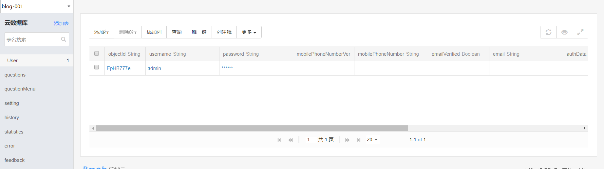

针对最近这样的需求，某个功能插入数据成功并实时同步到Bmob云上的数据库。

本来想在Bmob上找一个用Java写的，找了一圈发现没有，于是便采用Bmob的Rest-API方式进行数据插入。

另外补充一个小知识，Bmob的架构是一个叫Serverless的，关于这个Serverless，简单的说就是用服务代替服务器，不再想以往那样对服务器大量维护，特别是运维人员，每当上线时，心里难免会有点担惊受怕。

参考文档为[Bmob-Rest-Api之简单操作](http://doc.bmob.cn/data/restful/index.html)

此文假定你已经在Bmob云上建好相关的数据库(如果没有建好或者不知道如何建，请参考上述文档)
<!--more-->

## 利用Bmob-Rest-API进行数据插入

#### 我的Bmob数据库


#### 使用PostMan做接口测试(这个实验一定要做，这里跑通了，基本上可以排除很多问题)


注意必须要包含请求头如下参数,如下图所示(请求头中参数对应的值，如果不知道，请参考官方文档):


只要返回如下信息，就表示数据插入成功:
```
"createdAt":"2019-04-29 16:49:39","objectId":"11b732523d","sessionToken":"0a5c7099409b095080e159c17738f4cd"}

```

这里请大家注意，并不是所有的表都是这样请求的，比如如果是setting表的话，请求方式变成的如下:


具体可以参考官方文档[Rest API详细文档](http://doc.bmob.cn/data/restful/develop_doc/#_12)

我觉得Bmob的这种RestFul设计还挺不错的，可以借鉴，另外关于RestFul相关的资料可以参考如下:
[HTTP API Design Guide](https://geemus.gitbooks.io/http-api-design/content/en/)
[Principles of good RESTful API Design](https://codeplanet.io/principles-good-restful-api-design/)
[阮一峰理解RestFul架构](http://www.ruanyifeng.com/blog/2011/09/restful.html)