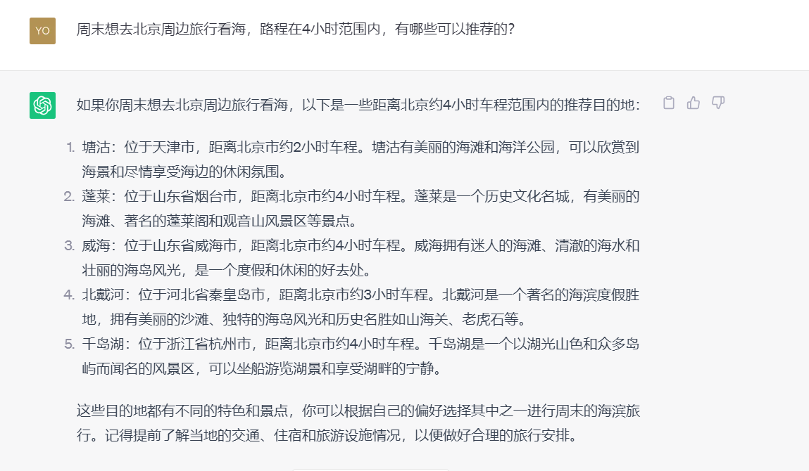

ChatGPT是2023年的热点事件之一，从诞生到现在，ChatGPT不断地升级，其AI模型更加强大了，国内不少人抓住此机会，由此衍生出各种产业链。
<!--more-->

## 一、什么是ChatGPT？
**ChatGPT是一种基于自然语言处理技术的人工智能模型，它采用了深度学习技术和大规模语料库的训练方式，这使其具备了理解和生成自然语言的能力**。ChatGPT是一个自然语言生成模型，它的主要任务是**理解用户输入的自然语言并生成相应的自然语言响应，以实现自然对话的能力**。与传统的基于规则或模板的对话系统相比，ChatGPT不需要事先准备大量的规则或模板，它能够根据大规模的语料库进行学习，从而具备了生成更加自然和流畅的对话的能力。

## 二、ChatGPT具有哪些特点？
- 1.**多轮对话**。
- 2.**多语言支持**。
- 3.**可扩展性强**。
- 4.**智能推荐**。
- 5.**自我学习**。

总的来说，与传统聊天机器人相比，ChatGPT具有更多优势。它可以以一种更加自然的方式生成回复，让用户获得更真实的对话体验。

## 三、为什么作为个体一定要拥抱人工智能？
尽管人工智能可能会带来潜在的风险和挑战，但我们必须**拥抱它，以实现更好的效率和更好的生活质量。**

## 四、ChatGPT的应用场景有哪些？
应用场景很广，如个人的学习、工作、生活等。

### 1.ChatGPT应用场景之学习篇
例如我想写一本书，但是我却不知道从何入手时，这时借助ChatGPT提出相关问题。提问结果如下:

### 2.ChatGPT应用场景之工作篇
例如今年已经过半了，针对公司领导层的要求，需要每个人做一个半年度PPT工作汇报，面对此，我有些茫然失措，这时我可以借助ChatGPT工具帮我简要梳理:

### 3.ChatGPT应用场景之生活篇
例如周末想去北京周边旅行看海，路程在4小时范围内，有哪些可以推荐的：

## 五、相关AI工具分享

**如AI绘画工具相关:**

- 1.DALL-E-2。
- 2.MidJourney。
- 3.Stable Diffusion。
- 4.Disco Diffusion。
- 5.Adobe Firefy。
- 6.文心一格。

**更多工具，可访问如下网站:**
https://aishouce.com/

**本文部分内容引用参考资料如下：**
《ChatGPT使用指南：人人都应该掌握的AI最强工具》
《ChatGPT:智能对话开创新时代》