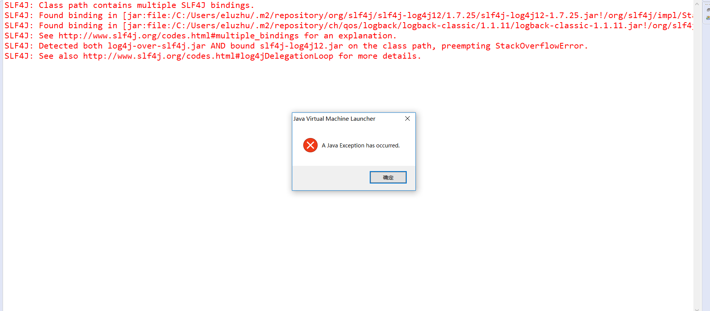
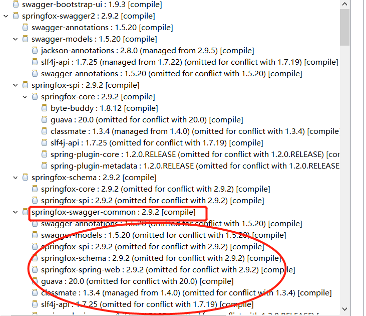

详细错误信息如下:
SLF4J: Class path contains multiple SLF4J bindings.
SLF4J: Found binding in [jar:file:/C:/Users/eluzhu/.m2/repository/org/slf4j/slf4j-log4j12/1.7.25/slf4j-log4j12-1.7.25.jar!/org/slf4j/impl/StaticLoggerBinder.class]
SLF4J: Found binding in [jar:file:/C:/Users/eluzhu/.m2/repository/ch/qos/logback/logback-classic/1.1.11/logback-classic-1.1.11.jar!/org/slf4j/impl/StaticLoggerBinder.class]
SLF4J: See http://www.slf4j.org/codes.html#multiple_bindings for an explanation.
SLF4J: Detected both log4j-over-slf4j.jar AND bound slf4j-log4j12.jar on the class path, preempting StackOverflowError. 
SLF4J: See also http://www.slf4j.org/codes.html#log4jDelegationLoop for more details.
Exception in thread "main" java.lang.ExceptionInInitializerError
	at org.slf4j.impl.StaticLoggerBinder.<init>(StaticLoggerBinder.java:72)
	at org.slf4j.impl.StaticLoggerBinder.<clinit>(StaticLoggerBinder.java:45)
	at org.slf4j.LoggerFactory.bind(LoggerFactory.java:149)
	at org.slf4j.LoggerFactory.performInitialization(LoggerFactory.java:124)
	at org.slf4j.LoggerFactory.getILoggerFactory(LoggerFactory.java:390)
	at org.slf4j.LoggerFactory.getLogger(LoggerFactory.java:340)
	at org.slf4j.LoggerFactory.getLogger(LoggerFactory.java:361)
	at com.eluzhu.sass.Application.<clinit>(Application.java:13)
Caused by: java.lang.IllegalStateException: Detected both log4j-over-slf4j.jar AND bound slf4j-log4j12.jar on the class path, preempting StackOverflowError. See also http://www.slf4j.org/codes.html#log4jDelegationLoop for more details.
	at org.slf4j.impl.Log4jLoggerFactory.<clinit>(Log4jLoggerFactory.java:54)
	... 8 more

<!--more-->

如图所示:


关键错误信息:Class path contains multiple SLF4J bindings.

翻译过来的意思是:类路径包含多个SLF4J绑定。


分析原因:类路径包含多个SLF4J绑定，也就是代表这有很多个SLF4J，这就表示重复了，在Maven中出现这种情况，会导致一个叫Maven冲突的玩意，主要体现jar方面的冲突。

解决办法:
排除即可

```
		<!-- 腾讯云 -->
		<dependency>
			<groupId>com.qcloud</groupId>
			<artifactId>cos_api</artifactId>
			<version>5.2.4</version>
			<exclusions>
				<exclusion>
					<groupId>org.slf4j</groupId>
					<artifactId>slf4j-log4j12</artifactId>
				</exclusion>
				<exclusion>
					<groupId>log4j</groupId>
					<artifactId>log4j</artifactId>
				</exclusion>
			</exclusions>
		</dependency>

```

使用exclusion就可以排除相关的依赖


那么为什么会出现这种情况呢？
是因为Maven一个重要特性，即依赖传递。依赖传递的表现是，一个maven依赖可能包含多个相关Jar，结合实际开发项目，为了实现某些特定的功能，我们需要引入特定的jar(当然了，也可以选择自己动手写一个，不过那样的话，时间成本会比较高)，特定的Jar对应特定的功能，通常一个Maven项目需要引入多个依赖(jar)。

如果你还是不太明白什么是依赖传递，如图所示(我相信图能够生动形象的体现出来):


