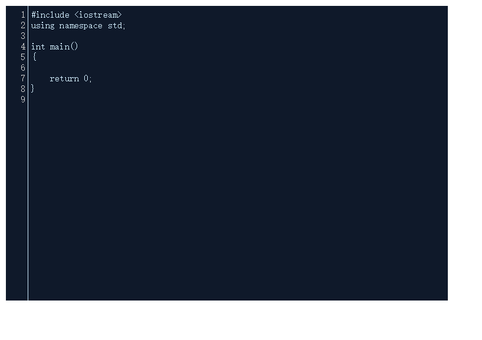

CodeMirror官网地址为:https://codemirror.net/

CodeMirror作为一款代码编辑器，其应用场景主要是在线网站写代码。
如现在的leetcode、洛谷、code-vs等都使用不同的代码编辑器。
<!--more-->
代码示例:
```
<!DOCTYPE html>
<html>
	<head>
		<meta charset="UTF-8">
		<title>测试</title>
		<link rel="stylesheet" type="text/css" href="../fonticon/css/codemirror.css"/>
	    <link rel="stylesheet" href="../fonticon/css/codemirror/theme/midnight.css">
	</head>
	<body>
		<textarea name="code" id="editorArea" style="display:none"></textarea>
		<script src="https://code.jquery.com/jquery-3.4.1.min.js" integrity="sha256-CSXorXvZcTkaix6Yvo6HppcZGetbYMGWSFlBw8HfCJo=" crossorigin="anonymous">
		</script>
		<script src="../js/codemirror.js"></script>
		<script>
			
			var editor = CodeMirror.fromTextArea(document.getElementById("editorArea"), {
				lineNumbers: true,        //是否在编辑器左侧显示行号
				matchBrackets: true,      // 括号匹配
				mode: "text/x-c++src",    //C++
				indentUnit:4,             // 缩进单位为4
				indentWithTabs: true,     //
				smartIndent: true,        //自动缩进，设置是否根据上下文自动缩进（和上一行相同的缩进量）。默认为true。
				styleActiveLine: true, 	  // 当前行背景高亮
		        theme: 'midnight',         // 编辑器主题
		
			});
	
			editor.setSize('600px','400px'); //设置代码框大小
			

		</script>
	</body>
</html>


```

效果图:


关于如何给代码框中赋值和取值，可使用如下方法:
```
editor.setValue(""); //赋值


editor.getValue(); //取值

```

上述只是一个简单的示例，更多知识还请参考官方网站对应的文档。