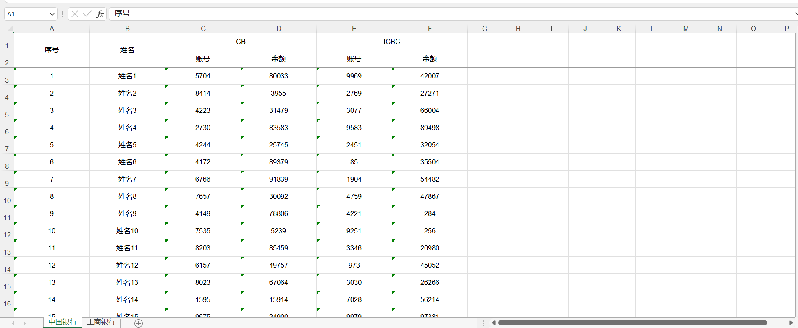

## 一、导入Maven依赖
<!--more-->
```
<dependency>
    <groupId>cn.afterturn</groupId>
    <artifactId>easypoi-base</artifactId>
    <version>4.1.0</version>
</dependency>
<dependency>
    <groupId>cn.afterturn</groupId>
    <artifactId>easypoi-web</artifactId>
    <version>4.1.0</version>
</dependency>
<dependency>
    <groupId>cn.afterturn</groupId>
    <artifactId>easypoi-annotation</artifactId>
    <version>4.1.0</version>
</dependency>

```

## 二、定义三个VO

### 1.ChinaBankVO.java
```
@Data
public class ChinaBankVO {
    @Excel(name = "账号", orderNum = "1", height = 10, width = 20)
    private Long account;
    @Excel(name = "余额", orderNum = "2", height = 10, width = 20)
    private BigDecimal total;
}

```

### 2.ICBCVO.java
```
@Data
public class ICBCVO {
    @Excel(name = "账号", orderNum = "1", height = 10, width = 20)
    private Long account;
    @Excel(name = "余额", orderNum = "2", height = 10, width = 20)
    private BigDecimal total;
}


```

### 3.BankVO.java
```
@Data
@ExcelTarget("bankVO")
public class BankVO {
    @Excel(name = "序号", orderNum = "1", height = 10, width = 20)
    private Integer num;
    @Excel(name = "姓名", orderNum = "2", height = 10, width = 20)
    private String name;
    @ExcelCollection(name = "CB", orderNum = "3")
    private List<ChinaBankVO> chinaBankVOList;
    @ExcelCollection(name = "ICBC", orderNum = "4")
    private List<ICBCVO> icbcvoList;
    public List<ChinaBankVO> getcIndexVO() {
        return chinaBankVOList;
    }
    public List<ICBCVO> getSo2VO() {
        return icbcvoList;
    }
}

```

## 三、编写测试Controller
```
@RestController
public class TestController {

    @GetMapping("/exportExcelTest")
    public void exportExcelTest(HttpServletResponse response) {
        Workbook workbook = null;
        try {
            List<BankVO> dataList1 = new ArrayList<>();
            List<BankVO> dataList2 = new ArrayList<>();
            for (int i = 1; i <= 100; i++) {
                BankVO bankVO = new BankVO();
                bankVO.setNum(i);
                bankVO.setName("姓名"+i);
                List<ChinaBankVO> chinaBankVOList = new ArrayList<>();
                List<ICBCVO> icbcvoList = new ArrayList<>();
                ChinaBankVO cVo = new ChinaBankVO();
                cVo.setAccount(Long.valueOf(RandomUtil.randomNumbers(4)));
                cVo.setTotal(new BigDecimal(RandomUtil.randomNumbers(5)));
                ICBCVO icbcVo = new ICBCVO();
                icbcVo.setAccount(Long.valueOf(RandomUtil.randomNumbers(4)));
                icbcVo.setTotal(new BigDecimal(RandomUtil.randomNumbers(5)));
                chinaBankVOList.add(cVo);
                icbcvoList.add(icbcVo);
                bankVO.setChinaBankVOList(chinaBankVOList);
                bankVO.setIcbcvoList(icbcvoList);
                dataList1.add(bankVO);
                dataList2.add(bankVO);
            }

            List<Map<String, Object>> sheetsList = new ArrayList<>();
            ExportParams siteDayExportParams = new ExportParams();
            siteDayExportParams.setSheetName("中国银行");
            // siteDayExportParams.setStyle(ExcelExportStyler.class);
            ExportParams siteMonthExportParams = new ExportParams();
            siteMonthExportParams.setSheetName("工商银行");
            //siteMonthExportParams.setStyle(ExcelExportStyler.class);
            // 创建sheet1使用得map
            Map<String, Object> siteDayExportMap = new HashMap<>();
            // title的参数为ExportParams类型，目前仅仅在ExportParams中设置了sheetName
            siteDayExportMap.put("title", siteDayExportParams);
            // 模版导出对应得实体类型
            siteDayExportMap.put("entity", BankVO.class);
            // sheet中要填充得数据
            siteDayExportMap.put("data", dataList1);
            // 创建sheet2使用得map
            Map<String, Object> siteMonthExportMap = new HashMap<>();
            siteMonthExportMap.put("title", siteMonthExportParams);
            siteMonthExportMap.put("entity", BankVO.class);
            siteMonthExportMap.put("data", dataList2);

            sheetsList.add(siteDayExportMap);
            sheetsList.add(siteMonthExportMap);

            // Workbook workbook = ExcelExportUtil.exportExcel(new ExportParams(), ExcelTemplateVO.class, dataList);
            workbook = ExcelExportUtil.exportExcel(sheetsList, ExcelType.HSSF);
            // 指定下载的文件名--设置响应头
            response.setHeader("Content-Disposition", "attachment;filename=" + URLEncoder.encode("银行账号信息.xls", "UTF-8"));
            response.setContentType("application/vnd.ms-excel;charset=UTF-8");
            response.setHeader("Pragma", "no-cache");
            response.setHeader("Cache-Control", "no-cache");
            response.setDateHeader("Expires", 0);
            // 写出数据输出流到页面
            OutputStream output = response.getOutputStream();
            BufferedOutputStream bufferedOutPut = new BufferedOutputStream(output);
            workbook.write(bufferedOutPut);
            bufferedOutPut.flush();
            bufferedOutPut.close();
            output.close();
        } catch (Exception e) {
            e.printStackTrace();
        }

    }
}


```

## 四、效果图
这仅仅是个Demo示例！！！


## 五、源代码
源代码地址:
https://github.com/developers-youcong/yc-framework/tree/main/yc-example/yc-example-easypoi