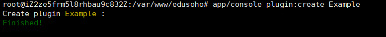
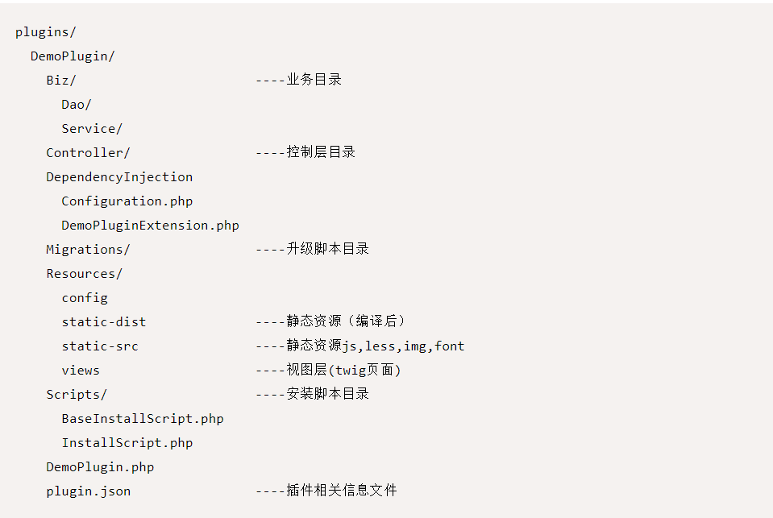
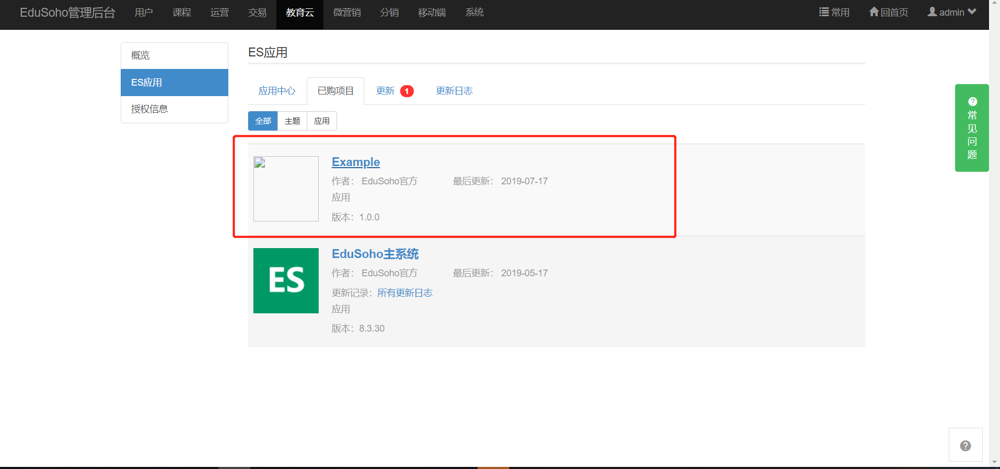

本文主要参考官方文档，地址为:http://developer.edusoho.com/plugin/start.html

插件开发的目的，一方面为了更好的扩展，另外一方面为了更好的维护。

关于这方面的例子，如wordpress、vscode等。至于EduSoho的插件开发是否也像wordpress、vscode那样无缝集成且学习成本并不是特别高，目前刚刚开始写，不好妄下结论。

<!--more-->

## 创建插件初始目录结构

```
app/console plugin:create Example

```



使用此命令会在plugins目录下创建名为Example的插件初始目录结构,目录结构图如下:



## 注册插件

注册插件两种方式：

第一种:
```
app/console plugin:register Example
```

第二种:
```
app/console plugin:register Example --without-database

```

开发模式下，建议使用--without-database选项。您可在执行此命令之后，使用：bin/phpmig migrate命令来创建数据库，这样数据库的变更就纳入了phpmig的管理，方便开发过程中调整数据库。

插件注册后，即可在后台->教育云->ES应用->已购项目中查看,如图:




## 卸载插件
当你不需要该插件时，可以卸载它，命令如下(主要作用:卸载插件，删除数据库及插件源码目录):
```
app/console plugin:remove Example --with-deleting-database --with-deleting-source

```
除此之外还有两种:
```
app/console plugin:remove Example //卸载插件，默认不删除数据库

app/console plugin:remove Example --with-deleting-database //卸载插件并删除数据库

```

补充说明:这个删除数据库是指删除数据库特定的表中的列信息，而不是等同于删库跑路。

