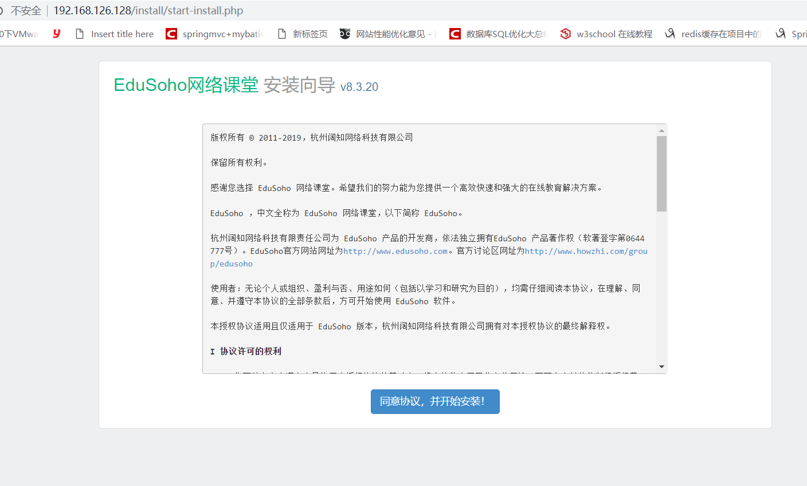
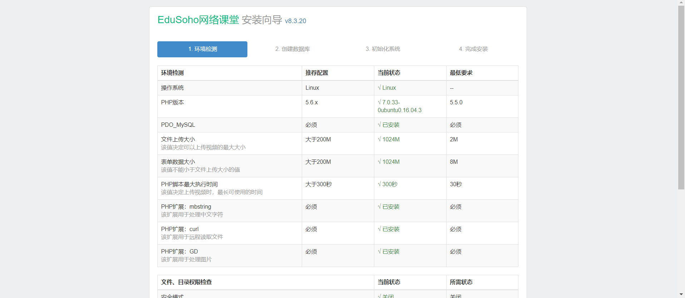
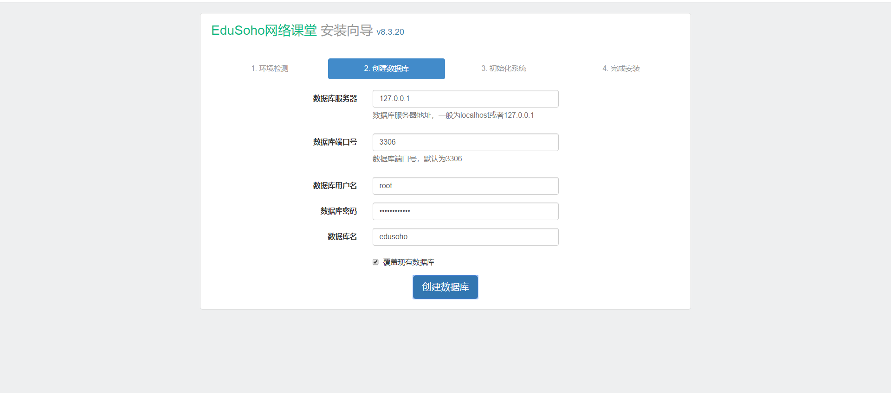
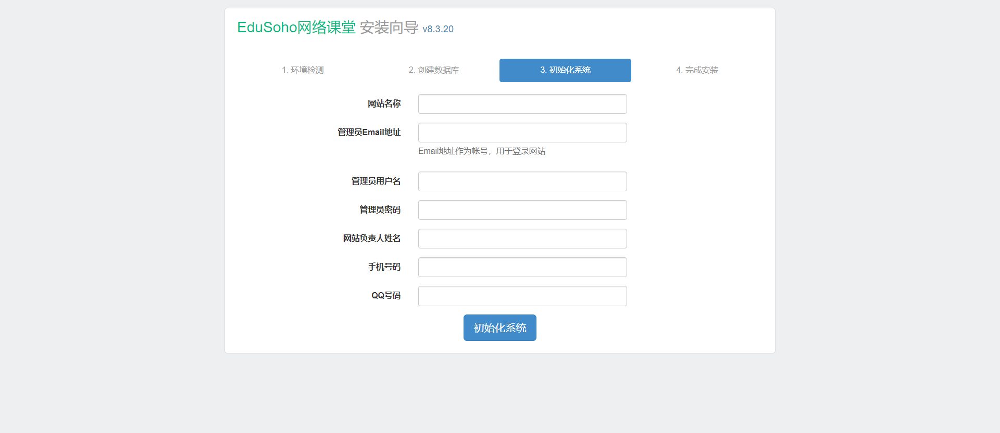
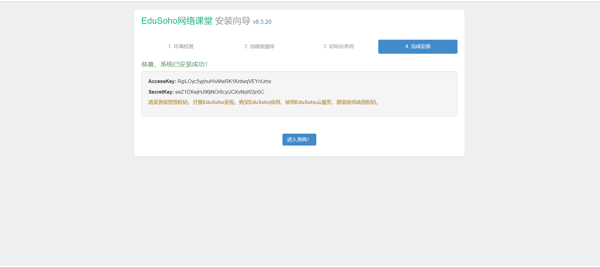
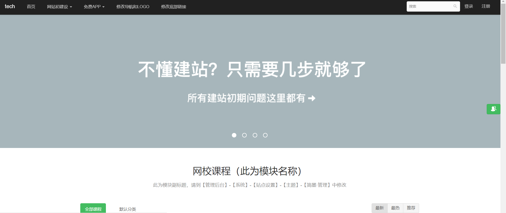

主要参考官方文档[Ubuntu16.04+Apache+PHP+MySQL+EduSoho 安装教程](http://www.qiqiuyu.com/course/20/task/2708/show)
LAMP环境按照如下搭建是没有问题的，本地虚拟机试验是完全没有问题的。

## 1.更新
```
sudo apt-get update
sudo apt-get upgrade

```

## 2.安装apache2
```
sudo apt-get install apache2 
sudo apt-get install libapache2-mod-xsendfile

```

通常sudo apt-get install apache2 默认是安装apache2.4(通过apache -v可以查看对应的apache版本)
```
sudo a2enmod rewrite   #启用rewrite模块
sudo a2enmod xsendfile    #启用xsendfile模块

```
<!--more-->

## 3.修改配置文件
```
vi /etc/apache2/sites-enabled/edusoho.conf

```
edusoho.conf内容如下:
```
<VirtualHost *:80>
    ServerName 192.168.126.130

    DocumentRoot /var/www/project/web
    <Directory /var/www/project/web>
        # enable the .htaccess rewrites
        AllowOverride All
        Require all granted   
    </Directory>
    ErrorLog /var/log/apache2/project_error.log
    CustomLog /var/log/apache2/project_access.log combined
</VirtualHost>

```
ServerName 可以域名也可以是IP地址，在这里我用的是IP地址。


## 4.安装php
```
sudo apt-get install php-pear php7.0-cli php7.0-common php7.0-curl \
    php7.0-dev php7.0-fpm php7.0-json php7.0-mbstring php7.0-mcrypt \
    php7.0-mysql php7.0-opcache php7.0-zip php7.0-intl php7.0-gd php7.0-xml

```

顺便修改对应的配置文件(主要用于修改PHP上传文件的大小限制)
```
sudo vim /etc/php/7.0/fpm/php.ini
```

修改这三个值的大小(通过/+对应的关键字搜索效率更高)，如/post_max_size就可以一下定位到该键上):
```
post_max_size = 1024M
memory_limit = 1024M
upload_max_filesize = 1024M

```
修改配置文件后，记得执行重启命令，让配置生效:
```
sudo service php7.0-fpm restart

```


## 5.安装mysql
```
sudo apt-get update
sudo apt-get install mysql-server

```
设置密码

在这个过程过程中会要求您输入MySQL数据库的root密码，请认真填写。


## 6.配置安装edusoho
```
cd /var/www
sudo wget http://download.edusoho.com/edusoho-8.3.20.tar.gz 
sudo tar -zxvf edusoho-8.3.20.tar.gz 
sudo chown www-data:www-data edusoho/ -Rf

```


## 7.重启apache访问

```
/etc/init.d/apache2 restart

```
访问地址为:192.168.126.130 初次出现的其实与jenkins和wordpress倒有不少相似之处，比如配置数据库和用户等。

如下图所示:
(1)同意协议


(2)检测环境


(3)配置数据库


(4)配置网站信息


(5)安装成功


(6)最终网站效果如图
