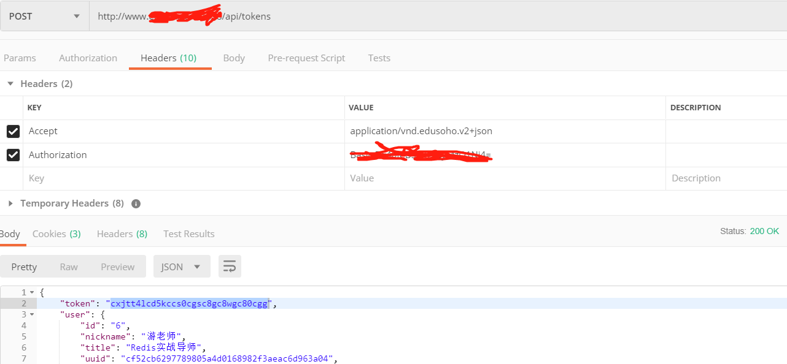
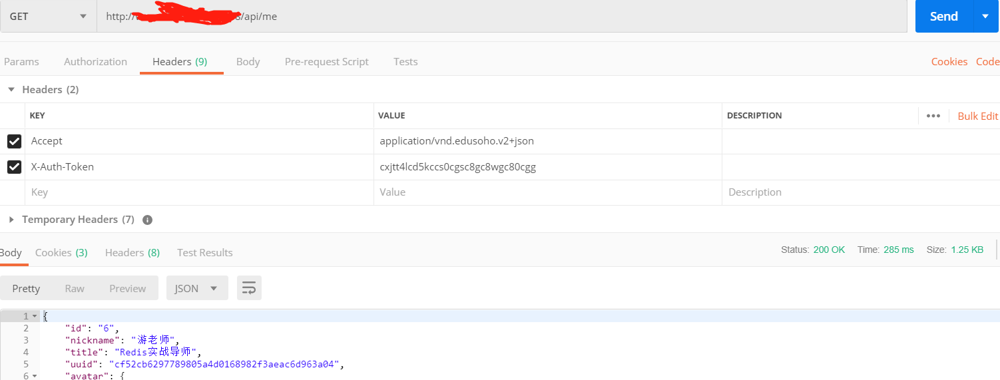

昨天这篇文章[Edusoho之Basic Authentication](https://developers-youcong.github.io/2019/07/01/Edusoho%E4%B9%8BBasic-Authentication/)提到了X-Auth-Token。今天我主要讲的是Edusoho之X-Auth-Token的请求API方式。

至于为什么建议不要用HTTP Basic Authentication，上面这篇文章已经说清楚了。

不过我还是要强调一下这一点。因为本篇文章就是着重说这个的。下面进入正文:
<!--more-->
还是以Edusoho对外API为例:
```
curl-X POST -H "Accept:application/vnd.edusoho.v2+json" -H "X-Auth-Token: nzGrtcsDsrFzrId2hoLYfUafskRJ0pb9" http://demo.edusoho.com/api/tokens

```

初看时，我不太明白这个X-Auth-Token是如何产生的，为此我通过搜索引擎搜了又搜，仍然找不到我想要的答案。

随后我转念一想，也许Http Basic Authentication与X-AUTH-Token存在某种联系。

于是我用Http Basic Authentication的方式请求获取对应的数据后，如图:



然后我将这个token复制，随后再使用X-AUTH-TOKEN的方式请求其它Edusoho API，发现我的猜想果然是对的(成功请求并获取对应的数据)，如图:



如果要说为什么要使用X-Auth-Token这种方式请求需要认证的接口数据，我经过测试接口对比(使用Http Basic Authentication的方式和X-Auth-Token方式)，得出的结论如下:
正如一些博文的作者所倡导的那样，之所以不建议使用Basic Authentication的方式是因为对于需要认证的接口，每次请求都需要携带用户名和密码(base64加密的，同时也可以解密，存在极大的安全风险)。而X-AUTH-TOKEN就显得安全的多，因为只需第一次这样做，随后拿到对应的token后，就不必这样做了。而且这个token并不是base64，至于是什么我也不知道(我用了在线加解密网站解密(acs,des等)，都发现解密不了)，由此可见X-AUTH-TOKEN还是要比HTTP Basic Authentication这种认证方式要安全的多。