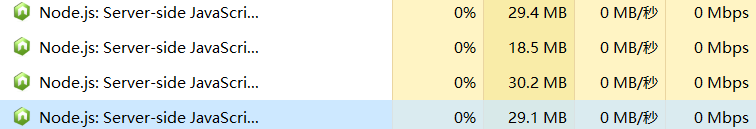

---

title: 'Error: listen EADDRINUSE :::3000'

date: 2019-03-19 14:48:21

tags: "Node.js"

---


错误详细信息如下:

```

events.js:183

      throw er; // Unhandled 'error' event

      ^


Error: listen EADDRINUSE :::3000

    at Server.setupListenHandle [as _listen2] (net.js:1360:14)

    at listenInCluster (net.js:1401:12)

    at Server.listen (net.js:1485:7)

    at Function.listen (E:\VsCode\mock-github-api\node_modules\express\lib\appli                                                                                                                                  cation.js:618:24)

    at Object.<anonymous> (E:\VsCode\mock-github-api\index.js:180:5)

    at Module._compile (module.js:653:30)

    at Object.Module._extensions..js (module.js:664:10)

    at Module.load (module.js:566:32)

    at tryModuleLoad (module.js:506:12)

    at Function.Module._load (module.js:498:3)

npm ERR! code ELIFECYCLE

npm ERR! errno 1

npm ERR! mock-github-api@1.0.0 start: `node index`

npm ERR! Exit status 1

npm ERR!

npm ERR! Failed at the mock-github-api@1.0.0 start script.

npm ERR! This is probably not a problem with npm. There is likely additional log                                                                                                                                  ging output above.


npm ERR! A complete log of this run can be found in:

npm ERR!     D:\Program Files\nodejs\node_cache\_logs\2019-03-19T06_44_19_978Z-d                                                                                                                                  ebug.log


```

<!--more-->

关键信息:listen EADDRINUSE :::3000


其实就是端口被占，主要修改的地方是app.listen(4000),我在这里将其改为4000,问题就迎刃而解。

当然了，接下来还可能会出现这个问题，最直接的解决办法是快捷键ctrl+shift+esc打开进程管理，并找到对应的进程，将其杀死，如图所示:


