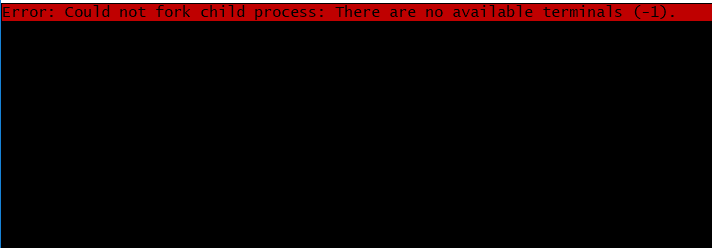
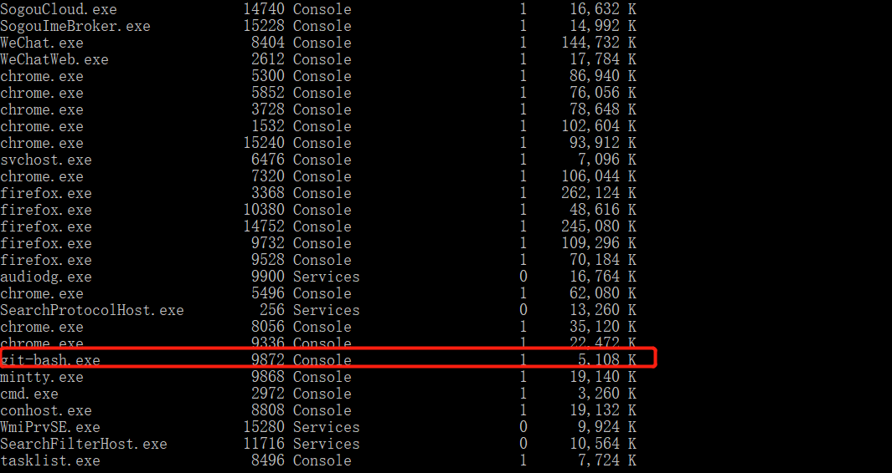

错误信息:
Error: Could not fork child process: There are no available terminals (-1)
<!--more-->
截图如下:

解决办法:

(1)使用cmd命令tasklist，找到git bash的进程

(2)找到红色标记处

(3)执行命令(`taskkill /pid 9872 -t -f`)将其杀死即可

参考问题解决链接:
[Git bash Error: Could not fork child process: There are no available terminals (-1)](https://blog.csdn.net/qq_2300688967/article/details/78642300)
