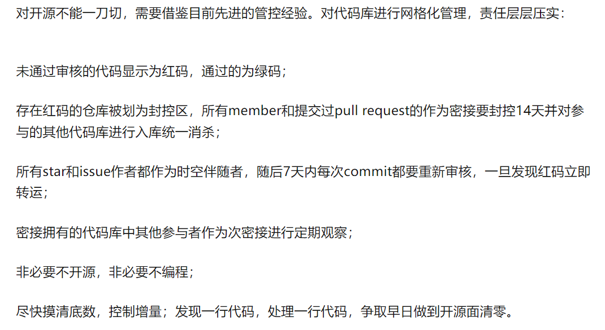

本文主要内容如下：

- 1.Gitee是什么？
- 2.Gitee与Github的区别有哪些？
- 3.为什么要使用Gitee？
- 4.Gitee的商业模式是怎样的？
- 5.Gitee为何会被整改？
- 6.Gitee这次的整改影响有多大呢？
- 7.网上对于Gitee这次整改是怎样看的呢？
- 8.Gitee的替代品有哪些？

<!--more-->


## 一、Gitee是什么？
Gitee是开源中国社区2013年推出的基于Git的代码托管服务，目前已经成为国内最大的代码托管平台，致力于为国内开发者提供优质稳定的托管服务。

## 二、Gitee与Github的区别有哪些？

### 1.不同点
- (1)使用人群上，Gitee面向国内人群，而Github面向世界各国人群。
- (2)环境限制上，Gitee受环境的限制比较多，而Github相对而言限制比较少。
- (3)开源生态上，Gitee开源生态比较单一，而Github非常丰富。
- (4)功能上，功能上既有共同点，也有不同点（企业版或个人免费版均有差异）。

### 2.相同点
- (1)均有企业版本，功能不一样。
- (2)均支持Git版本控制。
- (3)常用功能相似度比较高(如代码托管、wiki、issues、fork、pr、组织等)。

## 三、为什么要使用Gitee？
国内使用Gitee的朋友们，使用Gitee无非是基于如下几点？

- 1.搭建基于Hexo的静态网站服务。
- 2.Github与Gitee绑定，相关仓库代码实时同步。
- 3.万一Github被封锁了，可以使用Gitee作为替代品，持续为国内开源生态作贡献。
- 4.付费的企业版，适用于大多数IT公司的开发及团队管理模式(这也是Gitee商业模式的核心)。
- 5.访问速度比访问Github要快得多。


## 四、Gitee的商业模式是怎样的？
Gitee的商业模式就是Saas服务，为企业提供一整代码托管和研发协作方案，促使企业研发与管理模式的效率提升，从而实现盈利(持续盈利是通过企业不断续费来实现的)。以前在[深入理解SaaS之业务篇](https://youcongtech.com/2021/08/02/%E6%B7%B1%E5%85%A5%E7%90%86%E8%A7%A3SaaS%E4%B9%8B%E4%B8%9A%E5%8A%A1%E7%AF%87/)提到过一点：**SaaS的本质是续费**。

## 五、Gitee为何会被整改？
Gitee自2013年到现在，已经存货了9年。一家公司能坚持活过9年，也是十分不易。之所以被整改，是因为一些人上传了很多不和谐的东西，从而造成不好的影响，促使Gitee不得不整改。去年的时候博客园也是因此而整改，由此我写下了一篇文章叫[博客园整改之思考](https://youcongtech.com/2021/04/06/%E5%8D%9A%E5%AE%A2%E5%9B%AD%E6%95%B4%E6%94%B9%E4%B9%8B%E6%80%9D%E8%80%83/)。

## 六、Gitee这次的整改影响有多大呢？
我的回答是，非常大。一方面，促使一些人放弃使用Gitee；另外一方面，不少人的开源仓库遭到了封锁(需要绑定手机号以及实名认证才可以公开)；最后，对于Gitee而言，影响无疑是最大的(用户群体流失以及开源生态锐减)。但幸运的是，Gitee本质上面向的是企业，而非开源生态的用户们，由此而言，影响是有的，但并不致命。

## 七、网上对于Gitee这次整改是怎样看的呢？

以下看法不列举具体昵称或人名，用ABCDEFG之类的代替：

**A的看法：**


**B的看法：**


**C的看法：**


**D的看法：**


**E的看法：**


**F的看法：**


**G的看法：**


**H的看法：**


**I的看法：**


**J的看法：**


以上看法均来自[如何看待 5 月 18 日 Gitee 仓库开源须审核，已开源部分仓库暂时关闭，审核通过后再次公开？](https://www.zhihu.com/question/533388365)，感兴趣的朋友可以阅读原文了解。

## 八、Gitee的替代品有哪些？

### 1.从公有云的角度看
- (1)阿里云Code。
- (2)Azure DevOps。
- (3)Github。
- (4)Gitlab。
- (5)Coding DevOps。
- (6)Bitbucket。

### 2.从私有云的角度看
- (1)自建Gitlab。
- (2)自建Gitblit。
- (3)自建Gitea。
- (4)自建GitBucket。
- (5)自建Gogs。
- (6)自建Gitolite。

其中用的最多的就是自建Gitlab。

### 3.Gitlib-CE小试牛刀
关于Gitlib-CE环境搭建，可参考如下步骤(一共五步)：

#### (1)配置镜像
```
//备份
mv /etc/yum.repos.d/CentOS-Base.repo /etc/yum.repos.d/CentOS-Base.repo.backup

//下载
get -O /etc/yum.repos.d/CentOS-Base.repo http://mirrors.aliyun.com/repo/Centos-7.repo
# 或者
curl -o /etc/yum.repos.d/CentOS-Base.repo http://mirrors.aliyun.com/repo/Centos-7.repo

//生成缓存
yum makecache


```

#### (2)安装
```
curl -sS https://packages.gitlab.com/install/repositories/gitlab/gitlab-ce/script.rpm.sh | sudo bash

yum -y install gitlab-ce

```

#### (3)配置
```
cd /etc/gitlab/
vi gitlab.rb

external_url'http://gitlab.example.com' #域名或端口(如果是端口，需写为http://192.168.0.1:9090


```

#### (4)初始化
```
gitlab-ctl reconfigure

```

#### (5)启动
```
gitlab-ctl start


```