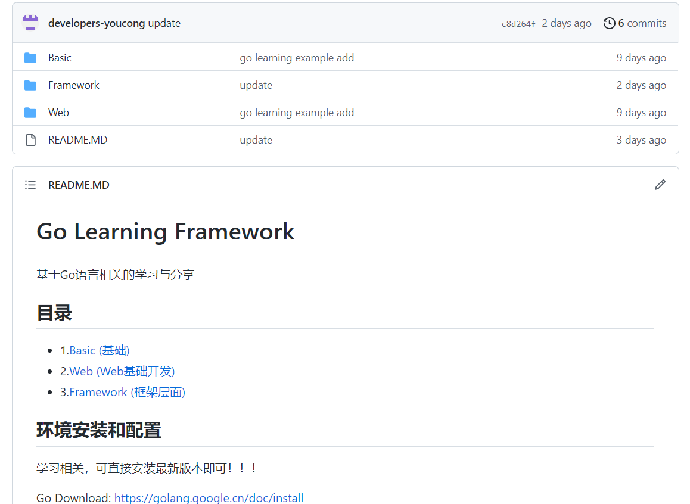

陈皓推荐学习Go语言，其理由如下(引用其《程序员练级攻略：编程语言相关内容》):
> Go语言现在很受关注，它是取代了C和C++的另一门有潜力的语言。C语言太原始了，C++太复杂了，Java太高级了，所以Go语言就在这个夹缝中出现了。这门语言已经10多年了，其已成为云计算领域事实上的标准语言，尤其是在Docker/Kubernetes等项目中。Go语言社区正在不断地从Java社区移植各种Java的轮子过来，Go社区现在也很不错。如果要写一些Pass层的应用，Go语言会比C和C++更好，目前和Java有一拼，而且Go语言在国内外一些知名公司中有了一定的应用和实践。此外，Go语言语法特别简单，你有了C和C++的基础，学习Go的学习成本基本为零。
<!--more-->

**补充一点:**
只要你掌握任意一门编程语言，学习其它编程语言，往往是一件很容易的事情。

最近学习和了解了一下Go，已经将相关代码上传至Github上。

**Go学习框架:**
https://github.com/developers-youcong/GoLearningFramework

**展示如下:**

由此可知内容，**分为三个层面:**

- 1.基础。
- 2.Web基础开发。
- 3.框架层面。

我所上传的相关Go语言学习代码，里面的文档示例均来自Go官方网站以及其它框架官方文档，大家在技术学习或选型层面可有选择的进行参考。

**学习顺序：**
基础->Web基础开发->框架层面

陈皓在学习Go语言的时候有如下**几点体会**：

- 第一、语言简单，上手快。
- 第二、并行和异步编程几乎无痛点。
- 第三、Go语言的lib库虽小五脏俱全。
- 第四、C语言的理念和Python的姿态。

其中最让我体会比较深的就是第一点和第三点。
