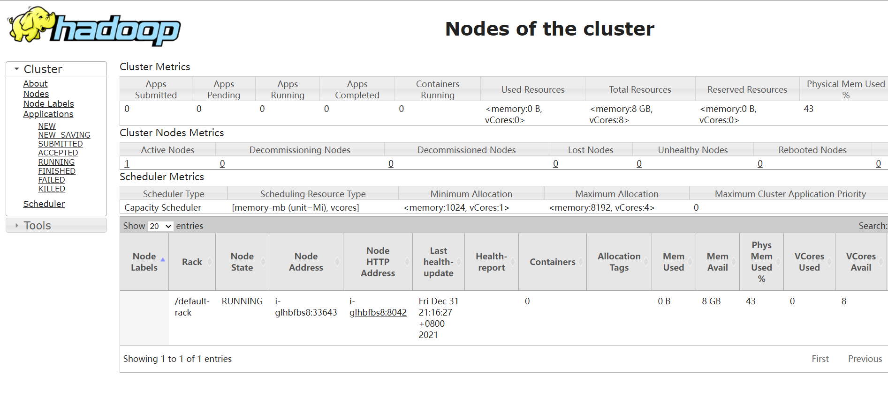
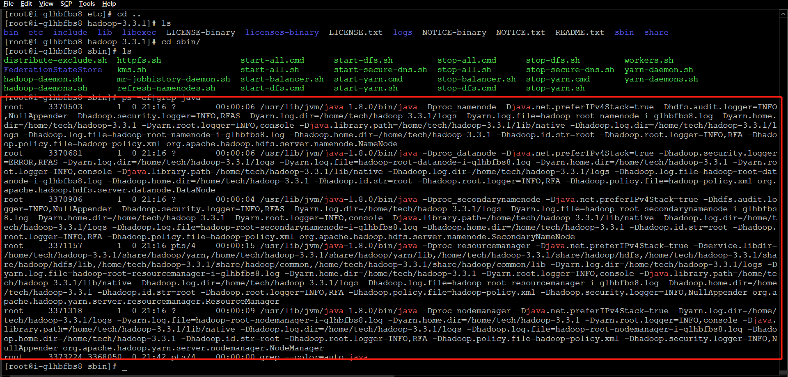

Hadoop官网:
https://hadoop.apache.org/

官网下载地址:
https://hadoop.apache.org/releases.html

可以选择最新版，也可以选择历史版本，如果是历史版本，可访问如下地址:
https://archive.apache.org/dist/hadoop/common/

官方文档写的很详细，我这篇文章是官方文档和一些博客文章的补充与完善。
<!--more-->

## 一、下载Hadoop
```
 wget https://mirrors.bfsu.edu.cn/apache/hadoop/common/hadoop-3.3.1/hadoop-3.3.1.tar.gz

```

## 二、解压
```
tar -zxvf hadoop-3.3.1.tar.gz

```

## 三、配置环境变量
```
vim /etc/profile
```
添加如下内容:
```
HADOOP_HOME=/home/tech/hadoop-3.3.1
PATH=$PATH:$JAVA_HOME/bin:$SPARK_HOME/bin:$HADOOP_HOME/bin

```

## 四、修改hadoop-env.sh配置文件
```
vim /home/tech/hadoop-3.3.1/etc/hadoop/hadoop-env.sh
```
修改如下内容:
```
export JAVA_HOME=/usr/lib/jvm/java-1.8.0

```

## 五、修改hdfs-site.xml配置文件
```
vim /home/tech/hadoop-3.3.1/etc/hadoop/hdfs-site.xml

```

添加如下内容:
```
<configuration>
<!-- 集群的namenode的位置  datanode能通过这个地址注册-->
<property>
    <name>dfs.namenode.rpc-address</name>
    <value>localhost:9000</value>
</property>

<!-- namenode存储元数据的位置 -->
<property>
    <name>dfs.namenode.name.dir</name>
    <value>/APP/hdpdata/name/</value>
</property>

<!-- datanode存储数据的位置 -->
<property>
    <name>dfs.datanode.data.dir</name>
    <value>/APP/hdpdata/data/</value>
</property>


<!--  WEB UI  -->
<property>
    <name>dfs.namenode.http-address</name>
    <value>localhost:6002</value>
</property>

</configuration>

```

## 六、修改core-site.xml
```
vim /home/tech/hadoop-3.3.1/etc/hadoop/core-site.xml

```
添加如下内容:
```
<configuration>
    <property>
        <name>fs.defaultFS</name>
        <value>hdfs://localhost:9000</value>
    </property>
</configuration>

```

## 七、初始化namedata
```
cd /home/tech/hadoop-3.3.1/bin/
./hadoop  namenode  -format

```
## 八、执行启动脚本
```
cd /home/tech/hadoop-3.3.1/sbin
bash start-all.sh #启动
bash stop-all.sh #关闭

```

## 九、




## 十、注意问题

### 1.hadoop-3.1.3 启动HDFS时报错ERROR: Attempting to operate on hdfs namenode as root的解决方法

解决办法:
```
vim /etc/profile.d/my_env.sh 

```
添加如下内容:
```
export HDFS_NAMENODE_USER=root
export HDFS_DATANODE_USER=root
export HDFS_SECONDARYNAMENODE_USER=root
export YARN_RESOURCEMANAGER_USER=root
export YARN_NODEMANAGER_USER=root

```

### 2.hadoop配置过程中可能会出的问题localhost: root@localhost: Permission denied (publickey,password)

解决办法(四条命令):
```
cd ~/.ssh/                     # 若没有该目录，请先执行一次ssh localhost
ssh-keygen -t rsa              # 会有提示，都按回车就可以
cat ./id_rsa.pub >> ./authorized_keys  # 加入授权
ssh localhost # 验证
```

