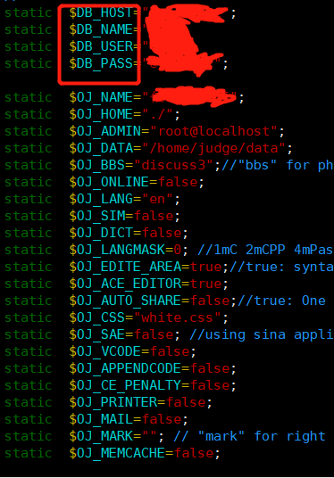
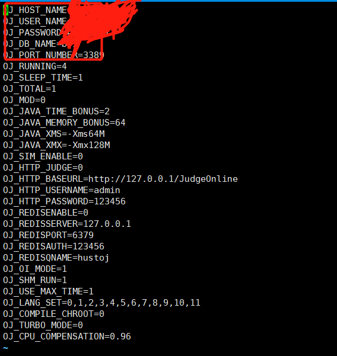

有的时候我们会因为某种业务需要的情况下，需要修改hustoj默认的数据库连接池之类的。
<!--more-->
## 修改数据库连接池步骤

### 进入到对应的目录
```
/home/judge/src/web/include

```


### 找到db_info.inc.php并修改
```
vim db_info.inc.php

```

修改红色标记处即可，如图:


### 修改judge.conf
```
cd /home/judge/etc

vim judge.conf

```

效果如图:




### 重启nginx和judge
```
/etc/init.d/nginx restart

sudo judged

```

不过在此之前需要先执行如下命令:

```
ps -ef|grep judged //相当于将对应的judged杀死
```