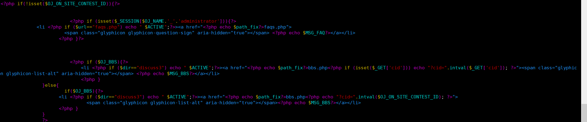
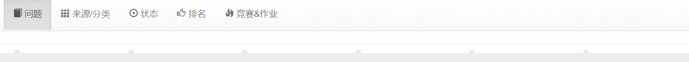
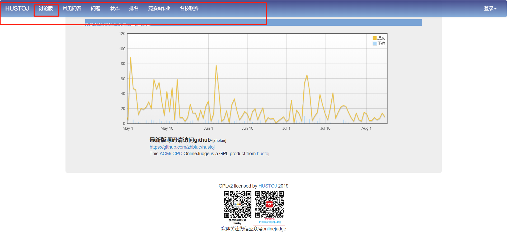

通过关键搜索:
```
find / -name *nav.php

```
出现如下结果:
/home/judge/src/web/template/ie/nav.php
/home/judge/src/web/template/ace/nav.php
/home/judge/src/web/template/bs3/nav.php
/home/judge/src/web/template/sweet/nav.php

```
vim /home/judge/src/web/template/bs3/nav.php

```
<!--more-->
将该片段代码注释即可，如图所示(以隐藏HustOJ的讨论版为例):


这回再看页面，就没有讨论版了，如图所示:


官方的HustOJ菜单栏:
