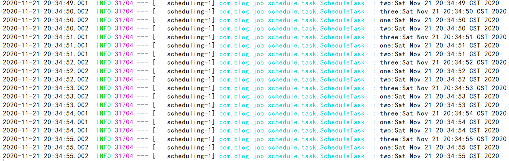
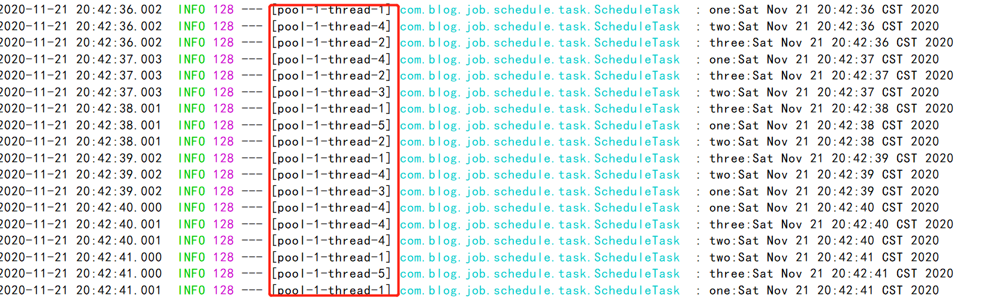
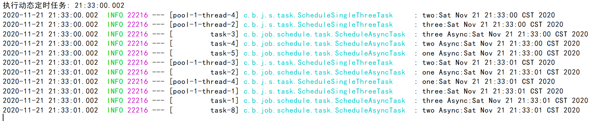
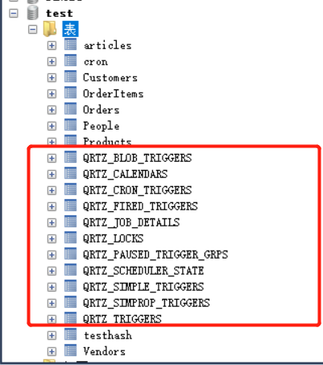
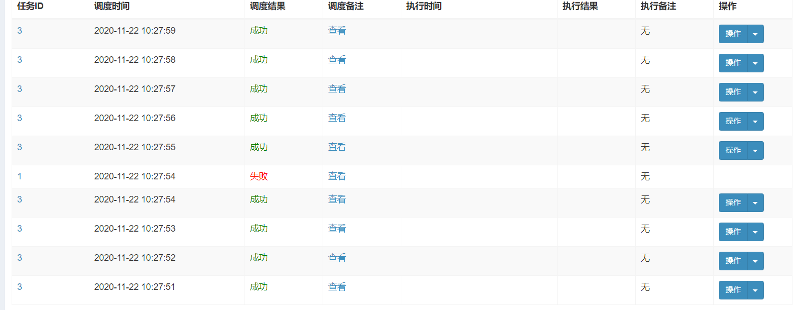
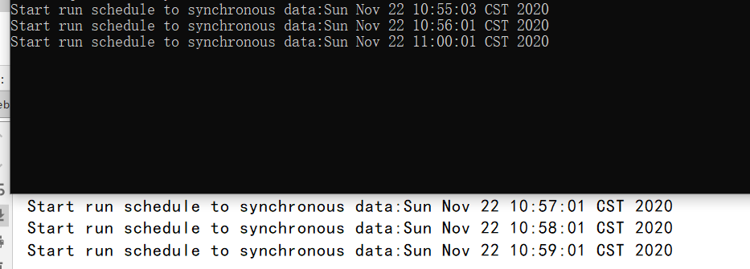

定时任务应用非常广泛，Java提供的现有解决方案有很多。
本次主要讲schedule、quartz、xxl-job、shedlock等相关的代码实践。
<!--more-->
## 一、SpringBoot使用Schedule

核心代码:
```
@Component
public class ScheduleTask {

    private Logger logger = LoggerFactory.getLogger(ScheduleTask.class);

    @Scheduled(cron = "0/1 * * * * ? ")
    public void one() {

        logger.info("one:" + new Date());
    }

    @Scheduled(cron = "0/1 * * * * ? ")
    public void two() {

        logger.info("two:" + new Date());
    }


    @Scheduled(cron = "0/1 * * * * ? ")
    public void three() {

        logger.info("three:" + new Date());
    }
}


```

运行效果如下:


除此之外还可以这样实现，核心代码:
```
@PropertySource(value = {
        "classpath:task.properties",
}, encoding = "utf-8")
@Component("scheduleTask")
public class ScheduleTask implements SchedulingConfigurer {


    @Value("${TEST_JOB_TASK_CRON}")
    private String cron;

    @Override
    public void configureTasks(ScheduledTaskRegistrar scheduledTaskRegistrar) {

        scheduledTaskRegistrar.addTriggerTask(new Runnable() {

            @Override
            public void run() {
                System.out.println("执行任务:" + DateUtil.date());


            }

        }, new Trigger() {
            @Override
            public Date nextExecutionTime(TriggerContext triggerContext) {
                return new CronTrigger(cron).nextExecutionTime(triggerContext);
            }
        });
    }

    public void setCron(String cron) {
        this.cron = cron;
    }
}

```
有朋友或许很疑惑，为什么要写这么一大堆，这个与前面的代码又有何区别呢？
区别是多线程并行。其实多线程并行也可以不用这么写，只需写一段核心配置类代码即可。

定时任务多线程配置类:
```
@Configuration
public class ScheduleConfig implements SchedulingConfigurer {

    public void configureTasks(ScheduledTaskRegistrar scheduledTaskRegistrar) {
        scheduledTaskRegistrar.setScheduler(Executors.newScheduledThreadPool(5));
    }
}

```

再次启动，查看效果，如下:

由此看出走不同的线程执行，不同的线程执行的好处是，如果某一个线程挂掉后，并不会阻塞导致其它定时任务无法执行。

另外如果要想并发执行，前面的配置可以不要，直接用SpringBoot提供的现成注解即可，核心代码如下:
```
@Component
@EnableAsync
public class ScheduleAsyncTask {

    private Logger logger = LoggerFactory.getLogger(ScheduleAsyncTask.class);

    @Scheduled(cron = "0/1 * * * * ? ")
    @Async
    public void one() {

        logger.info("one Async:" + new Date());
    }

    @Scheduled(cron = "0/1 * * * * ? ")
    @Async
    public void two() {

        logger.info("two Async:" + new Date());
    }


    @Scheduled(cron = "0/1 * * * * ? ")
    @Async
    public void three() {

        logger.info("three Async:" + new Date());
    }
}


```

除此外，还有基于schedule动态定时任务(所谓动态只不过是指cron表达式放在对应的数据表里)，简单示例代码:
```
@Configuration
public class DynamicScheduleTask implements SchedulingConfigurer {

    @Autowired
    @SuppressWarnings("all")
    CronMapper cronMapper;

    @Mapper
    public interface CronMapper {
        @Select("select cron from cron limit 1")
        public String getCron();
    }

    /**
     * 执行定时任务.
     */
    public void configureTasks(ScheduledTaskRegistrar taskRegistrar) {

        taskRegistrar.addTriggerTask(
                //1.添加任务内容(Runnable)
                () -> System.out.println("执行动态定时任务: " + LocalDateTime.now().toLocalTime()),
                //2.设置执行周期(Trigger)
                triggerContext -> {
                    //2.1 从数据库获取执行周期
                    String cron = cronMapper.getCron();
                    //2.2 合法性校验.
                    if (StringUtils.isEmpty(cron)) {
                        // Omitted Code ..
                    }
                    //2.3 返回执行周期(Date)
                    return new CronTrigger(cron).nextExecutionTime(triggerContext);
                }
        );
    }


}

```
核心配置文件(application.yml):
```
spring:
  datasource:
    url: jdbc:mysql://127.0.0.1:3306/test
    username: root
    password: 1234

```
SQL脚本:
```
DROP DATABASE IF EXISTS `test`;
CREATE DATABASE `test`;
USE `test`;
DROP TABLE IF EXISTS `cron`;
CREATE TABLE `cron`  (
  `cron_id` varchar(30) NOT NULL PRIMARY KEY,
  `cron` varchar(30) NOT NULL  
);
INSERT INTO `cron` VALUES ('1', '0/5 * * * * ?');

```

运行效果如下:


## 二、SpringBoot使用Quartz

### 1.Maven依赖
```
        <!--引入quartz定时框架-->
        <dependency>
            <groupId>org.springframework.boot</groupId>
            <artifactId>spring-boot-starter-quartz</artifactId>
        </dependency>

```

### 2.配置文件
```
spring:
  quartz:
    #相关属性配置
    properties:
      org:
        quartz:
          scheduler:
            instanceName: clusteredScheduler
            instanceId: AUTO
          jobStore:
            class: org.quartz.impl.jdbcjobstore.JobStoreTX
            driverDelegateClass: org.quartz.impl.jdbcjobstore.StdJDBCDelegate
            tablePrefix: QRTZ_
            isClustered: true
            clusterCheckinInterval: 10000
            useProperties: false
          threadPool:
            class: org.quartz.simpl.SimpleThreadPool
            threadCount: 10
            threadPriority: 5
            threadsInheritContextClassLoaderOfInitializingThread: true
    #数据库方式
    job-store-type: jdbc
    #初始化表结构
    jdbc:
      initialize-schema: always
  datasource:
    url: jdbc:mysql://127.0.0.1:3306/test
    username: root
    password: 1234

```

### 3.启动类
```
@SpringBootApplication
@EnableScheduling
public class BlogQuartzApplication {

    public static void main(String[] args) {
        SpringApplication.run(BlogQuartzApplication.class, args);
    }


}

```

### 4.配置类
```
@Configuration
public class QuartzConfiguration {
    // 使用jobDetail包装job
    @Bean
    public JobDetail myCronJobDetail() {
        return JobBuilder.newJob(CouponTimeOutJob.class).withIdentity("couponTimeOutJob").storeDurably().build();
    }

    // 把jobDetail注册到Cron表达式的trigger上去
    @Bean
    public Trigger CronJobTrigger() {
        CronScheduleBuilder cronScheduleBuilder = CronScheduleBuilder.cronSchedule("0/1 * * * * ?");

        return TriggerBuilder.newTrigger()
                .forJob(myCronJobDetail())
                .withIdentity("CouponTimeOutJobTrigger")
                .withSchedule(cronScheduleBuilder)
                .build();
    }
}

```

### 5.定时任务类
```
public class CouponTimeOutJob extends QuartzJobBean {
    @Override
    protected void executeInternal(JobExecutionContext jobExecutionContext) throws JobExecutionException {
        System.out.println("定时任务执行");
    }
}

```

### 6.启动成功不报错

#### (1)对应的数据库会生成定时任务相关的数据表


#### (2)控制台不断输出定时任务执行日志


## 三、SpringBoot使用xxl-job
之前写过一样的例子，如今简化了下。
关于xxl-job使用详情，可以参考我的这篇文章:
[SpringBoot整合Xxl-Job](https://www.cnblogs.com/youcong/p/12935760.html)

### 1.Maven依赖
```
        <dependency>
            <groupId>com.xuxueli</groupId>
            <artifactId>xxl-job-core</artifactId>
            <version>2.2.0</version>
        </dependency>

```
### 2.配置类
```
@Configuration
public class XxlJobConfig {
    private Logger logger = LoggerFactory.getLogger(XxlJobConfig.class);

    @Value("${xxl.job.admin.addresses}")
    private String adminAddresses;

    @Value("${xxl.job.executor.appname}")
    private String appName;

    @Value("${xxl.job.executor.ip}")
    private String ip;

    @Value("${xxl.job.executor.port}")
    private int port;

    @Value("${xxl.job.accessToken}")
    private String accessToken;

    @Value("${xxl.job.executor.logpath}")
    private String logPath;

    @Value("${xxl.job.executor.logretentiondays}")
    private int logRetentionDays;


    @Bean(initMethod = "start", destroyMethod = "destroy")
    public XxlJobSpringExecutor xxlJobExecutor() {
        logger.info(">>>>>>>>>>> xxl-job config init.");
        XxlJobSpringExecutor xxlJobSpringExecutor = new XxlJobSpringExecutor();
        xxlJobSpringExecutor.setAdminAddresses(adminAddresses);
        xxlJobSpringExecutor.setAppname(appName);
        xxlJobSpringExecutor.setIp(ip);
        xxlJobSpringExecutor.setPort(port);
        xxlJobSpringExecutor.setAccessToken(accessToken);
        xxlJobSpringExecutor.setLogPath(logPath);
        xxlJobSpringExecutor.setLogRetentionDays(logRetentionDays);

        return xxlJobSpringExecutor;
    }

}

```
### 3.配置文件内容
```
# web port
server.port=8081
# no web
#spring.main.web-environment=false
### xxl-job admin address list, such as "http://address" or "http://address01,http://address02"
xxl.job.admin.addresses=http://127.0.0.1:8080/xxl-job-admin
### xxl-job, access token
xxl.job.accessToken=
### xxl-job executor appname
xxl.job.executor.appname=blog-job-xxl-job
### xxl-job executor registry-address: default use address to registry , otherwise use ip:port if address is null
xxl.job.executor.address=
### xxl-job executor server-info
xxl.job.executor.ip=
xxl.job.executor.port=8888
### xxl-job executor log-path
xxl.job.executor.logpath=/data/applogs/xxl-job/jobhandler
### xxl-job executor log-retention-days
xxl.job.executor.logretentiondays=30

```
### 4.定时任务类
```
@Component
public class XxlJobTaskExample {


    @XxlJob("blogJobHandler")
    public ReturnT<String> blogJobHandler(String param) throws Exception {
        System.out.println("执行");
        XxlJobLogger.log("XXL-JOB, Hello World.");

        for (int i = 0; i < 5; i++) {
            XxlJobLogger.log("beat at:" + i);
            TimeUnit.SECONDS.sleep(2);
        }
        return ReturnT.SUCCESS;
    }

}


```
### 5.执行效果
分别如下所示:




## 四、SpringBoot使用ShedLock

### 1.导入Maven依赖
```
     <!-- 分布式定时任务锁 -->
        <!-- https://mvnrepository.com/artifact/net.javacrumbs.shedlock/shedlock-spring -->
        <dependency>
            <groupId>net.javacrumbs.shedlock</groupId>
            <artifactId>shedlock-spring</artifactId>
            <version>4.0.4</version>
        </dependency>
        <!-- 使用redis做分布式任务 -->
        <dependency>
            <groupId>net.javacrumbs.shedlock</groupId>
            <artifactId>shedlock-provider-redis-spring</artifactId>
            <version>2.5.0</version>
        </dependency>
        <!-- redis组件 -->
        <dependency>
            <groupId>org.springframework.boot</groupId>
            <artifactId>spring-boot-starter-data-redis</artifactId>
        </dependency>


```

### 2.编写配置类
```
@Configuration
@EnableSchedulerLock(defaultLockAtMostFor = "PT30M")
public class ShedLockConfig {

    @Bean
    public LockProvider lockProvider(RedisTemplate redisTemplate) {
        return new RedisLockProvider(redisTemplate.getConnectionFactory());

    }

}

```

### 3.编写具体的定时任务
```
@Component
public class TaskSchedule {

    /**
     * 每分钟执行一次
     * [秒] [分] [小时] [日] [月] [周] [年]
     */
    @Scheduled(cron = "1 * * * * ?")
    @SchedulerLock(name = "synchronousSchedule")
    public void SynchronousSchedule() {
        
        System.out.println("Start run schedule to synchronous data:" + new Date());

    }
}


```

### 4.编写启动类
```
@SpringBootApplication
@EnableScheduling
public class ShedLockRedisApplication {
    public static void main(String[] args) {
        SpringApplication.run(ShedLockRedisApplication.class);
    }
}

```

### 5.配置文件
```
server:
  tomcat:
    uri-encoding: UTF-8
    max-threads: 1000
    min-spare-threads: 30
  port: 8083

spring:
  redis:
    database: 0
    host: localhost
    port: 6379
    password:      # 密码（默认为空）
    timeout: 6000ms  # 连接超时时长（毫秒）
    jedis:
      pool:
        max-active: 1000  # 连接池最大连接数（使用负值表示没有限制）
        max-wait: -1ms      # 连接池最大阻塞等待时间（使用负值表示没有限制）
        max-idle: 10      # 连接池中的最大空闲连接
        min-idle: 5       # 连接池中的最小空闲连接

```

### 6.测试
我之所以用shedlock是因为确保在集群环境下各微服务的定时任务只执行一个，而不是全部都运行相同的定时任务。

本次测试效果如下:


本次代码例子已放至我的GitHub:
https://github.com/developers-youcong/blog-job