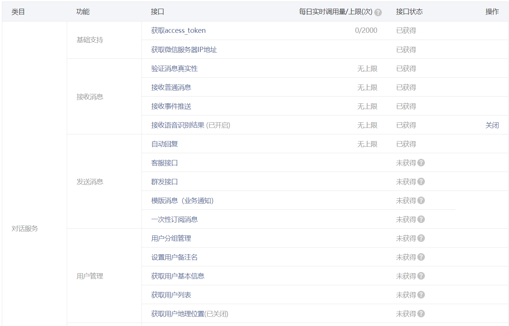
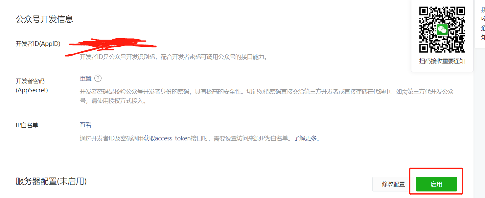
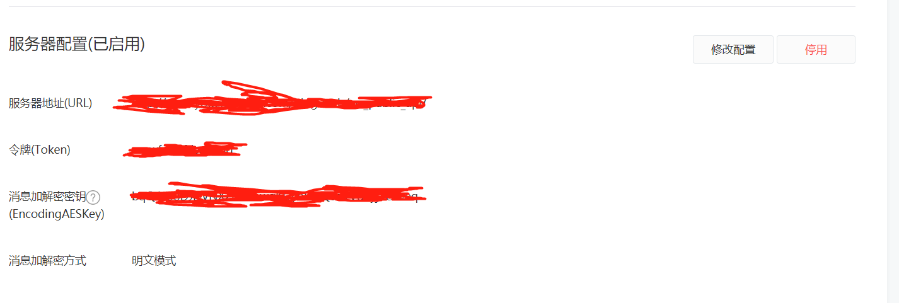
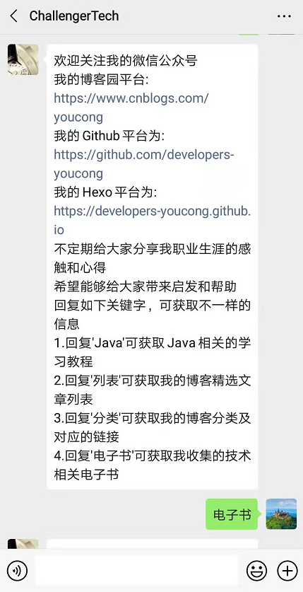

这次以文本回复作为案例来讲解Java相关得微信公众号开发。

## 首先必须要有一个个人微信公众号

个人微信公众号相关的接口权限有限，不过用于个人学习体验一下足够了，如图:

<!--more-->

然后进入微信公众后台，点击基本配置，按照如下操作(点击启用，相当于设置请求url为自己后台的):


设置服务器URL、令牌、消息加解密密钥(这个可以使用自动生成的):



服务器URL至关重要，我在这里设置为我自己的域名http://www.youcongtech.com/wx-api。

这个wx-api就是后面对应的接口(比如我发送某个关键字，返回对应的信息)。
token可以设置复杂点。


## 效果图



上面的演示效果来自本人微信公众号，并长期运行稳定没有任何问题。


## 后台路由代码
```
package com.blog.springboot.controller;

import java.io.IOException;
import java.io.PrintWriter;
import java.io.UnsupportedEncodingException;

import javax.servlet.http.HttpServletRequest;
import javax.servlet.http.HttpServletResponse;

import org.springframework.beans.factory.annotation.Autowired;
import org.springframework.web.bind.annotation.GetMapping;
import org.springframework.web.bind.annotation.PostMapping;
import org.springframework.web.bind.annotation.RequestMapping;
import org.springframework.web.bind.annotation.RestController;

import com.blog.springboot.wx.service.WxService;
import com.blog.springboot.wx.util.SignUtil;

import io.swagger.annotations.Api;
import io.swagger.annotations.ApiOperation;
/**
 * 微信公众号API
 * @author youcong
 * @date 2019-6-02
 */
@RestController
@RequestMapping("/wx_public_api")
@Api(tags = { "微信公众号api" }, description = "微信公众号api")
public class WxPublicApiController extends AbstractController{

	@Autowired
	private WxService wxService;
	
	
       /**
        * 微信公众平台服务器配置验证
        * @param request
        * @param response
        */
	   @GetMapping
	   @ApiOperation("微信公众平台服务器配置验证")
	   public void validate(HttpServletRequest request, HttpServletResponse response) {
	        // 微信加密签名，signature结合了开发者填写的token参数和请求中的timestamp参数、nonce参数。
	        String signature = request.getParameter("signature");
	        // 时间戳
	        String timestamp = request.getParameter("timestamp");
	        // 随机数
	        String nonce = request.getParameter("nonce");
	        // 随机字符串
	        String echostr = request.getParameter("echostr");

	        PrintWriter out = null;
	        try {
	            out = response.getWriter();
	            // 通过检验signature对请求进行校验，若校验成功则原样返回echostr，否则接入失败
	            if (SignUtil.checkSignature(signature, timestamp, nonce)) {
	                out.print(echostr);
	            }
	        } catch (IOException e) {
	            e.printStackTrace();
	            logger.error(e.getMessage());
	            
	        } finally {
	            
	        	out.close();
	            out = null;
	        }
	    }

     /**
      * 关注推送消息
      * @param request
      * @param response
      */
	 @PostMapping
	 @ApiOperation("关注推送消息")
	 public void about(HttpServletRequest request, HttpServletResponse response) {
	        try {
	            request.setCharacterEncoding("UTF-8");
	        } catch (UnsupportedEncodingException e) {
	            e.printStackTrace();
	            logger.error(e.getMessage(),e);
	        }
	        response.setContentType("text/html;charset=UTF-8");

	        // 调用核心业务类接收消息、处理消息
	        String respMessage = wxService.newMessageRequest(request);

	        // 响应消息
	        PrintWriter out = null;
	        try {
	            out = response.getWriter();
	            out.print(respMessage);
	        } catch (IOException e) {
	            e.printStackTrace();
	            logger.error(e.getMessage(),e);
	        } finally {
	            out.close();
	            out = null;
	        }
	    }
}


```

## 完整代码
完整代码已经放到我个人的GitHub仓库，地址为:https://github.com/developers-youcong/blog-springcloud-pro/tree/master/blog-wx-client

这是其中的子项目，功能主要是微信公众平台。

鉴于我个人主要维护的开源项目尚未公开，有很多隐私信息等，所以将其中的微信公众号模块抽取出来放到我的新开源项目blog-springcloud-pro中(此项目目前处于开发中)。

微信公众号模块基本上换上自己的token、appid、appsecret并部署到线上就基本可用了。有任何问题，可留言。