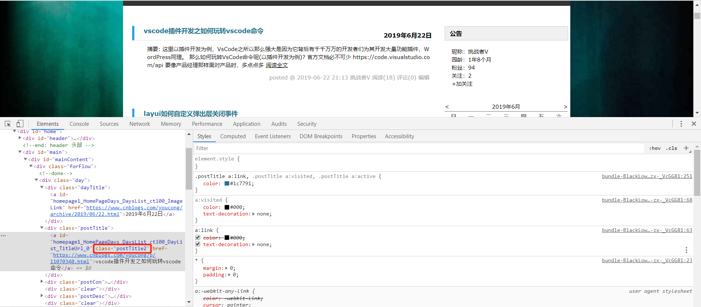
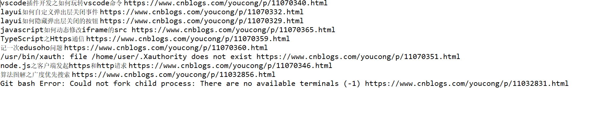

## 导入Maven依赖


```


	<!-- https://mvnrepository.com/artifact/org.jsoup/jsoup -->


		<dependency>


		    <groupId>org.jsoup</groupId>


		    <artifactId>jsoup</artifactId>


		    <version>1.11.3</version>


		</dependency>


```


<!--more-->


## 选择你要爬取网站(这里我以爬取自己的博客文章为例)


#### 通过浏览器进入这个网址
如[我的博客](https://www.cnblogs.com/youcong/)


#### 使用浏览器调试工具(后面会说到这个目的)





### 编写对应的Java的代码


```


package cn.test;


import org.jsoup.Connection;


import org.jsoup.Jsoup;


import org.jsoup.nodes.Document;


import org.jsoup.nodes.Element;


import org.jsoup.select.Elements;


import java.io.IOException;


import java.util.ArrayList;


import java.util.List;


/**


 * A simple example, used on the jsoup website.


 */


public class BlogJsoup {


	/**


	 * 获取博客最近十篇文章


	 * @param args


	 * @throws IOException


	 */


    public static void main(String[] args) throws IOException {


    	


		Connection connection = Jsoup.connect("https://www.cnblogs.com/youcong/");


        


        connection.header("User-Agent", "Mozilla/5.0 (Windows NT 6.1; WOW64) AppleWebKit/537.36 (KHTML, like Gecko) Chrome/52.0.2743.116 Safari/537.36");


        try {


           


            Document document = connection.timeout(100000).get();


            //包含所有列表的文章


            Elements elements = document.getElementsByClass("postTitle2");


     


            for (Element element : elements) {


         


                String path = element.attr("href");


            	String text = element.text();


                String msg = text+" "+path;


			    System.out.println(msg);


			}


            


        } catch (IOException e) {


       	 


            e.printStackTrace();


        }


             


   


}


    


}


```


上面的代码，用流程可以梳理为如下:


连接爬取的网站->设置浏览器请求头(防止因浏览器的限制导致爬取数据失败)->获取整个HTML(实际就是一个html)->选择HTML中的某一个元素(如类选择器postTitle2，如果不指定对应的元素选择器，那么直接爬取的就是整个HTML)->爬取数据并输出


输出结果如图:





