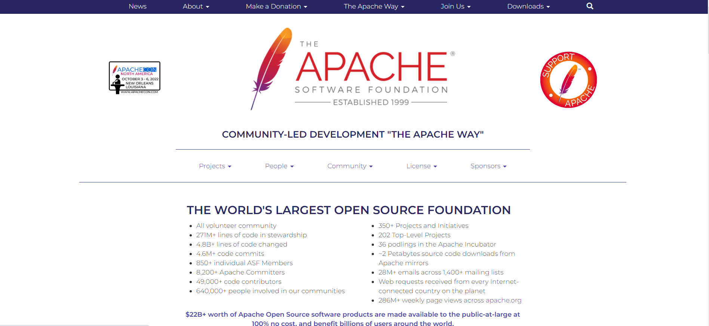
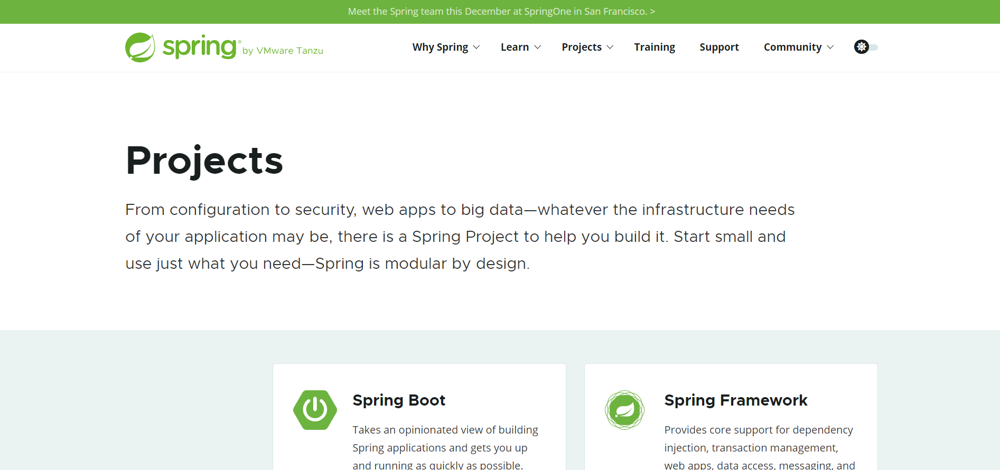
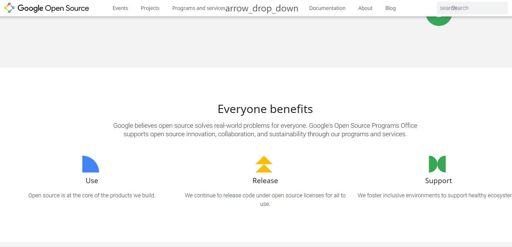
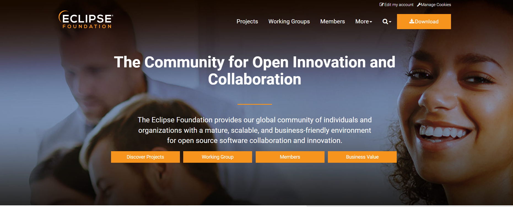
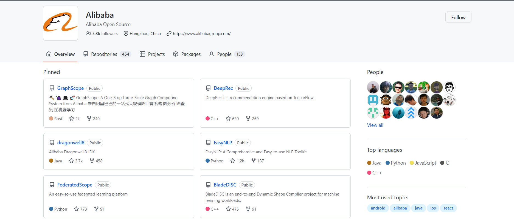
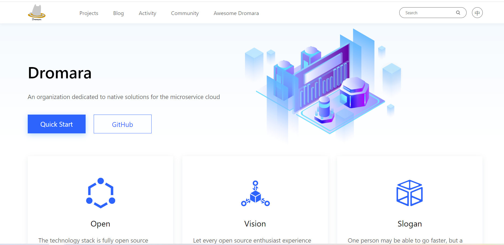
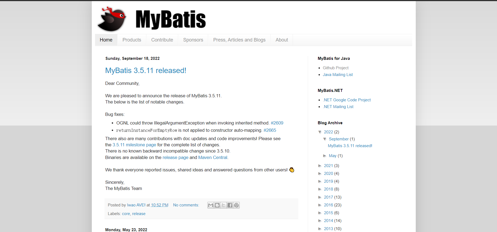
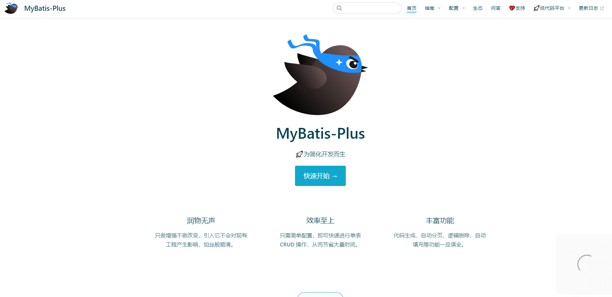

Java之所以被称为最大的工业级语言，在于它的生态之庞大与丰富。
<!--more-->

## 一、Apache生态
Apache生态涵盖各类主流编程语言！！！

**Apache官网:**
https://www.apache.org/

**Apache Github:**
https://github.com/apache

## 二、Spring生态
从配置到安全，从Web应用到大数据——无论应用程序的基础设施需求是什么，都有一个Spring Project来帮助您构建它。从小处入手，按需使用——Spring在设计上是模块化的。

**Spring官网:**
https://spring.io/projects

**Spring Github:**
https://github.com/spring-projects

## 三、Google生态
谷歌相信开源为每个人解决了现实世界的问题。

**Google官网:**
https://opensource.google/

**Google Github:**
https://github.com/google

## 四、Eclipse生态
Eclipse Foundation为我们的全球个人和组织社区提供了一个成熟的、可伸缩的、业务友好的环境，用于开源软件协作和创新。

**Eclipse官网:**
https://www.eclipse.org//

**Eclipse Github:**
https://github.com/eclipse

## 五、Alibaba生态
Alibaba 的Java编程规范手册为国内各个IT公司所熟知！！！

Alibaba Github:
https://github.com/alibaba

## 六、Dromara生态
致力于微服务云原生解决方案的组织！！！

**Dromara官网:**
https://dromara.org/

**Dromara Github:**
https://github.com/dromara

**Dromara Gitee:**
https://gitee.com/dromara

## 七、MyBatis生态
MyBatis对于Java开发者们一定非常不陌生了！！！

**MyBatis官网:**
https://www.mybatis.org//

**MyBatis Github:**
https://github.com/mybatis

## 八、MyBatis-Plus生态(又称苞米豆生态)
MyBatis-Plus因简化开发而生，为国内广大Java开发者们所喜爱！！！

**MyBatis-Plus官网:**
https://baomidou.com/

**MyBatis-Plus Github:**
https://github.com/baomidou/mybatis-plus

**MyBatis-Plus Gitee:**
https://gitee.com/baomidou/mybatis-plus

## 九、总结
上述八大Java相关的生态，我想大多Java开发者们均或多或少用过。
在我的博客里(Hexo博客或博客园博客)均包含上述生态相关的实战应用。我个人开发的[分布式微服务框架](https://mp.weixin.qq.com/s?__biz=MzUxODk0ODQ3Ng==&mid=2247485813&idx=1&sn=daa6e8447409672c28f07dbe094c4f28&chksm=f9805a66cef7d37061b15154a900c840da4bfdedd77cd0ea5865aee740bd1f2c01bb5cc37127&token=1774829840&lang=zh_CN#rd)就涉及到上面的大多生态。同样我本人工作中也用到上面生态下的不少框架组件。