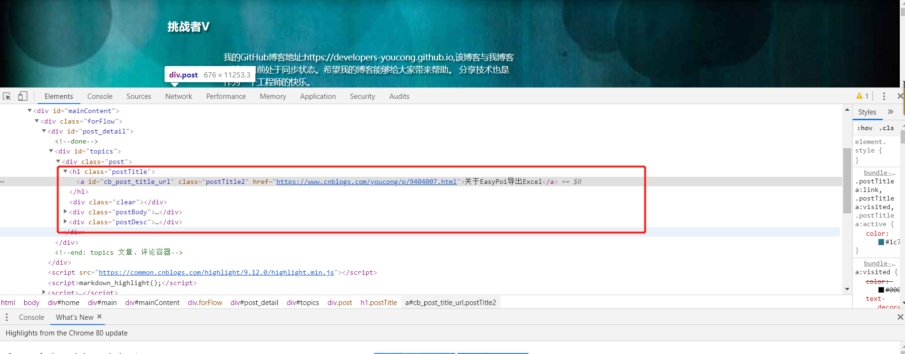

## 一、介绍
WebMagic是一个简单灵活的Java爬虫框架。基于WebMagic，你可以快速开发出一个高效、易维护的爬虫。
<!--more-->
## 二、如何学习

### 1.查看官网
官网地址为:http://webmagic.io/
官网详细文档:http://webmagic.io/docs/zh/

### 2.跑通hello world示例(具体可以参考官网，也可以参考博客)

我下面写的单元测试案例，可作为Hello World示例。

注意需要导入Maven依赖:
```
<dependency>
    <groupId>us.codecraft</groupId>
    <artifactId>webmagic-core</artifactId>
    <version>0.7.3</version>
</dependency>
<dependency>
    <groupId>us.codecraft</groupId>
    <artifactId>webmagic-extension</artifactId>
    <version>0.7.3</version>
</dependency>

```

### 3.带着一个目的
说说我的目的，最近我开发的博客系统，其中有个导入第三方博客的插件，这个插件比较简单就是一个搜索框，在对应的搜索框里面填写URL，点击搜索即可导入到自己的博客。

以导入博客园单篇文章为例:

下面是我的源代码(单篇文章导入,我已经将其封装成一个工具类):
```
import cn.hutool.core.date.DateUtil;
import com.blog.springboot.dto.CnBlogModelDTO;
import com.blog.springboot.entity.Posts;
import com.blog.springboot.service.PostsService;
import org.springframework.beans.factory.annotation.Autowired;
import org.springframework.stereotype.Component;
import us.codecraft.webmagic.Page;
import us.codecraft.webmagic.Site;
import us.codecraft.webmagic.Spider;
import us.codecraft.webmagic.pipeline.ConsolePipeline;
import us.codecraft.webmagic.processor.PageProcessor;
import us.codecraft.webmagic.selector.Selectable;
import javax.annotation.PostConstruct;


/**
 * 导入博客园文章工具类
 */
@Component
public class WebMagicCnBlogUtils implements PageProcessor {

    @Autowired
    private PostsService postService;


    public static WebMagicCnBlogUtils magicCnBlogUtils;

    @PostConstruct
    public void init() {
        magicCnBlogUtils = this;
        magicCnBlogUtils.postService = this.postService;
    }
    private Site site = Site.me()
            .setDomain("https://www.cnblogs.com/")
            .setSleepTime(1000)
            .setUserAgent("Mozilla/5.0 (Windows NT 10.0; Win64; x64) AppleWebKit/537.36 (KHTML, like Gecko) Chrome/67.0.3396.99 Safari/537.36");


    @Override
    public void process(Page page) {


        Selectable obj = page.getHtml().xpath("//div[@class='post']");
        Selectable title = obj.xpath("//h1[@class='postTitle']//a");
        Selectable content = obj.xpath("//div[@class='blogpost-body']");
        System.out.println("title:" + title.replace("<[^>]*>", ""));
        System.out.println("content:" + content);
        CnBlogModelDTO blog = new CnBlogModelDTO();
        blog.setTitle(title.toString());
        blog.setContent(content.toString());

        Posts post = new Posts();

        String date = DateUtil.date().toString();
        post.setPostAuthor(1L);
        post.setPostTitle(title.replace("<[^>]*>", "").toString());
        post.setPostContent(content.toString());
        post.setPostExcerpt(content.replace("<[^>]*>", "").toString());
        post.setPostDate(date);
        post.setPostDate(date);
        post.setPostModified(date);
        boolean importPost = magicCnBlogUtils.postService.insert(post);

        if (importPost) {
            System.out.println("success");
        } else {
            System.out.println("fail");
        }


    }

    @Override
    public Site getSite() {
        return site;
    }


    /**
     * 导入单篇博客园文章数据
     *
     * @param url
     */
    public static void importSinglePost(String url) {
        Spider.create(new WebMagicCnBlogUtils())
                .addUrl(url)
                .addPipeline(new ConsolePipeline())
                .run();

    }
}


```

单元测试代码:
```
import com.blog.springboot.dto.CnBlogModelDTO;
import us.codecraft.webmagic.Page;
import us.codecraft.webmagic.Site;
import us.codecraft.webmagic.Spider;
import us.codecraft.webmagic.pipeline.ConsolePipeline;
import us.codecraft.webmagic.processor.PageProcessor;
import us.codecraft.webmagic.selector.Selectable;


public class WebMagicJunitTest implements PageProcessor {
    private Site site = Site.me()
            .setDomain("https://www.cnblogs.com/")
            .setSleepTime(1000)
            .setUserAgent("Mozilla/5.0 (Windows NT 10.0; Win64; x64) AppleWebKit/537.36 (KHTML, like Gecko) Chrome/67.0.3396.99 Safari/537.36");


    @Override
    public void process(Page page) {


        Selectable obj = page.getHtml().xpath("//div[@class='post']");
        Selectable title = obj.xpath("//h1[@class='postTitle']//a");
        Selectable content = obj.xpath("//div[@class='blogpost-body']");

        System.out.println("title:" + title.replace("<[^>]*>", ""));
        System.out.println("content:" + content);


    }

    @Override
    public Site getSite() {
        return site;
    }


    public static void importSinglePost(String url) {
        Spider.create(new WebMagicJunitTest())
                .addUrl(url)
                .addPipeline(new ConsolePipeline())
                .run();
    }
    public static void main(String[] args) {

        WebMagicJunitTest.importSinglePost("https://www.cnblogs.com/youcong/p/9404007.html");
    }


```
**另外我是怎么知道要爬取哪些数据呢?**
需求第一，然后通过Chrome或Firefox浏览器检查元素，如图:

