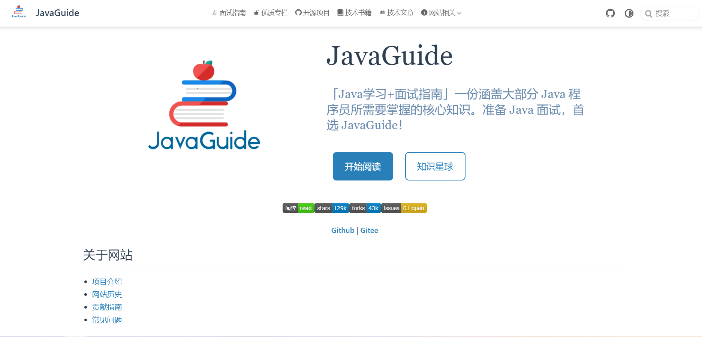
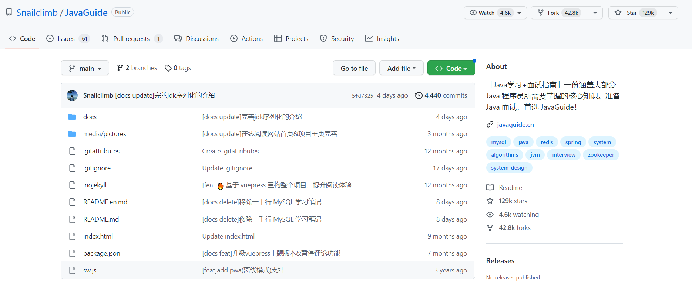
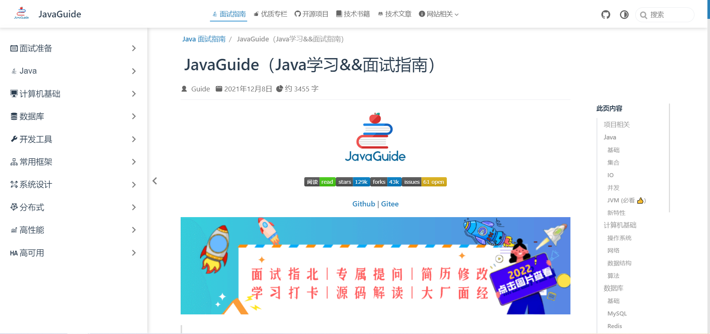

## 一、为什么需要面试八股文？
因为任何一场面试，基本上都离不开做纸质面试题(即便是如今的线上面试也一样，线上面试会给你一个word文档，让你在一定时间范围内做完并以邮件的形式进行发送)。如果纸质面试题答得非常不理想，意味着线上二面或线下复试的机会将不复存在。纸质面试题以Java为例，离不开Java相关的基础、常用框架、数据库、中间件(Redis、MQ、MongoDB等)、分布式微服务等相关的内容，而这些内容是可以通过刻意记忆来实现的。换句话说，之所以需要Java面试八股文，目的在于增加面试的成功率。
<!--more-->

## 二、如何正确看待面试八股文？
如果是真实面试，刻意记忆面试八股文是必要的，对于初面(非技术官)，一般是HR之类的，以面试题来筛选面试者，即便你在实战方面非常有优势(做过很多项目，积累大量的成功经验)，但你面试题做的很糟糕，就很容易被淘汰(初面筛选被刷了)。

有些人很不愿意去记忆这些面试八股文，很大原因在于，他们觉得没有这个必要，因为真正到了工作，之前背诵大量的八股文意义不大，这也是业界中流传的一句话，**“面试造火箭，工作拧螺丝”。**

在此我写本文的时候，希望大家能够正确看待面试八股文，这个东西既然存在，便有它存在的意义。以下，我提出几点关于如何正确看待面试八股文的建议：

- 1.**把刻意记忆面试八股文当作“温故而知新”**。
- 2.**将面试八股文的相关内容同工作相结合(将知识由死变活)**。
- 3.**结合自己的职业生涯有选择地刻意记忆**。

以Java为例。

Java有一本书叫做《Java编程思想》，这本书我买了有好几年，即便买了好几年但看之甚少。这本书我总共看过三次。
第一次是买来的时候看的，那个时候工作经验不丰富，有种看天书似的，觉得枯燥无味，一停就近两年。
第二次是因为技术总监T哥年终一对一谈话的时候，他建议我有空的时候看一看这本书，他以自身为例，时常温故而知新。
第三次是自我内部复盘的时候，有选择地看了该书的一部分内容。

"温故而知新"的意义在于，过去你没有实践经验，看这些东西是空洞无物的，当你有了实践经验，再回过头来看，这些理论文字的东西便不再空洞无物，因为实践出真知。

面试八股文的内容很广，需要结合你自己的职业规划而定，你给自己的定位是Leader、架构师、项目经理、技术经理、技术总监还是其它相关。以我个人为例，我给自己的定位是架构师，技术是一方面，业务也是一方面，技术层面，我需要刻意记忆一些架构相关的内容，但不能单单仅记忆，更要将其同我所待公司的业务相结合，否则，即便过了面试题的一关，也很难过得了公司技术总监或其他懂技术和业务高层的那关。

## 三、关于在职人员有关的问题有哪些？

### 1.在职人员是否有必要看面试题？
我的回答是：有必要。通常通过面试题能看到业界的一些趋势动态。比分说以牛客网为例，他们主要靠各类大厂面试题来吸引对应的消费群体(找工作的人群为主)，所以他们必定非常关注业界的一些情况。

### 2.在职人员是否需要定期看看招聘网站？
我的回答是：需要。我在[我的学习方法论](https://mp.weixin.qq.com/s?__biz=MzUxODk0ODQ3Ng==&mid=2247486963&idx=1&sn=8859d387d719dda001b192078c4aa0cf&chksm=f9805ee0cef7d7f6e5d1360270f221dba49e59936e56542dd18262d51cf6886d4a5de702ecad&token=1529163421&lang=zh_CN#rd)一文中提到岗位招聘学习法，该学习法的应用场景有三个方面(从而回答了为什么需要定期看看招聘网站)：

- 第一、有助于促进你的职业生涯发展，你不知道你的目标是什么，你可以自己去寻找目标。
- 第二、在职如果太安逸，通过岗位招聘学习法，促使自己把时间利用起来，用于提高自己。
- 第三、如果不满足于现有公司的待遇，打算跳槽，可通过岗位招聘学习法找到意向公司进行刻意学习，从而增加面试成功的把握。

### 3.在职人员是否需要定期面试？
我的回答是：分情况来看。

- 第一种情况，岗位招聘学习法的最好验证方式便是实际去面试(针对你给自己定的岗位目标去验证)。
- 第二种情况，骑驴找马(不满足当下公司的情况，做好准备，定期面试，offer到手以后，结合实际情况离职)。
- 第三种情况，鞭策自己。觉得自己太安逸了，出去面试，感受一下市场行情以及体会一下被面试官的“打压羞辱”是什么感觉(有的面试官不会这么做，有的面试官以此来体现自我的优越感，本人曾经找工作的过程中就体会过)。

### 4.在职人员是否有必要定期回顾？
我的答案是：十分有必要。每一个版本迭代、每一个项目周期都需要定期回顾。这些定期回顾一般情况是不公开的，用于自我内部复盘。这些定期回顾通常会形成一个有序指导性原则(告诉你遇到版本迭代遇到一些问题该怎么办、整个项目周期团队协作出现了哪些问题以及问题是怎么解决的、在整个项目周期中你在团队中扮演怎样的角色等)。

### 5.在职人员是否有必要记录问题？
我的答案是：十分有必要。这些问题为定期回顾积累的大量的素材。这些问题的解决回答了、检验了、完善了你个人的方法论(也可以叫原则)。而且也为未来跳槽面试官可能问的一些问题(你在某公司某项目遇到了怎样具有挑战性的问题以及这些问题你最终又是用了什么办法解决的以、面对公司新的业务你个人在没有任何相关积累的前提下是如何快速熟悉并推进的等)。

## 四、面试资料相关的分享有哪些？
这里我推荐JavaGuide!!!

JavaGuide的官网：
https://javaguide.cn/

JavaGuide的GitHub:
https://github.com/Snailclimb/JavaGuide

JavaGuide相关的内容目录:
