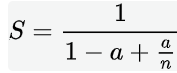
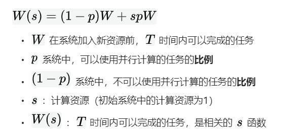

## 一、必须知道的基本概念有哪些？
<!--more-->
### 1.同步和异步是什么？
同步和异步通常用来形容一次方法调用。同步方法调用一旦开始，调用者必须等到方法调用返回后，才能继续后续的行为。异步方法调用更像一个消息传递，一旦开始，方法调用就会立即返回，调用者就可以继续后续的操作。

**现实例子:**
同步->线下购物(下单付款-当场拿到商品)
异步->线上购物(下单付款-晚点拿到商品-快递送货上门)

### 2.并发和并行是什么？
并发和并行很容易让人混淆。它们都可以表示两个或多个任务一起执行，但是侧重点却有效不同。并发侧重于多个任务交替执行，而多个任务之间有可能还是串行，而并行是真正意义上的同时执行。

**从严格意义上说：**
并行的多个任务是真的同时执行，而对于并发来说，这个过程只是交替，一会儿执行任务A，一会儿执行任务B，系统会不停地在两者之间切换。但对于外部观察者来说，即使多个任务之间是串行并发的，也会造成多任务间并行执行的错觉。

**现实例子：**
并发->工作时间内-我既能从事技术管理工作，也能也从事设计与研发工作。
并行->非工作时间内-我一边听音乐一边写作。

### 3.临界区是什么？
临界区用来表示一种公共资源或者说共享数据，可以被多个线程使用。但是每一次，只能有一个线程使用它，一旦临界区资源被占用，其他线程要想使用这个资源就必须等待。

**现实例子：**
某个公司比较穷，为了降低成本，租住在居民楼中，一室一厅一卫，老板在一室，员工在一厅，卫生间只有一个，员工和老板只能轮流使用，一方使用一方只能等待着另外一方使用完毕后才能使用。

### 4.阻塞和非阻塞是什么？
阻塞和非阻塞通常用来形容多线程间的相互影响。比如一个线程占用了临界区资源，那么其他所有需要这个资源的线程就必须在这个临界区中等待。等待会导致线程挂起，这种情况就是阻塞。
非阻塞的意思与之相反，它强调没有一个线程可以妨碍其他线程执行，所有的线程都会尝试不断前向执行。

**现实例子:**
阻塞->通过第三方软件抢火车票，没有票挂着，等待着放票。
非阻塞->作为多年的酒鬼，这时被困在某个地方，没有喜欢喝的白酒，周边只有啤酒，这时凑合着照样喝(也就是丝毫不影响我喝酒)。

### 5.死锁、饥饿、活锁是什么？
死锁、饥饿和活锁都属于多线程的活跃性问题。

死锁是指两个或两个以上的进程在执行过程中，由于竞争资源或者由于彼此通信而造成的一种阻塞的现象，若无外力作用，它们都将无法推进下去。此时称系统处于死锁状态或系统产生了死锁，这些永远在互相等待的进程成为死锁进程。

饥饿是指某一个或者多个线程因为种种原因无法获得所需要的资源，导致一直无法执行。

活锁是指任务没有被阻塞，由于某些条件没有满足，导致一直重复尝试—失败—尝试—失败的过程。 处于活锁的实体是在不断的改变状态，活锁有可能自行解开。

**现实例子:**

死锁->A、B、C等三辆小车正在行驶，突然B占用了A要行驶的车道，C占用了B要行驶的车道，A占用了C要行驶的车道，最终谁也无法行驶。
饥饿->典型的金字塔模型 金字塔顶端充分享有丰富的物质与特权 底端经常为生存而发愁 时常饥饿
活锁-> 公交车给小朋友、老人、孕妇等让座

## 二、并发的级别包含哪些？
**并发的级别一共有五种，分别如下：**
● 阻塞
● 无饥饿
● 无障碍
● 无锁
● 无等待

## 三、有关并行的两个重要定律是什么？
● 阿姆达尔定律
● 古斯塔夫森定律

### 1.阿姆达尔定律是什么？
Amdahl's law（阿姆达尔定律） 由计算机科学家 Gene Amdahl 在 1967 年提出，旨在用公式描述在并行计算中，多核处理器理论上能够提高多少倍速度，**公式如下：**

 S为 speedup，代表全局加速倍速（原来总时间/ 加速后总时间）， 为并行计算所占比例（可以并行计算代码量 / 总代码量）， 为并行节点处理个数，可以理解为 CPU 的核心数，
 
 
### 2.古斯塔夫森定律是什么？

**解释：**
系统在规定时间 内，可以完成的计算量， 随着加入的计算资源增加而增加。

## 四、JMM(Java内存模型)
JMM的关键技术点都是围绕着多线程的原子性、可见性和有序性来建立的。

### 1.原子性是什么？
原子性是指一个操作是不可中断的。即使是在多个线程一起执行的时候，一个操作一旦开始，就不会被其他线程干扰。

### 2.可见性是什么?
可见性是指当一个线程修改了某一个共享变量的指时，其他线程是否能够立即知道这个修改。

### 3.有序性是什么？
有序性是指程序执行的顺序按照代码的先后顺序执行。在并发时，程序的执行可能就会出现乱序。给人最直观的感觉是：写在前面的代码，会在后面执行。

**有序性问题的原因在于：**程序在执行时，可能会进行指令重排，重排后的指令与原指令的顺序未必一致。

当然了，还有就是并不是所有的指令都会重排，有一些指令是无法重排的，**需要遵循如下基本原则:**
● 程序顺序原则：一个线程内保证语义的串行性。
● volatile原则：volatile变量的写先于读的发生，这保证了volatile变量的可见性。
● 锁规则：解锁必然发生在随后的加锁前。
● 传递性：A先于B，B先于C，那么A必然先于C。
● 线程的start()方法先于它的每一个动作。
● 线程的所有操作优于线程的终结。
● 线程的中断先于被中断线程的代码。
● 对象的构造函数的执行、结束先于finalize()方法。