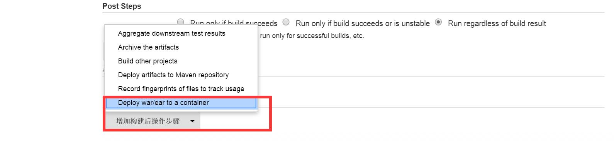
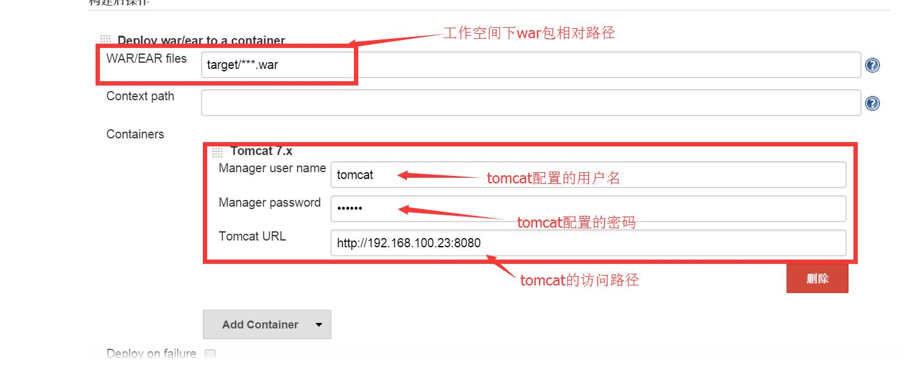

关于Linux安装Jenkins可以参考我的这篇博文[Ubuntu16.04环境安装jenkins](https://www.cnblogs.com/youcong/p/8710025.html)
<!--more-->
## 1.安装部署插件
进入插件管理，并搜索该插件Deploy to container Plugin进行安装 ，下载地址为：https://wiki.jenkins-ci.org/display/JENKINS/Deploy+Plugin 


## 2.安装完后，将会在项目配置中见到一下选项


## 3.修改tomcat-users.xml
```
<role rolename="manager-gui"/>
<role rolename="manager-script"/>
<role rolename="manager-jmx"/>
<role rolename="manager-status"/>
<role rolename="admin-gui"/>
<role rolename="admin-script"/>
<user username="admin" password="123456" roles="manager-gui,manager-script,manager-jmx,manager-status,admin-gui,admin-script"/>


```


## 4.host-manager和manager项目下的/META-INF/下有个context.xml，将其修改为如下
```
<Context antiResourceLocking="false" privileged="true" >
  <Valve className="org.apache.catalina.valves.RemoteAddrValve"
         allow="\d+\.\d+\.\d+\.\d+|::1|0:0:0:0:0:0:0:1" />
  <Manager sessionAttributeValueClassNameFilter="java\.lang\.(?:Boolean|Integer|Long|Number|String)|org\.apache\.catalina\.filters\.CsrfPreventionFilter\$LruCache(?:\$1)?|java\.util\.(?:Linked)?HashMap"/>
</Context>


```
## 5.配置jenkins

当然要想部署多个tomcat 还以点击 Add Container 添加容器


主要参考如下资料:
[使用jenkins 插件自动部署项目至tomcat](http://www.cnblogs.com/llining/p/4943291.html)
[tomcat8设置用户名和密码](https://xhnszdm.iteye.com/blog/2309327)
[tomcat8 tomcat-users相关配置](https://blog.csdn.net/fly_leopard/article/details/79654254)