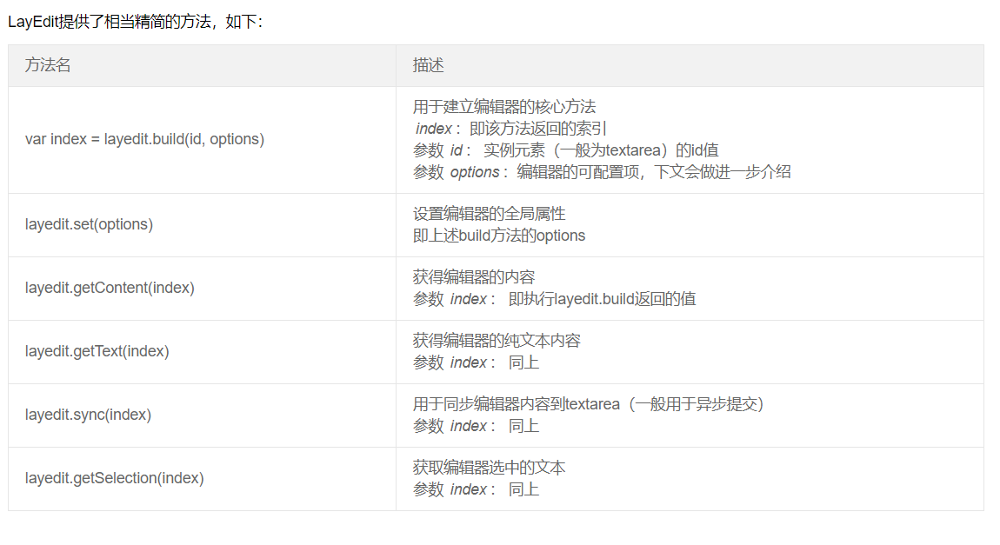
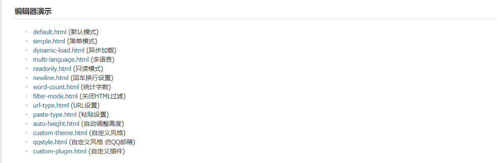

我的博客本来打算使用layui的富文本编辑器，但是出了一个问题，无法获取编辑器内容，我参考官方文档，获取内容也就那几个方法而已，但是引入进去后始终获取的值为空，百度和bing都试过了，但是始终还是获取不到值。
<!--more-->
layui富文本编辑器文档如下图所示:

能尝试的方法都试过了，最后实在没有办法，只好引入新的富文本编辑解决这个问题。

现在回到这个话题上，如何使用KindEditor富文本编辑器?

## 1.去官网下载对应的js库
官网地址为:http://kindeditor.net/down.php

## 2.对应的效果可以看官网demo
进入官网，点击演示，出现如图所示:

下面的编辑器例子，你可以根据自己的需求而定，我选择默认的。

## 3.具体使用可以看官方文档
官方文档地址为:http://kindeditor.net/doc.php
如果说你想直接越过官方文档直接引入到自己的系统里面，其实很简单，请点击进入对应的演示界面，使用Google浏览器，右击查看源代码即可，源代码里面就包含n它所引用的库和相关的js。

