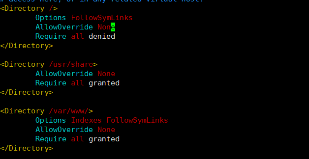
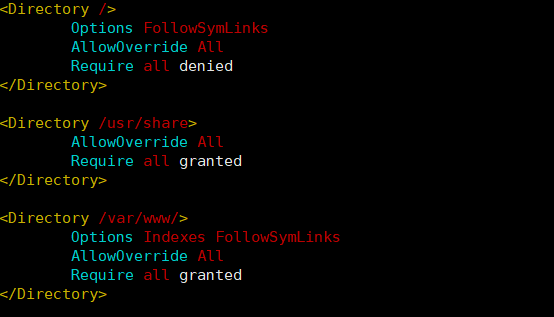
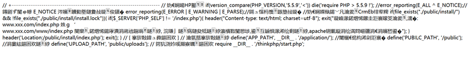
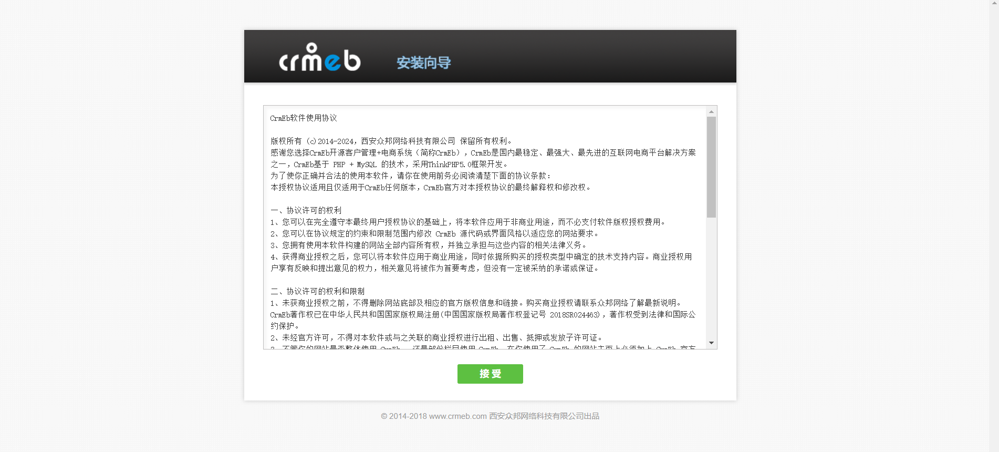
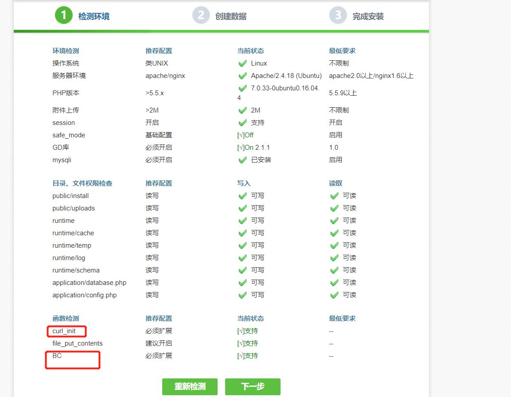
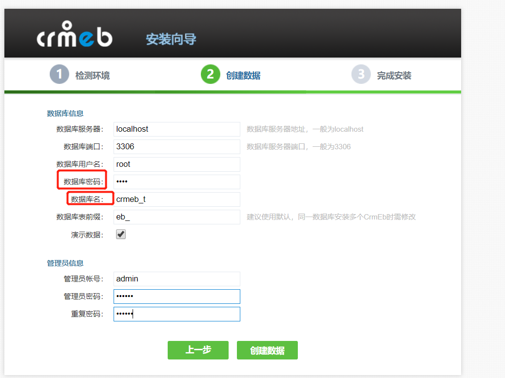
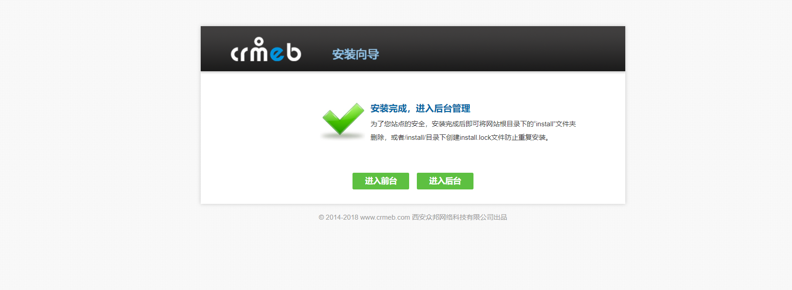
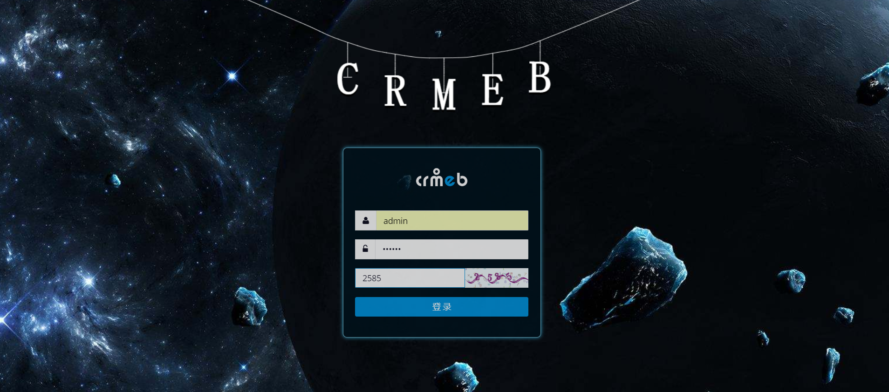
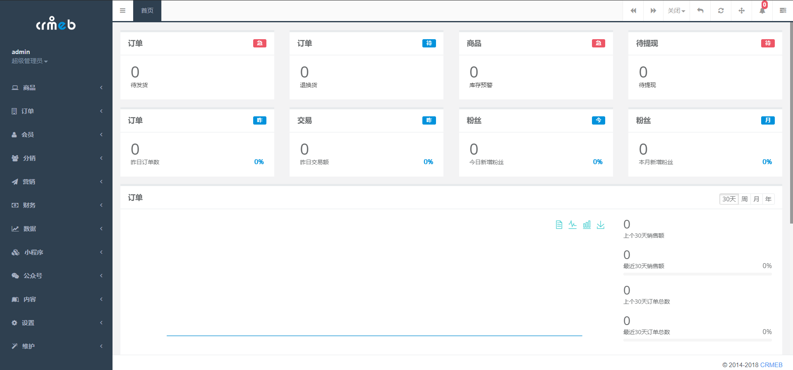

环境准备:
PHP7.0.33
MySQL5.7
Apache2.4

PHP环境安装:

```
sudo apt-get install php-pear php7.0-cli php7.0-common php7.0-curl \
    php7.0-dev php7.0-fpm php7.0-json php7.0-mbstring php7.0-mcrypt \
    php7.0-mysql php7.0-opcache php7.0-zip php7.0-intl php7.0-gd php7.0-xml


```
MySQL环境安装:
```
sudo apt-get install mysql-client mysql-server

```

Apache2.4环境安装
```
sudo apt-get install apache2

```
<!--more-->

## 克隆Gitee项目
```
cd /var/www/html

git clone https://gitee.com/ZhongBangKeJi/CRMEB

```


## 修改apache的配置(vim /etc/apache2/apache2.conf)
可以通过`/Option`快速定位查找
配置文件如下:


将其改为如下:



修改完apache配置文件后，记得重启一下apache(重启可以让配置文件生效)
```
/etc/init.d/apache2 restart

```
## 访问http://IP/CRMEB出现如图


解决办法:
```
apt-get install libapache2-mod-php

```

这个问题的原因是因为apache没有对php的解析模块导致的，安装一下就好了。
安装后记得重启一下apache2

这时在访问时，出现如图:


这样就表示没有问题了，这时你只需输入http://IP/CRMEB/public/install进入安装即可
再进入安装前，先给目录授权一下，不然监测环境会出现目录、文件权限监测不通过问题
## 授权
```
cd /var/www/html/CRMEB

chmod -R 777 public
chmod -R 777 runtime
chmod -R 777 application

```


## 安装流程
(1)安装向导


(2)检测环境

红色标记处是常见错误，可参考后面的问题解决链接。

(3)创建数据库

红色标记处是常见错误，可参考后面的问题解决链接。

(4)安装成功


点击进入后台,如图:



后台管理界面如图:

本地虚拟机访问地址:http://IP/CRMEB/admin/login/index.html
如果是远程服务器，访问地址就变更为:http://IP/index.php/admin/login/index.html

注意如果你访问后台管理界面并不像上面那样，而是出现没有样式的登录界面，请在/var/www/html/CRMEB目录下执行
```
cp -r ./* ../

```
最后再重启一下apache服务器发现就正常可以看到登录界面了。


问题解决链接:
[PHP无法使用curl_init()函数](https://developers-youcong.github.io/2019/05/06/PHP%E6%97%A0%E6%B3%95%E4%BD%BF%E7%94%A8curl-init-%E5%87%BD%E6%95%B0/)
[请在mysql配置文件修sql-mode或sql_mode为NO_AUTO_CREATE_USER,NO_ENGINE_SUBSTITUTION](https://developers-youcong.github.io/2019/05/06/%E8%AF%B7%E5%9C%A8mysql%E9%85%8D%E7%BD%AE%E6%96%87%E4%BB%B6%E4%BF%AEsql-mode%E6%88%96sql-mode%E4%B8%BANO-AUTO-CREATE-USER-NO-ENGINE-SUBSTITUTION/)


参考资料如下:
[CRMEB官方安装文档](https://www.kancloud.cn/crmeb/crmeb/895383)

