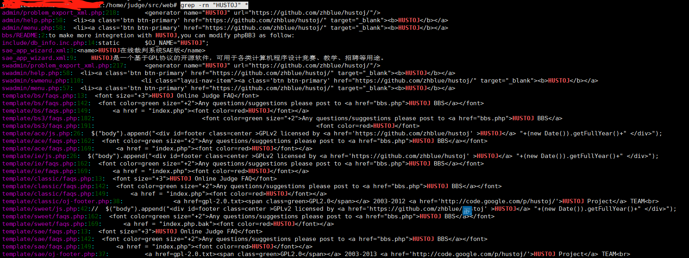

主要命令如下:
```
grep -rn "{填写关键字}" *

```

* : 表示当前目录所有文件，也可以是某个文件名
-r 是递归查找
-n 是显示行号
-R 查找所有文件包含子目录
-i 忽略大小写
-l 只列出匹配的文件名
-L 列出不匹配的文件名
-w 只匹配整个单词，而不是字符串的一部分（匹配 hello，不匹配helloo）


应用场景:
比如我最近我在我个人的服务器上弄一个在线评测，我想改改它的源代码，这时我可以通过关键字搜索来搜索，这样总比一个个的文件里面找要方便多了。
<!--more-->

例子如下:
```
grep -rn "HUSTOJ" *

```

效果图如下:
