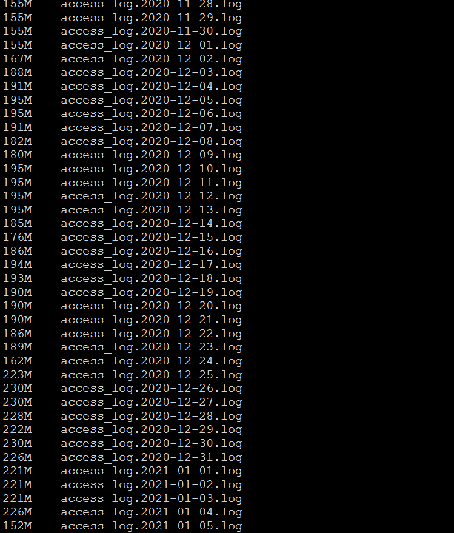

### 一、问题是如何发现的以及如何解决的
<!--more-->
某天前端在调接口的时候，发现登录页面得验证码接口居然没有响应数据，显示的是500响应码。于是我一路排查，首先排查验证码接口所属的微服务是否正常，通过lsof -i:服务端口进行排查，发现该微服务进程存在，同时我在服务注册中心的服务管理列表也发现该服务正常注册。结合之前遇到的问题，验证码接口报500，没有及时响应数据，与Redis有关，验证码的数据会存放Redis，我再次排查Redis，发现Redis也正常，最后我看错误日志。**我排查该问题的步骤:**
- 第一排查提供验证码的微服务是否正常；
- 第二排查服务注册中心是否有该服务；
- 第三排查Redis是否正常运行；
- 最后查看日志。
最后我从错误日志中看到了设备上没有空间这样的错误信息。当时我还没有意识到，可能是Linux磁盘空间不足的原因，下意识使用程序员的万能绝招"重启"，但"重启"并没有从根本上解决这个问题，这里提到的"重启"是指重启Java应用而不是重启Linux服务器。最后发现重启也不能解决这个问题，于是我又下意识的觉得是内存的原因，于是便直接关闭其它无需和前端对接口的微服务，突然发现问题一下解决了。于是就没有深究了。
而后过了一个小时左右，前端又再次反馈其它接口有问题了，不能及时响应正确的数据，全部报500，这时我开始慌了，隐隐约约觉得问题并未从根本上解决，根本不是内存的原因，这时我才想起用free -m命令查看一下内存的使用，发现还有2个多G的内存，排除了内存不足的原因，通常运行Java应用，内存不足会报如下异常:

```
Java HotSpot(TM) 64-Bit Server VM warning: INFO: os::commit_memory(0x0000000794500000, 576716800, 0) failed; error='Cannot allocate memory' (errno=12)

```
这时我冷静下来，看日志信息，再次发现了这句话"设备上没有空间"。于是通过关键字搜索，找到了问题所在，如图所示:


结合Windows，形象地概括，就是我的系统盘C盘满了。

### 二、当时我很疑惑为什么/dev/mapper/centos-root一下就满了呢？
我仔细想了下，发现我将很多软件和服务以及日志全部放在/usr下的某个目录里，于是我一路排查后，发现有这么几类文件占用很大的空间:
- 日志文件(Nacos日志以及各项微服务日志、MySQL日志、系统日志等足足10G以上，这时我终于明白了，为什么日志要实时备份传输以及删除了)；
- 遗留的软件包和压缩包(10G以上)；
- 静态文件(离线地图，足足占了20G以上)和其它图片文件；
- 项目源代码以及打包成功后的jar(3个多G)；
- Maven仓库(足足占了5个多G)。

### 三、问题已经定位到了，那么我是如何解决这个问题的？
问题的根源在于不合理的占用系统盘空间，将这些不合理的从系统盘空间转移出去即可，转移到磁盘空间充足的，也就是/dev/mapper/centos-home下。

**我做了这些事情:**
- 备份日志，下载到本地(目前备份服务器还没有申请下来，同时关于哪些需要保留的，需要内部协商探讨)，原有的日志进行删除(这个工作可以脚本化)；
- 遗留软件包和压缩包直接删除；
- 静态文件迁移至/home下的某个用户目录，通过配置进行映射(确保迁移后仍不影响正常的访问)；
- 项目源代码迁移到/home下的某个用户目录；
- 修改Maven配置文件，仓库地址指向/home下的某个用户目录。

最终解决了这个问题，释放了50%的空间，其中还有15%暂时不能动。
这样一来，/dev/mapper/centos-root这个系统盘得到了充分释放，同时/dev/mapper/centos-home也得到了充分利用(不再资源闲置)。

### 四、问题列表和具体解决措施

#### 1.如何通过Linux命令知道当前磁盘空间使用情况?
命令格式如下:
du -sh 文件路径
```
du -sh *

```
执行就能看到当前文件以及文件夹所占用内存。占用内存多的，可进一步查看到底是什么原因占用这么多内存的。

下面就是我通过du -sh *命令查看内存占用最多的文件或文件夹:
- Nacos;
- MySQL;
- Nginx;
- Project。

#### 2.为什么Nacos会占用这么多内存呢？它仅仅是一个服务注册中心并不对外提供服务。
通过du -sh *命令，我排查到原来是nacos下的bin目录占用内存最多，其它很少，于是我进一步查看，发现bin目录下的log目录占用内存最多，因为该log目录下主要是nacos的访问日志，最后我通过du -sh *命令查看，如图所示:

由图可知，平均一个日志文件就是一百多M，足足占了十几个G也就不足为奇了。

我的解决办法很简单，分为两个方面:
第一方面是定时删除仅保留一个和备份迁移到/home下的某个目录;
第二个方面通过修改nacos的配置解决，具体参考如下链接:
[Nacos系列(4)-Nacos各种日志太多问题的终极解决办法](https://blog.csdn.net/qq_43437874/article/details/108027122)

#### 3.为什么MySQL会占用这么多磁盘空间？
通过命令排查(即du -sh *)，我发现是MySQL下的data目录占用磁盘空间最大，其中有一个足足占了4个多G，针对这样的问题，我将其直接由/usr/software目录下迁移到/home下，这样一来系统盘的空间再度得到释放，迁移后需要改mysql的配置文件(即my.cnf文件)。

#### 4.Nginx为何占用这么多磁盘空间？
之所以占用这么多，前面我提到过是因为离线地图，离线地图包括街道地图和卫星地图，两个加在一起足足二十多G，为此我将其迁移到/home下的某个目录，然后修改Nginx的核心配置nginx.conf文件进行映射，这样一来系统盘的空间再次得到释放，同时用户盘的空间得到了充分利用。

#### 5.关于Project
Project主要放源代码和打包成功产生的jar，我还是用老办法将其迁移(迁移到/home下的某个目录)。


### 五、问题的根本原因是什么？为什么我需要排查这么长时间才定位到这个原因呢？
问题的根本原因在于不规范性。正常来说，不应该将用户磁盘空间做的事情放在系统磁盘空间(与Windows同理)。从这一刻起，我也深深意识到规范性的重要，不规范性导致的bug何止千千万万，仔细想来我的开发经历，造成bug的绝大多数原因均是因为不规范，因为不规范，暴露出各种奇奇怪怪的bug。
另外从我排查问题来看也是很有问题的，问题在于没有用正确的态度对待日志，其实一开始仔细排查日志，定位到这个关键信息，然后将这样的关键信息复制搜索引擎来寻找解决办法，这样一来就不必浪费了近一个多小时来捣鼓这样的事情。

### 六、如何避免这样的问题再现？以及通过这样的问题总结出什么样的原则？
首先这样的问题属于运维范畴，而我作为公司的兼职运维，面对这样的问题，首先从规范入手，制定可行的规范，从根本上杜绝这样的问题再现，对于这样的问题，**我总结的原则如下:**
- (1)不同的用户做不同的事情，保持Linux用户的功能专一性(后面会提到一个重大bug,是因为违反这样的原则导致的)；
- (2)遇到问题，分为两个方面来解决，见过和没有见过，见过表示过去我遇到过这样的问题，可以借鉴以往经验来快速解决这个问题；没有见过的问题，严格遵守的流程:复现问题->仔细查看日志->定位问题->解决问题->总结并存入知识库(如有必要进行定期复盘)。总而言之，最关键的在于定位问题(如何定位问题，可通过重复复现问题->仔细查看日志这样的步骤来定位；
- (3)针对常见运维需求，编写脚本(如监控系统磁盘使用情况以及用户磁盘使用情况，超出阈值，自动告警和人工干预)，推进脚本自动化；
- (4)制定适合当下情况的运维规范(如安装软件安在哪个目录、大文件放在哪个目录、日志存放多久并备份后自动清除、每个用户只做自己的事情等,根据实际情况不断增加和修订，定期写入文档进行维护)。


