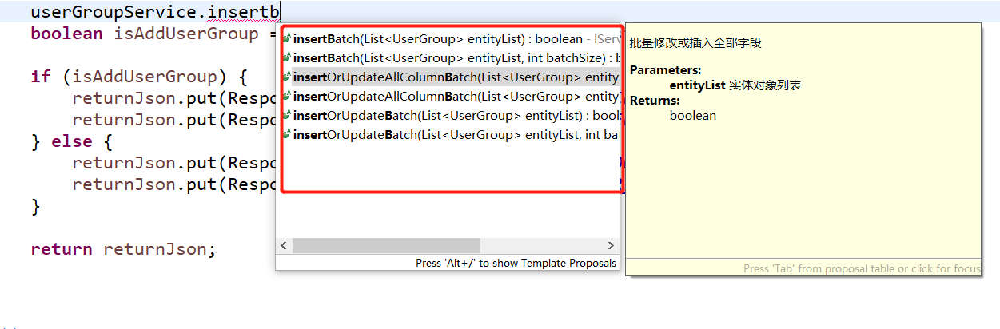

批量操作在实际开发中也应用非常多，例如批量下发优惠券、批量添加用户等。

以MyBatis为例，通常实现批量操作，有这么几种方式?

第一，单条插入sql语句，进行for循环遍历，基准条件是根据前端传过的数组长度而定，如果传了四个参数过来，也就是长度为4，代表遍历4次(也就是执行四次插入)，这种方式不太建议采用;

第二、编写相关mapper
关于这一点不再赘述，，也参考我的这篇文章[SSM框架之批量增加示例(同步请求jsp视图解析)](https://www.cnblogs.com/youcong/p/9356776.html)
其主要使用的就是MyBatis的动态sql;


换做MyBatis-Plus，就不必要编写批量新增相关的sql以及mapper(可以理解为数据访问接口)，因为MyBatis-Plus已经封装好了，你只需按照对应的规则进行调用即可。

以下面这段路由层代码为例，示例如下:
<!--more-->
```
    @PostMapping("/betchAddUserGroup")
	@ApiOperation(value = "批量添加用户到对应的分组", notes = "批量添加用户到对应的分组")
	public JSONObject betchAddUserGroup(@RequestParam String[] userIds, @RequestParam String groupId) {

		JSONObject returnJson = new JSONObject();
		
        ArrayList<UserGroup> list = new ArrayList<UserGroup>();
		
        for (String userId : userIds) {
			Console.log("userId:" + userId);

			UserGroup userGroup = new UserGroup();
			userGroup.setGroupId(Integer.parseInt(groupId));
			userGroup.setUserId(Integer.parseInt(userId));
			list.add(userGroup);

		}

		boolean isAddUserGroup = userGroupService.insertBatch(list);

		if (isAddUserGroup) {
			returnJson.put(ResponseUtils.CODE, ResponseUtils.SUCCESS_CODE);
			returnJson.put(ResponseUtils.MSG, ResponseUtils.SUCCEESS_MSG);
		} else {
			returnJson.put(ResponseUtils.CODE, ResponseUtils.ERROR_CODE);
			returnJson.put(ResponseUtils.MSG, ResponseUtils.ERROR_MSG);
		}

		return returnJson;

	}


```


这里我使用的是insertBetch，关于MyBatis-Plus批量添加或修改相关的API，如图:
