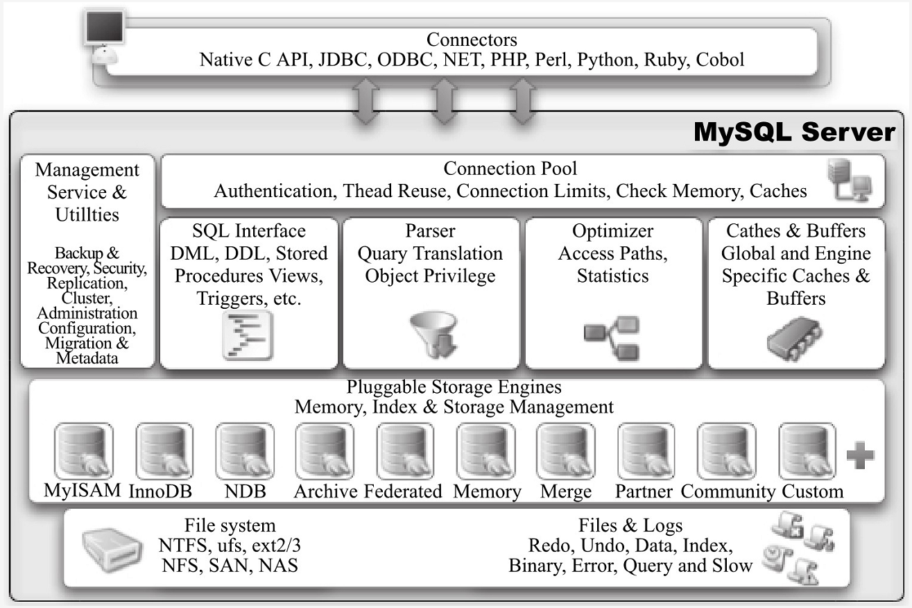

## 一、定义数据库和实例

数据库和实例在数据库领域很容易被混淆。作为常见的数据库术语，这两个词定义如下:

### 数据库
物理操作系统文件或其他形式文件类型的集合。在MySQL数据库中，数据库文件可以是frm、MYD、MYI、ibd结尾的文件。当使用NDB引擎时，数据库的文件可能不是操作系统上的文件，而是存放于内存之中的文件，但是定义仍然不变。

**那么什么是NDB引擎(这里稍微普及一下)?**
NDB也称为NDB CLUSTER, 是另一种存储引擎，但是它主要存储数据在内存中，并且独立于MySQL Server实例。它是MySQL Cluster使用的存储引擎。 NDB代表“网络数据库”。

参考资料:
[InnoDB和NDB，MySQL群集和InnoDB群集之间有什么区别？](https://www.cnblogs.com/margiex/p/12706567.html)

### 实例
MySQL数据库由后台线程以及一个共享内存区组成。共享内存可以被运行的后台线程所共享。需要牢记的是，**数据库实例才是真正用于操作数据库文件的。**

两个词的可以互换使用，但两者的概念完全不同。
因为在MySQL数据库中，实例与数据库的关系通常是一一对应的，即一个实例对应一个数据库，一个数据库对应一个实例。但是，在集群情况下可能存在一个数据库被多个数据实例使用的情况。

关于MySQL集群可以参考:
[Mysql集群搭建（多实例、主从）](https://blog.csdn.net/qq_21153619/article/details/81529880)
[如何在Ubuntu 16.04上安装MySQL集群](https://www.howtoing.com/how-to-install-a-mysql-cluster-on-ubuntu-16-04/)

## MySQL体系结构

### 数据库和数据库实例容易混淆?
从概念上来说，
数据库是文件的集合，是依照某种数据模型组织起来并存放于二级存储器中的数据集合;
数据库实例是程序，是位于用户与操作系统之间的一层数据管理软件，用户对数据库数据的任何操作，包括数据库定义、数据查询、数据维护、数据库运行控制等都是在数据库实例下进行的，应用程序只有通过数据库实例才能和数据库打交道。

MySQL数据库体系结构，如下图所示:

由图可知，MySQL由以下几部分组成:
连接池组件
管理服务和工具组件
SQL接口组件
查询分析器组件
优化器组件
缓存组件
插件式存储组件
物理文件

**MySQL区别于其他数据库的最重要的一个特点是骑插件式的表存储引擎。**

**存储引擎是基于表的，而不是数据库。**

## 二、MySQL存储引擎
存储引擎是MySQL区别于其他数据库的一个最重要特性。

存储引擎的好处是，每个存储引擎都有各自的特点，能够根据具体的应用建立不同存储引擎表。

### 1.InnoDB存储
InnoDB存储引擎支持事务，其设计目标主要面向在线事务处理的应用。

特点:行锁设置、支持外键、并支持类似于Oracle的非锁定读(默认读取操作不会产生锁)。

从MySQL数据库5.5.8版本开始InnoDB是默认的存储引擎。

每个InnoDB存储引擎的表单独放到一个独立的ibd文件中。

InnoDB存储引擎支持用裸设备用来建立表空间。

InnoDB通过使用多版本并发控制来获得高并发性，并且实现了SQL标准的4种隔离级别，默认为RE-PEATABLE级别。同时使用了next-key locking的策略避免幻读现象的产生。

InnoDB存储引擎还提供了插入缓冲、二次写、自适应哈希索引、预读等高性能和高可用的功能。

对于表中数据的存储，InnoDB存储引擎采用了聚集的方式，因此每张表的存储都是按主键的顺序进行存放。如果没有显式地在表定义时指定主键，InnoDB存储引擎会为每一行生成一个6字节的ROWID，并以此作为主键。

InnoDB存储引擎是MySQL数据库最为常用的一种引擎。