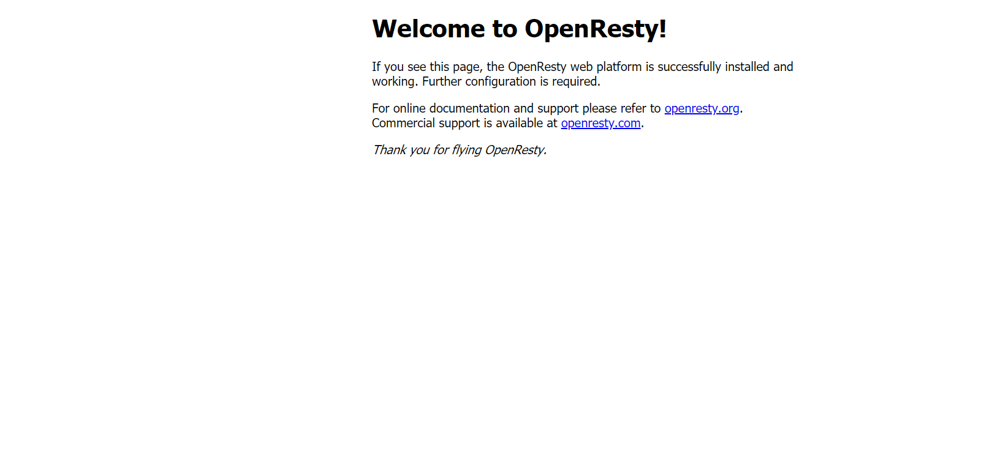

### 一.下载源码包
```
wget https://openresty.org/download/openresty-1.17.8.1.tar.gz
wget http://labs.frickle.com/files/ngx_cache_purge-2.3.tar.gz
wget https://github.com/yaoweibin/nginx_upstream_check_module/archive/v0.3.0.tar.gz 

```
<!--more-->
### 二、解压
```
tar -xzvf openresty-1.17.8.1.tar.gz
tar -xzvf ngx_cache_purge-2.3.tar.gz
tar -xzvf v0.3.0.tar.gz

```

### 三、将ngx_cache_purge和nginx_upstream_check_module移动至openresty-1.17.8.1/bundle下
```
cp -r ngx_cache_purge-2.3 openresty-1.17.8.1/bundle/
cp -r nginx_upstream_check_module-0.3.0 openresty-1.17.8.1/bundle/
```
### 四、编译安装

```
./configure --prefix=/usr/local/openresty --with-luajit --with-http_ssl_module --user=root --group=root --with-http_realip_module --add-module=./bundle/ngx_cache_purge-2.3/ --add-module=./bundle/nginx_upstream_check_module-0.3.0/

```
出现如下所示，表示Ok:
```
出现如下表示OK:
Configuration summary
  + using system PCRE library
  + using system OpenSSL library
  + using system zlib library

  nginx path prefix: "/usr/local/openresty/nginx"
  nginx binary file: "/usr/local/openresty/nginx/sbin/nginx"
  nginx modules path: "/usr/local/openresty/nginx/modules"
  nginx configuration prefix: "/usr/local/openresty/nginx/conf"
  nginx configuration file: "/usr/local/openresty/nginx/conf/nginx.conf"
  nginx pid file: "/usr/local/openresty/nginx/logs/nginx.pid"
  nginx error log file: "/usr/local/openresty/nginx/logs/error.log"
  nginx http access log file: "/usr/local/openresty/nginx/logs/access.log"
  nginx http client request body temporary files: "client_body_temp"
  nginx http proxy temporary files: "proxy_temp"
  nginx http fastcgi temporary files: "fastcgi_temp"
  nginx http uwsgi temporary files: "uwsgi_temp"
  nginx http scgi temporary files: "scgi_temp"

cd ../..
Type the following commands to build and install:
    make
    make install
	

```
接着再执行如下:
```
make && make install

```

不报错并再/usr/local/目录下发现openrestry，就表示安装成功。

### 五、启动
```
cd /usr/local/openresty/nginx

./sbin/nginx

```

界面效果，如图所示:


本文主要参考资料如下:
[Openresty 源码编译安装 Nginx模块安装Njs](https://blog.csdn.net/anhuizwwandthd/article/details/106140661)