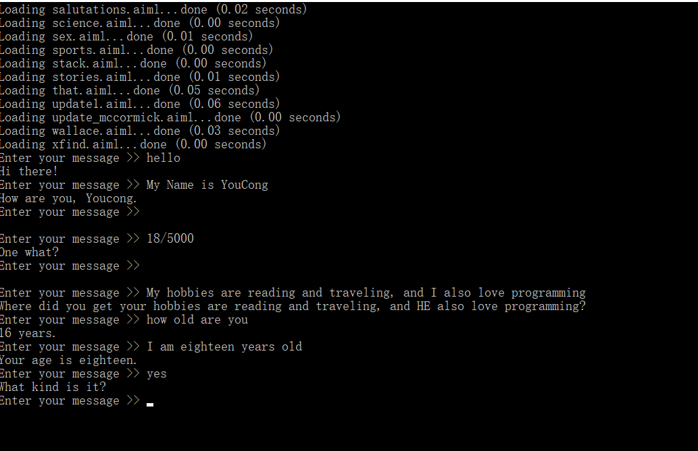
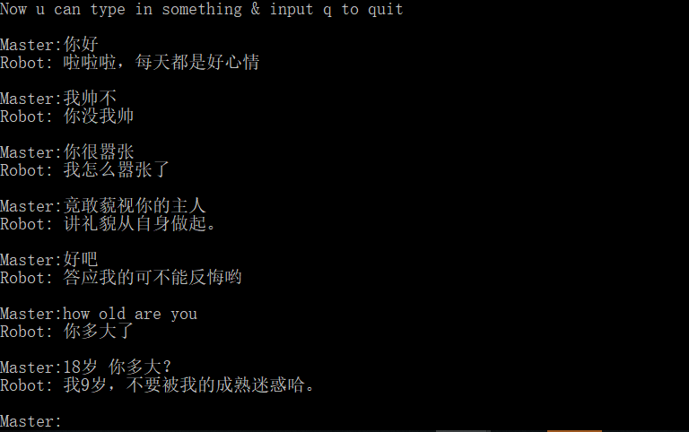

今天午休的时候，无意之中看了一篇博客，名字叫Python实现机器人，感觉挺有的意思的。
<!--more-->
于是用其写了一个简单的Python聊天，源码如下所示:
```
# -*- coding: utf-8 -*-
import aiml
import sys
import os
  
  
def get_module_dir(name):
 print("module", sys.modules[name])
 path = getattr(sys.modules[name], '__file__', None)
 print(path)
 if not path:
  raise AttributeError('module %s has not attribute __file__' % name)
 return os.path.dirname(os.path.abspath(path))
  
  
alice_path = get_module_dir('aiml') + '\\botdata\\alice'
 
os.chdir(alice_path)  # 切换到语料库所在工作目录
 
alice = aiml.Kernel()  # 创建机器人alice对象
alice.learn("startup.xml") # 加载...\\botdata\\alice\\startup.xml
alice.respond('LOAD ALICE') # 加载...\\botdata\\alice目录下的语料库
  
while True:
 message = input("Enter your message >> ")
 if("exit" == message):
  exit()
 response = alice.respond(message) # 机器人应答
 print(response)
```

注意:如果出现某某模块找不到的时候，记得使用pip安装对应的模块。

效果图如下所示:


唯一美中不足的是英文，不过没关系，国内有图灵机器人。

代码如下所示:
```
from urllib.request import urlopen,Request
from urllib.error import URLError
from urllib.parse import urlencode
import json

class TuringChatMode(object):
    """this mode base on turing robot"""

    def __init__(self):
        # API接口地址
        self.turing_url = 'http://www.tuling123.com/openapi/api?'

    def get_turing_text(self,text):
        ''' 请求方式:   HTTP POST
            请求参数:   参数      是否必须        长度          说明
                        key        必须          32           APIkey
                        info       必须          1-32         请求内容，编码方式为"utf-8"
                        userid     必须          32           MAC地址或ID
        '''
        turing_url_data = dict(
            key = 'fcbf9efe277e493993e889eabca5b331',
            info = text,
            userid = '60-14-B3-BA-E1-4D',

        )
        # print("The things to Request is:",self.turing_url + urlencode(turing_url_data))
        self.request = Request(self.turing_url + urlencode(turing_url_data))
        # print("The result of Request is:",self.request)

        try:
            w_data = urlopen(self.request)
            # print("Type of the data from urlopen:",type(w_data))
            # print("The data from urlopen is:",w_data)
        except URLError:
            raise IndexError("No internet connection available to transfer txt data")
            # 如果发生网络错误，断言提示没有可用的网络连接来传输文本信息
        except:
            raise KeyError("Server wouldn't respond (invalid key or quota has been maxed out)")
            # 其他情况断言提示服务相应次数已经达到上限

        response_text = w_data.read().decode('utf-8')
        # print("Type of the response_text :",type(response_text))
        # print("response_text :",response_text)

        json_result = json.loads(response_text)
        # print("Type of the json_result :",type(json_result))
        return json_result['text']

if __name__ == '__main__':
    print("Now u can type in something & input q to quit")

    turing = TuringChatMode()

    while True:
        msg = input("\nMaster:")
        if msg == 'q':
            exit("u r quit the chat !")         # 设定输入q，退出聊天。
        else:
            turing_data = turing.get_turing_text(msg)
            print("Robot:",turing_data)

```

效果图如下:


可能由于机器人智能太低了，有点答非所问。

更多精彩可以去图灵机器人官网了解:http://www.tuling123.com

编程的世界是有趣的，你去探索，你会发现很多有意思的事情。
