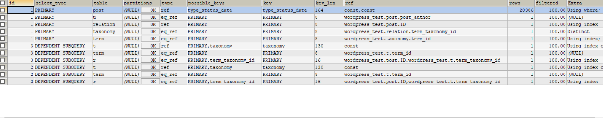
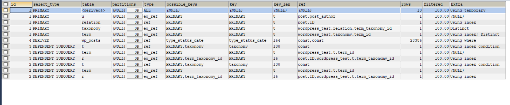

问题背景:
博客首页随着数据量的增加，最初是几百上千的数据，访问正常，这是开发环境，当切换测试环境(通过爬虫已有数据六万多)，这时候访问非常缓慢，长达一分钟。
<!--more-->

问题SQL:
```
            SELECT
            DISTINCT post.`ID` AS postId,post.`post_title`,post.`post_content`,post.`post_excerpt`,u.`display_name`,
            (SELECT IFNULL(GROUP_CONCAT(term.name),'') FROM wp_term_relationships AS r LEFT JOIN wp_term_taxonomy AS t ON(r.term_taxonomy_id = t.term_taxonomy_id) LEFT JOIN wp_terms AS term ON(term.term_id = t.term_id)
            WHERE r.object_id = post.ID AND t.taxonomy = 'category') AS categoryName,
            (SELECT IFNULL(GROUP_CONCAT(term.name),'') FROM wp_term_relationships AS r LEFT JOIN wp_term_taxonomy AS t ON(r.term_taxonomy_id = t.term_taxonomy_id) LEFT JOIN wp_terms AS term ON(term.term_id = t.term_id)
            WHERE r.object_id = post.ID AND t.taxonomy = 'post_tag') AS tagName,
            post.`comment_count`,post.`post_status`,post.`post_date`
            FROM wp_posts AS post
            LEFT JOIN wp_users AS u ON(post.`post_author` = u.`ID`)
            LEFT JOIN wp_term_relationships AS relation ON(relation.`object_id` = post.`ID`)
            LEFT JOIN wp_term_taxonomy AS taxonomy ON(taxonomy.`term_taxonomy_id` =relation.`term_taxonomy_id`)
            LEFT JOIN wp_terms AS term ON(term.`term_id` = taxonomy.`term_id`)
            WHERE post.`post_type` = 'post'
            AND post.`post_status` IN ('publish')
            ORDER BY post.`post_date` DESC
            LIMIT 0,10

```

将这段sql放在sqlyog里执行，结果花费时间如下:
执行:59.204sec 总数:59.239 10行(仅仅显示10条数据)


优化后的SQL:
```
SELECT
            DISTINCT post.`ID` AS postId,post.`post_title`,post.`post_content`,post.`post_excerpt`,u.`display_name`,
            (SELECT IFNULL(GROUP_CONCAT(term.name),'') FROM wp_term_relationships AS r LEFT JOIN wp_term_taxonomy AS t ON(r.term_taxonomy_id = t.term_taxonomy_id) LEFT JOIN wp_terms AS term ON(term.term_id = t.term_id)
            WHERE r.object_id = post.ID AND t.taxonomy = 'category') AS categoryName,
            (SELECT IFNULL(GROUP_CONCAT(term.name),'') FROM wp_term_relationships AS r LEFT JOIN wp_term_taxonomy AS t ON(r.term_taxonomy_id = t.term_taxonomy_id) LEFT JOIN wp_terms AS term ON(term.term_id = t.term_id)
            WHERE r.object_id = post.ID AND t.taxonomy = 'post_tag') AS tagName,
            post.`comment_count`,post.`post_status`,post.`post_date`
            FROM ( SELECT * FROM wp_posts WHERE `post_type` = 'post'  AND `post_status` IN ('publish') ORDER BY  `post_date` DESC LIMIT 0,10 ) AS post
            LEFT JOIN wp_users AS u ON(post.`post_author` = u.`ID`)
            LEFT JOIN wp_term_relationships AS relation ON(relation.`object_id` = post.`ID`)
            LEFT JOIN wp_term_taxonomy AS taxonomy ON(taxonomy.`term_taxonomy_id` =relation.`term_taxonomy_id`)
            LEFT JOIN wp_terms AS term ON(term.`term_id` = taxonomy.`term_id`)

```

将这段sql放在sqlyog里执行，结果花费时间如下:
执行:0.056sec 总数:0.288sec 10行(仅仅显示10条数据)


优化过后，直接是毫秒级。结果项目在测试环境下访问不卡了。

主要的改动把查询和过滤条件从最后面嵌入到主表的子查询里。


### 那么问题SQL为什么会这么慢？而优化过后的SQL为什么会突然一下如此迅速到毫秒级呢？

先看问题一，为什么问题SQL会这么慢，问题SQL:
```
  SELECT
            DISTINCT post.`ID` AS postId,post.`post_title`,post.`post_content`,post.`post_excerpt`,u.`display_name`,
            (SELECT IFNULL(GROUP_CONCAT(term.name),'') FROM wp_term_relationships AS r LEFT JOIN wp_term_taxonomy AS t ON(r.term_taxonomy_id = t.term_taxonomy_id) LEFT JOIN wp_terms AS term ON(term.term_id = t.term_id)
            WHERE r.object_id = post.ID AND t.taxonomy = 'category') AS categoryName,
            (SELECT IFNULL(GROUP_CONCAT(term.name),'') FROM wp_term_relationships AS r LEFT JOIN wp_term_taxonomy AS t ON(r.term_taxonomy_id = t.term_taxonomy_id) LEFT JOIN wp_terms AS term ON(term.term_id = t.term_id)
            WHERE r.object_id = post.ID AND t.taxonomy = 'post_tag') AS tagName,
            post.`comment_count`,post.`post_status`,post.`post_date`
            FROM wp_posts AS post
            LEFT JOIN wp_users AS u ON(post.`post_author` = u.`ID`)
            LEFT JOIN wp_term_relationships AS relation ON(relation.`object_id` = post.`ID`)
            LEFT JOIN wp_term_taxonomy AS taxonomy ON(taxonomy.`term_taxonomy_id` =relation.`term_taxonomy_id`)
            LEFT JOIN wp_terms AS term ON(term.`term_id` = taxonomy.`term_id`)
            WHERE post.`post_type` = 'post'
            AND post.`post_status` IN ('publish')
            ORDER BY post.`post_date` DESC
            LIMIT 0,10


```

程序自上而下，从左到右执行，先SELECT 再LEFT JOIN 多个表，最后再WHERE 以及 ORDER BY 和 LIMIT，咋看一下也没有问题啊，但实际上很有问题。

问题分析？？？
- 首先，我并没有使用SELECT * 而是列举我需要的字段。
- 使用explain 关键字看问题SQL,结果如下:

以type字段为主要的来说，表扫描方式:system>const>eq_ref>ref>range>index>all，最慢的是all，也就是全表扫描。

再看优化后的SQL:


为了更好的比较它们究竟有何区别，需要理解explain获取参数的含义。

#### explain关键字含义

##### (1)id
MySQL QueryOptimizer选定的执行计划中查询的序列号，表达查询中执行select子句或操作表顺序。id值越大优先级越高，优先级越高就会先被执行。id相同，执行顺序由上至下。

##### (2)select_type
- SIMPLE(简单的select查询(不使用union及子查询))
- PRIMARY(最外层的select查询，如果两表存在则查询，则外层的表操作为PRIMARY,内层(子查询)的操作为SUBQUERY)
- SUBQUERY(子查询中首个SELECT(如果有多个子查询存在)，不依赖于外层的表。除from子句中包含的子查询外，其他地方出现的子查询都可能是SUBQUERY)/DEPENDENT SUBQUERY(子查询中首个SELECT(如果有多个子查询存在)，就依赖于外层的表)

##### (3)table
输出行所引用的表。显示的查询表名，如果查询使用了别名，那么这里显示的是别名，如果不涉及对数据表的操作，那么这显示为null，如果显示为尖括号括起来的<derived N>就表示这个是临时表，后边的N就是执行计划的id，表示结果来自这个查询产生。如果是尖括号括起来的<union M,N>，与<derived N>类似，也是一个临时表，表示这个结果来自于union查询的id为M,N的结果集。

##### (4)type
从优到差的顺序如下:system->const->eq_ref->ref->fulltext->ref_or_null->index_merge->unique_subquery->index_subquery->range->index->all
一般来说，开发人员写的SQL基本要求是eq_ref级别。

##### (5)possible_keys
指出能再该表中使用哪些索引有助于查询，查询可能使用的索引都会再这里列出来。如果为空，说明没有可用的索引。

##### (6)key
实际从possible_key选择使用的索引，如果为null，则没有使用索引。select_type为index_merge时，这里可能出现两个以上的索引，其他的select_type这里只会出现一个。很少的情况下，MySQL会选择优化不足的索引。这种情况下，可以再SELECT语句中使用USE INDEX来强制使用一个索引或者用IGNORE INDEX来强制MySQL忽略索引。

##### (7)key_len
用于处理查询的索引长度，再不损失精确性的情况下，长度越短越好。如果是单列索引，那就整个索引长度算进去，如果是多列索引，那么查询不一定都能使用到所有的列，具体使用了多少个列的索引，这里就会计算进去，没有使用的列，这里不会计算进去。key_len只计算where条件用到的索引长度，而排序和分组就算用到了索引，也不会计算到ken_len中。

##### (8)ref
显示索引的哪一列被使用。如果使用的常数等值查询，这里会显示const，如果是连接查询，被驱动表的执行计划这里会显示驱动表的关联字段，如果条件使用了表达式或者函数，或者条件列发生内部隐式转换，这里可能会显示func。

##### (9)rows
认为必须检查的用来返回请求数据的行数，即需要扫描的次数。

##### (10)extra
这个列可以显示的信息很，如果出现Using filesort、Using temporary两项意味着不能使用索引，效率会受到重大影响。应尽可能对其进行优化。
- distinct:在select部分使用了distinct关键字
- using filesort:排序时无法使用到索引时，就会出现这个。常见于order by 和group by语句中。没有办法利用现有索引进行排序，需要额外排序，建议:根据排序需要，创建相应合适的索引。
- using index:查询时不需要回表查询，直接通过索引就可以获取查询的数据。利用覆盖索引，无需回表即可取得结果数据，这种结果是好的。
- using temporay:表示使用了临时表存储中间结果。
- using where:表示存储引擎返回的记录并不是所有的都满足查询条件，需要在server层进行过滤。

理解完explain后，用explain重要参数来解释这段问题SQL:
即key、type 、rows、extra。**以其中的rows来看，该段sql执行之初直接就扫描28386次数。而优化后的SQL仅仅扫描10次，由此可知慢在该地方，针对次进行修改。这是问题SQL慢的根本原因。**

但最后我发现优化后的SQL还算很冗余，因为作为首页展示，其实没必要这么多表关联，如果是查看详情的话还可以通过拆分，然后分段执行即可。

最终首页SQL如下(也相当于另外一种解法，优化为单表):
```
            SELECT
            DISTINCT post.`ID` AS postId,post.`post_title`,post.`post_content`,post.`post_excerpt`,
            (SELECT `display_name` FROM wp_users WHERE ID = post_author) AS display_name, 
            post.`comment_count`,post.`post_status`,post.`post_date` 
            FROM  wp_posts AS post
            WHERE `post_type` = 'post'  AND `post_status` IN ('publish')
            ORDER BY  `post_date` DESC
            LIMIT 0,10

```
另外除此之外，归档查询也是用的这段SQL,这样一来也需要优化，于是我将其分离写成不同的DAO，针对性优化(如果不优化，数据量过大也会有问题)。

问题SQL(归档,消耗8.183sec):
```
SELECT
            DISTINCT post.`ID` AS postId,post.`post_title`,post.`post_content`,post.`post_excerpt`,u.`display_name`,
            post.`comment_count`,post.`post_status`,post.`post_date`
            FROM ( SELECT * FROM wp_posts WHERE `post_type` = 'post'  AND `post_status` IN ('publish') 
AND DATE_FORMAT(`post_date`, '%Y年%m月') = '2020年06月'            
            ORDER BY  `post_date` DESC LIMIT 0,10 ) AS post
            LEFT JOIN wp_users AS u ON(post.`post_author` = u.`ID`)
       

```

问题SQL再度优化(这次执行时间是55.496sec):
```
SELECT
            DISTINCT post.`ID` AS postId,post.`post_title`,post.`post_content`,post.`post_excerpt`,u.`display_name`,
            post.`comment_count`,post.`post_status`,post.`post_date`
            FROM ( SELECT * FROM wp_posts WHERE `post_type` = 'post'  AND `post_status` IN ('publish') 
AND DATE_FORMAT(`post_date`, '%Y年%m月') = '2020年06月'            
            ORDER BY  `post_date` DESC LIMIT 0,10 ) AS post
            LEFT JOIN wp_users AS u ON(post.`post_author` = u.`ID`)

```

最终优化版:
```
 SELECT
            DISTINCT post.`ID` AS postId,post.`post_title`,post.`post_content`,post.`post_excerpt`,
            (SELECT `display_name` FROM wp_users WHERE ID = post_author) AS display_name,
             post.`comment_count`,post.`post_status`,post.`post_date` 
            FROM wp_posts AS post WHERE ID IN 
            (SELECT `ID` FROM wp_posts  WHERE `post_type` = 'post' AND `post_status` IN ('publish') AND DATE_FORMAT(`post_date`, '%Y年%m月') =  '2020年06月'  ORDER BY `post_date` DESC)
            LIMIT 0,10
       

```
这个优化版本，我的思路是归档抽取为一个子查询条件查询和排序获取ID，获取ID这段SQL是毫秒级，然后再在外层LIMIT即可。

### 通用规律和方法
- 通过explain关键字理解SQL走向和慢的原因(explain中的id可以了解sql是如何执行的)
- 学会拆分，一分为二写(以查看文章详情为例，可分为两部分，一部分为获取详情，另外一部分获取文章对应的分类或标签，这样一来sql基本上都可以确保为eq_ref级别且毫秒级)
- 合理使用子查询(例如归档这部分查id，拿获取的id作为where查询条件，背后的原理走主键索引，那么为什么主键索引快，因为主键索引比普通索引快是因为主键索引只检索一次)

以上述方法为例，解决数据量大分页性能问题(解决博客系统点击尾页加载慢问题(本质上还是SQL原因，优化了下，主要利用主键索引))，优化后的代码如下:
```
SELECT DISTINCT post.`ID` AS postId,post.`post_title`,post.`post_content`,post.`post_excerpt`,
(SELECT `display_name` FROM wp_users WHERE ID = post_author) AS display_name, post.`comment_count`,post.`post_status`,post.`post_date` 
FROM wp_posts AS post JOIN (SELECT ID FROM wp_posts WHERE `post_type` = 'post' AND `post_status` IN ('publish') LIMIT 2340,10) AS post_b ON(post.ID = post_b.ID) 
WHERE `post_type` = 'post' AND `post_status` IN ('publish')  ORDER BY `post_date` DESC

```

### FAQ

#### 为什么SQL查询缓慢？
通常可归纳为如下:
- 没有索引或没有用到索引
- I/O吞吐量小
- 内存不足
- 网络速度慢
- 查询出的数据量过大
- 锁或死锁
- 返回不必要的行和列

以我本次为例，首页之所以慢，是因为最开始那段SQL扫描行数大。等到扫描完后再关联表，再子查询。

而优化过后的扫描行数仅仅就10行，然后再关联再子查询。

两者的区别是前者是全部扫描一遍再关联再条件，后者直接根据条件过滤再关联。


#### 子查询(内嵌查询)的执行过程是什么？
由内向外处理，对应本文举的首页文章优化语句。

#### 为什么SQL查单个字段不分页同样也是六万条数据，消耗时间却是毫秒级？
因为IO的消耗(输入/输出)，输出数据量大会导致吞吐量小(吞吐量与磁盘、CPU、内存相关)。
