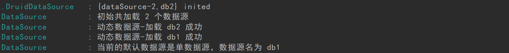

# 一、介绍

dynamic-datasource-spring-boot-starter 是一个基于springboot的快速集成多数据源的启动器。

## 1.dynamic-datasource-spring-boot-starter开源地址
GitHub开源地址(具体详情可参考官方文档):
https://github.com/baomidou/dynamic-datasource-spring-boot-starter

## 2.说明和应用场景
可用于主从分离、读写分离、分布式事务等。


# 二、详细整合步骤

## 1.导入Maven依赖

```
        <dependency>
            <groupId>com.baomidou</groupId>
            <artifactId>dynamic-datasource-spring-boot-starter</artifactId>
            <version>2.5.4</version>
        </dependency>

```

## 2.application.yml配置
```
spring:
  datasource:
    dynamic:
      primary: db1 #设置默认的数据源,默认值为master
      datasource:
        db1:  #数据源db1
          driver-class-name: com.mysql.jdbc.Driver
          url: jdbc:mysql://127.0.0.1:3306/wordpress_master?useUnicode=true&characterEncoding=UTF-8&serverTimezone=Asia/Shanghai
          username: root
          password: 123456
        db2: #数据源db2
          driver-class-name: com.mysql.jdbc.Driver
          url: jdbc:mysql://127.0.0.1:3306/wordpress_slave?useUnicode=true&characterEncoding=UTF-8&serverTimezone=Asia/Shanghai
          username: root
          password: 123456
      type: com.alibaba.druid.pool.DruidDataSource
      druid:
        initial-size: 10
        max-active: 100
        min-idle: 10
        max-wait: 60000
        pool-prepared-statements: true
        max-pool-prepared-statement-per-connection-size: 20
        time-between-eviction-runs-millis: 60000
        min-evictable-idle-time-millis: 300000
        #Oracle需要打开注释
        #validation-query: SELECT 1 FROM DUAL
        test-while-idle: true
        test-on-borrow: false
        test-on-return: false
        stat-view-servlet:
          enabled: true
          url-pattern: /druid/*
          #login-username: admin
          #login-password: admin
        filter:
          stat:
            log-slow-sql: true
            slow-sql-millis: 1000
            merge-sql: false
          wall:
            config:
              multi-statement-allow: true

```

## 3.完成1、2步后，启动应用

如果控制台不报错且出现如下图所示，就表示成功整合:



## 4.注意事项
启动主类需要排除Druid相关依赖，否则会出现如下错误:
```
***************************
APPLICATION FAILED TO START
***************************

Description:

Failed to configure a DataSource: 'url' attribute is not specified and no embedded datasource could be configured.

Reason: Failed to determine a suitable driver class

```

解决办法，加上如下代码即可:
```
@SpringBootApplication(exclude = DruidDataSourceAutoConfigure.class)

```