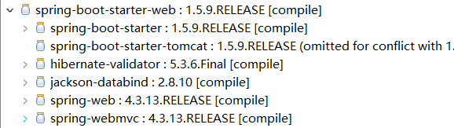

说到SpringBoot，难免会想到Spring。
对于Spring，我曾用其开发过很多大大小小的项目。
当使用SpringBoot之后，给人最直观的感受，用古人一句话:"大道至简"。
<!--more-->
SpringBoot相比Spring，它的优点其实就是Spring的缺点或不足:

(1)内嵌入Tomcat、Jetty等容器，无需Tomcat就能直接跑起来(这让我想到开发一个庞大的项目，光启动Tomcat就需要花好几分钟);

(2)部署方便，一个可执行的Jar，你可以将其以Docker容器的形式管理部署，也可以使用nohub命令让其持久运行在服务器上;

(3)无需管理一大堆繁重的xml配置(记得初次接触Spring的时候，它给最直观的感受就是将对象交给Spring管理，其实也就是在对应的xml进行配置，不再像很久以前那样自己New之类的，New十几二十个还好，但是一个实际项目，对象太庞大了，如果沿用传统new的方式来管理对象的话，那么将会耗费很多时间精力在这上面，不能很好的集中精力进行业务开发，因为需要考虑对象的初始化以及销毁等)，而当我使用SpringBoot以后开发项目，基本上SpringBoot很好的集成第三方库，需要什么就是直接在application.yml或application.properties直接配置即可;

(4)提供的starter-web简化Maven配置(整合常用依赖，相当于将一些web常用jar集成进去，省的我们一个个导入还需要考虑版本兼容性问题)

可以从spring-boot-starter-web依赖传递可以看出，如图:


(5)创建独立的Spring应用(更好的适用于微服务开发);


## SpringAOP的应用场景


从实际开发出发,举两个典型例子简单概括一下:
(1)可用于做接口权限控制或者是权限控制;
(2)可用于检测接口请求并统计接口请求次数;

实际上可以从这么几个方面深入挖掘?
(1)日志记录;
(2)性能统计;
(3)安全控制(可以理解为权限控制);
(4)事务处理;
(5)异常处理;

我想每个Java开发者对于这五个方面再了解不过了。

## 以监听接口请求为例

核心代码如下:
```
package com.blog.springboot.aop;
import java.util.HashMap;
import java.util.Map;
import org.aspectj.lang.ProceedingJoinPoint;
import org.aspectj.lang.annotation.Around;
import org.aspectj.lang.annotation.Aspect;
import org.aspectj.lang.annotation.Pointcut;
import org.springframework.stereotype.Component;
import cn.hutool.core.lang.Console;
/**
 * 系统日志类(用于统计接口请求)
 * @author youcong
 * @date 2019-09-05
 */
@Aspect
@Component
public class SystemLogAspect {

	
  @Pointcut("execution(public * com.blog.springboot.controller..*.*(..))")
  public void Pointcut() {
  
	  Console.log("走你");
  }
 
 
    //@Around：环绕通知
    @Around("Pointcut()")
    public Object Around(ProceedingJoinPoint pjp) throws Throwable {
        Map<String,Object> data = new HashMap<>();
        //获取目标类名称
        String clazzName = pjp.getTarget().getClass().getName();
        //获取目标类方法名称
        String methodName = pjp.getSignature().getName();
 
        //记录类名称
        data.put("clazzName",clazzName);
        //记录对应方法名称
        data.put("methodName",methodName);
        //记录请求参数
        data.put("params",pjp.getArgs());
        //开始调用时间
        // 计时并调用目标函数
        long start = System.currentTimeMillis();
        Object result = pjp.proceed();
        Long time = System.currentTimeMillis() - start;
 
        //记录返回参数
        data.put("result",result);
 
        //设置消耗总时间
        data.put("consumeTime",time);
        System.out.println(data);
        return result;
 
    }


}
```

基本上每次请求接口都会获取到对应的接口信息并输出。

如果后台这边需要统计接口请求次数，针对某些接口请求非常频繁，可考虑加缓存或者是进行其它优化等。


## SpringAOP之常用注解

简单的说一下AOP，AOP又称面向切面编程，它的常用术语如下:

### 连接点(Joinpoint)
增强程序执行的某个特定位置(要在哪个地方做增强操作)。SPring仅支持方法的连接点，既仅能在方法调用前，方法调用后，方法抛出异常时等这些程序执行点进行织入增强。

### 切点(Pointcut)
切点是一组连接点的集合。AOP通过"切点"定位特定的连接点。通过数据库查询的概念来理解切点和连接点的关系再适合不过来:连接点相当于数据库中的记录，而切点相当于查询条件。

### 增强(Advice)
增强是织入到目标类连接点上的一段程序代码。表示要在连接点上做的操作。

### 切面(Aspect)
切面由切点和增强(引介)组成(可以包含多个切点和多个增强)，它既包括横切逻辑的定义，也包括连接点的定义，SpringAOP就是负责实施切面的框架，它将切面所定义的横切逻辑织入到切面所指定的链接点中。


SpringAOP常用注解如下:
@aspect(定义切面)
@pointcut(定义切点)
@before(标注Before Advice定义所在的方法)
@afterreturning(标注After Returning Advice定义所在的方法)
@afterthrowing(标注After Throwing Advice定义所在的方法)
@after(标注After(Finally)Advice定义所在的方法)
@around(标注Around Advice定义所在的方法)
