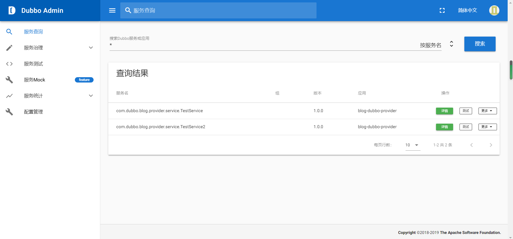
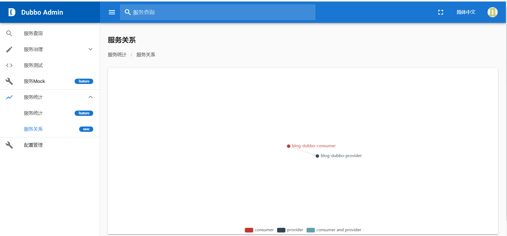

## 一、下载Dubbo-Admin并导入本地

dubbo-admin地址为:
https://github.com/apache/dubbo-admin

官方文档:
https://github.com/apache/dubbo-admin/blob/develop/README_ZH.md

注意需要安装Zookeeper(因为Dubbo使用Zookeeper作为注册中心)
<!--more-->

## 二、建立服务提供者(这里是我博客的一个子项目名为blog-dubbo-provider)

### 1.导入Maven依赖

```
        <dependency>
            <groupId>org.springframework.boot</groupId>
            <artifactId>spring-boot-starter</artifactId>
        </dependency>
        <!-- dubbo的依赖 -->
        <!-- https://mvnrepository.com/artifact/org.apache.dubbo/dubbo-spring-boot-starter -->
        <dependency>
            <groupId>org.apache.dubbo</groupId>
            <artifactId>dubbo-spring-boot-starter</artifactId>
            <version>2.7.6</version>
        </dependency>


        <!-- zk的依赖 -->
        <dependency>
            <groupId>org.apache.dubbo</groupId>
            <artifactId>dubbo-dependencies-zookeeper</artifactId>
            <version>2.7.6</version>
            <type>pom</type>
            <exclusions>
                <exclusion>
                    <groupId>org.slf4j</groupId>
                    <artifactId>slf4j-log4j12</artifactId>
                </exclusion>
            </exclusions>
        </dependency>

```


### 2.编写启动类和配置文件

启动类:
```
package com.dubbo.blog;

import org.springframework.boot.SpringApplication;
import org.springframework.boot.autoconfigure.SpringBootApplication;

@SpringBootApplication
public class DubboProviderApplication {

    public static void main(String[] args) {
        SpringApplication.run(DubboProviderApplication.class, args);
    }
}


```


配置文件(application.properties):
```
# Spring boot application
spring.application.name=blog-dubbo-provider
# Base packages to scan Dubbo Component: @org.apache.dubbo.config.annotation.Service
dubbo.scan.base-packages=com.dubbo.blog.provider.service.impl   
# Dubbo Application
## The default value of dubbo.application.name is ${spring.application.name}
dubbo.application.name=${spring.application.name}
# Dubbo Protocol
dubbo.protocol.name=dubbo
dubbo.protocol.port=20880
## Dubbo Registry
dubbo.registry.address=zookeeper://127.0.0.1:2181
server.port=7010


```

3.编写接口和对应的实现类
TestService:
```
package com.dubbo.blog.provider.service;

public interface TestService {

    String showName();
}


```
TestServiceImpl:
```
package com.dubbo.blog.provider.service.impl;

import com.dubbo.blog.provider.service.TestService;
import org.apache.dubbo.config.annotation.Service;

@Service(version = "1.0.0")
public class TestServiceImpl implements TestService {
    @Override
    public String showName() {
        return "HELLO   DUBBO";
    }
}


```


TestService2:
```
package com.dubbo.blog.provider.service;

public interface TestService2 {
    String showName();
}


```

TestService2Impl:
```
package com.dubbo.blog.provider.service.impl;

import com.dubbo.blog.provider.service.TestService2;
import org.apache.dubbo.config.annotation.Service;

@Service(version = "1.0.0")
public class TestService2Impl implements TestService2 {
    @Override
    public String showName() {
        return "HELLO   TestService2";
    }
}


```

### 4.启动主类并打开Dubbo-Admin
下图表示Ok


## 三、建立服务消费者(这里是我博客的一个子项目名为blog-dubbo-consumer)

### 1.导入Maven依赖
```

        <dependency>
            <groupId>com.challenger.blog</groupId>
            <artifactId>blog-dubbo-provider</artifactId>
            <version>1.0-SNAPSHOT</version>
        </dependency>
        <dependency>
            <groupId>org.springframework.boot</groupId>
            <artifactId>spring-boot-starter</artifactId>
        </dependency>

        <dependency>
            <groupId>org.springframework.boot</groupId>
            <artifactId>spring-boot-starter-web</artifactId>
        </dependency>

        <!-- dubbo的依赖 -->
        <!-- https://mvnrepository.com/artifact/org.apache.dubbo/dubbo-spring-boot-starter -->
        <dependency>
            <groupId>org.apache.dubbo</groupId>
            <artifactId>dubbo-spring-boot-starter</artifactId>
            <version>2.7.6</version>
        </dependency>


        <!-- zk的依赖 -->
        <dependency>
            <groupId>org.apache.dubbo</groupId>
            <artifactId>dubbo-dependencies-zookeeper</artifactId>
            <version>2.7.6</version>
            <type>pom</type>
            <exclusions>
                <exclusion>
                    <groupId>org.slf4j</groupId>
                    <artifactId>slf4j-log4j12</artifactId>
                </exclusion>
            </exclusions>
        </dependency>

```

### 2.编写启动类和配置文件

启动类:
```
package com.dubbo.blog;

import org.springframework.boot.SpringApplication;
import org.springframework.boot.autoconfigure.SpringBootApplication;

@SpringBootApplication
public class DubboConsumerApplication {

    public static void main(String[] args) {
        SpringApplication.run(DubboConsumerApplication.class, args);
    }

}

```

配置文件(application.properties):
```
spring.application.name=blog-dubbo-consumer
dubbo.registry.address=zookeeper://127.0.0.1:2181
server.port=7000

```

### 3.编写Controller
```
package com.dubbo.blog;


import com.dubbo.blog.provider.service.TestService;
import com.dubbo.blog.provider.service.TestService2;
import org.apache.dubbo.config.annotation.Reference;
import org.springframework.web.bind.annotation.GetMapping;
import org.springframework.web.bind.annotation.RestController;

@RestController
public class TestDubboController {
    @Reference(version = "1.0.0")
    private TestService2 service2;
    @Reference(version = "1.0.0")
    private TestService service;

    @GetMapping("test1")
    public String test1() {
        return service.showName();
    }

    @GetMapping("test2")
    public String test2() {
        return service2.showName();
    }
}

```

### 4.切换到dubbo-admin看服务关系


### 5.可以请求Controller对应的url测试一下