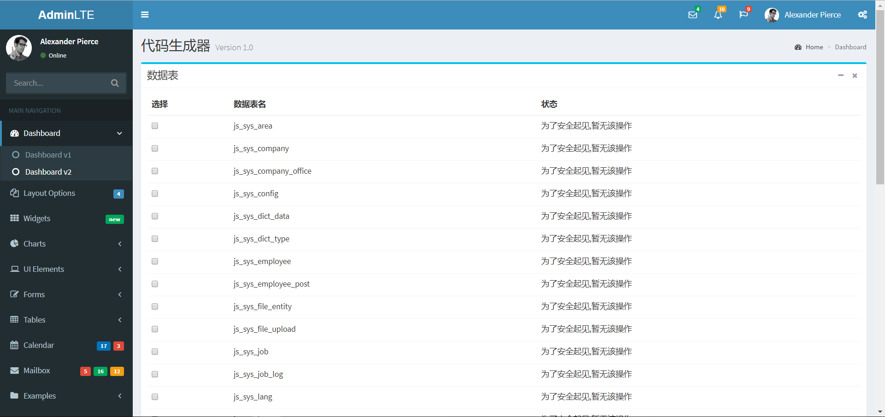
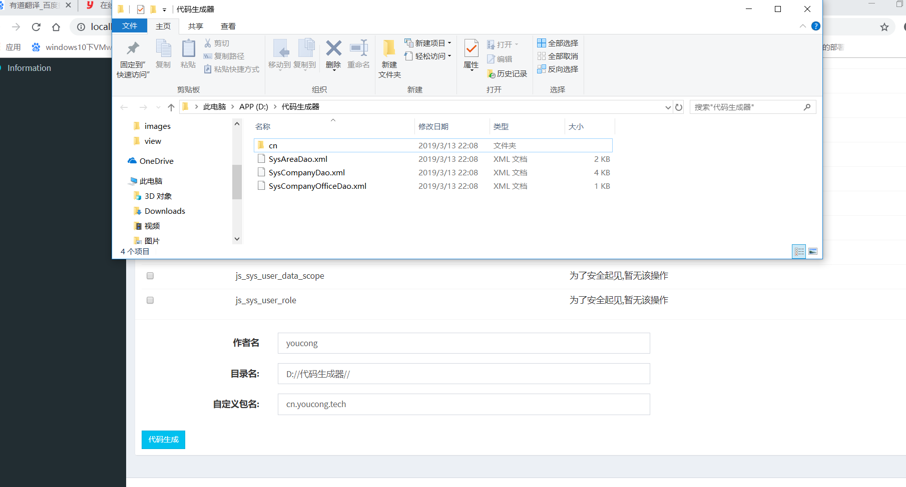

为了提高开发效率，编写对应的代码生成器。代码生成器主要有两个方面，一个是在线Web，另外一个是运行某个类。

使用的技术是SpringBoot+MyBatis-Plus+MySQL+JDK8。

在编写在线代码生成器的时候，正好遇到一个小问题，那就是静态资源无法访问。


以SSM(Spring+SpringMVC+MyBatis/MyBatis-Plus)框架来说，通常要想对静态资源放行，最简单直接的办法是使用*.do。

<!--more-->

如果你不想使用*.do，那么可以尝试下面两种方法？


## 第一种方法


在spring-mvc.xml中配置如下:

```


  <mvc:default-servlet-handler/>

```


光这样还不够，如果是不起作用，你还需要在web.xml配置如下:

```


<!-- 静态资源文件的引入 -->

 <servlet-mapping>

  <servlet-name>default</servlet-name>

  <url-pattern>*.js</url-pattern>

 </servlet-mapping>

 <servlet-mapping>

  <servlet-name>default</servlet-name>

  <url-pattern>*.css</url-pattern>

 </servlet-mapping>

 <servlet-mapping>

  <servlet-name>default</servlet-name>

  <url-pattern>*.png</url-pattern>

 </servlet-mapping>

  <servlet-mapping>

  <servlet-name>default</servlet-name>

  <url-pattern>*.jpg</url-pattern>

 </servlet-mapping>


```


## 第二种方法

对指定目录放行，通常也是修改spring-mvc.xml,请参考:

```

<!-- 对指定目录下的静态资源放行 -->

<mvc:resources location="/images/" mapping="/images/**"/>

<mvc:resources location="/css/" mapping="/css/**"/>

<mvc:resources location="/js/" mapping="/js/**"/>  


```


如果是使用SpringBoot的话，该如何配置静态资源放行呢？

一般情况下，SpringBoot+模板语言(jsp+freemarker等)开发。

但是有部分开发者为了实现前后端分离(这是一种变相的分离)，将静态资源放在src/main/resources目录下。

放在这个目录下是无法访问的，如果要想访问，需要配置。


WebConfig.java

```

package com.acs.springboot.config;


import java.util.concurrent.TimeUnit;


import org.springframework.context.annotation.Configuration;

import org.springframework.http.CacheControl;

import org.springframework.web.bind.annotation.ControllerAdvice;

import org.springframework.web.servlet.config.annotation.InterceptorRegistry;

import org.springframework.web.servlet.config.annotation.ResourceHandlerRegistry;

import org.springframework.web.servlet.config.annotation.WebMvcConfigurerAdapter;


@ControllerAdvice

@Configuration

public class WebConfig extends WebMvcConfigurerAdapter {


    @Override

    public void addResourceHandlers(ResourceHandlerRegistry registry) {

        //静态资源放行

    	registry.addResourceHandler("/view/**").addResourceLocations("classpath:/view/");

    }

}


```


效果图如下:







参考(均来自我个人的博客园):

JavaWeb在线代码生成器:https://www.cnblogs.com/youcong/p/9494892.html

MP实战系列(六)之代码生成器讲解:https://blog.csdn.net/suijiarui/article/details/51360980

