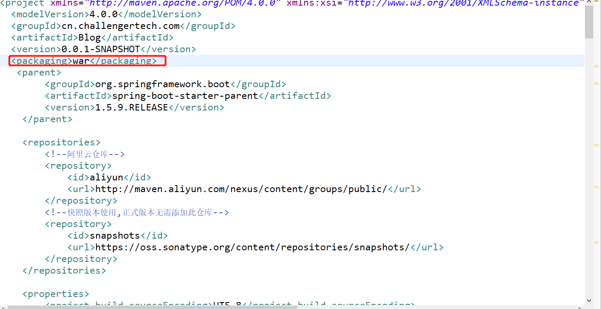
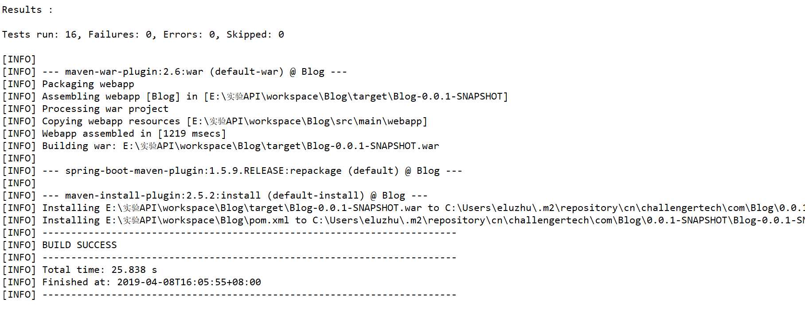

关于SpringBoot打成jar包以及jar包如何在Linux持久运行，我在前面已经说过了，所以本次不再赘述。

关于SpringBoot打包成war，其实步骤特别简单，如下图所示(如果是jar，通常是没有图中红色标记处，因为默认就是jar):
<!--more-->
## 1.添加<packaging>war</packaging>



## 2.修改启动类
```
package com.blog.springboot;

import org.slf4j.Logger;
import org.slf4j.LoggerFactory;
import org.springframework.boot.Banner;
import org.springframework.boot.SpringApplication;
import org.springframework.boot.autoconfigure.SpringBootApplication;
import org.springframework.boot.builder.SpringApplicationBuilder;
import org.springframework.transaction.annotation.EnableTransactionManagement;

@EnableTransactionManagement
@SpringBootApplication
public class Application {

    protected final static Logger logger = LoggerFactory.getLogger(Application.class);


    public static void main(String[] args) {
        SpringApplication app = new SpringApplication(Application.class);
        app.setBannerMode(Banner.Mode.OFF);
        app.run(args);
        logger.info("Application is success!");

    }
    //关键是添加这段代码
    protected SpringApplicationBuilder configure(SpringApplicationBuilder builder) {
		// 注意这里要指向原先用main方法执行的Application启动类
		return builder.sources(Application.class);
	}


}


```


## 3.做完1和2你会发现项目报错，这时你只需update project即可，直到不报错为止。

## 4.mvn install，出现如图所示,表示打包成功(至于war的部署方式就不多说了，直接扔到tomcat下的webapps目录下即可)


