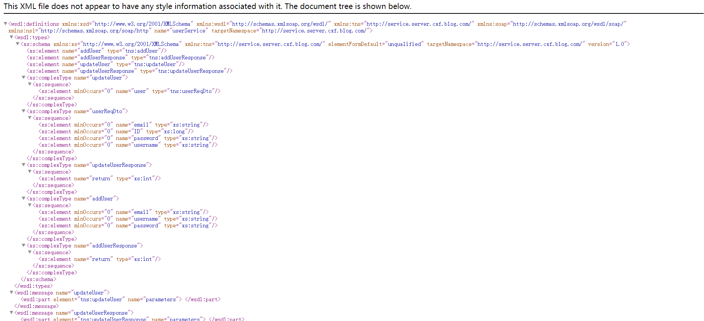
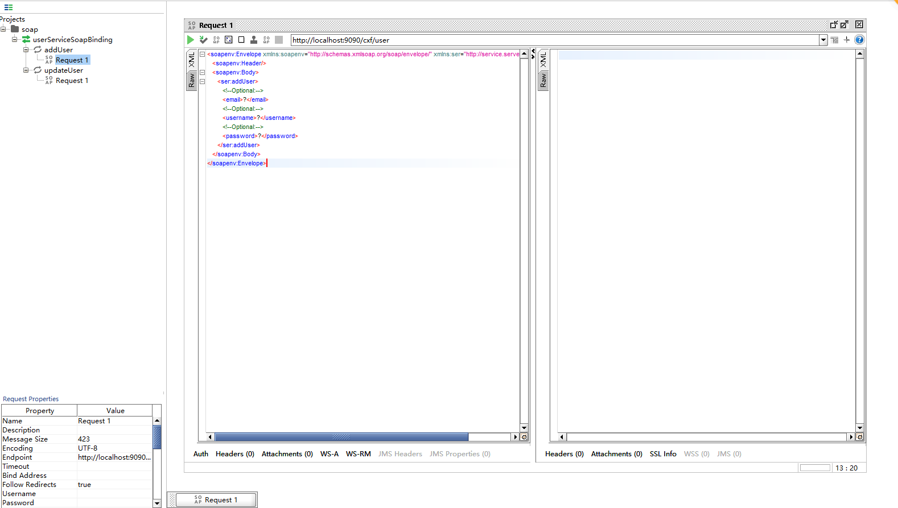
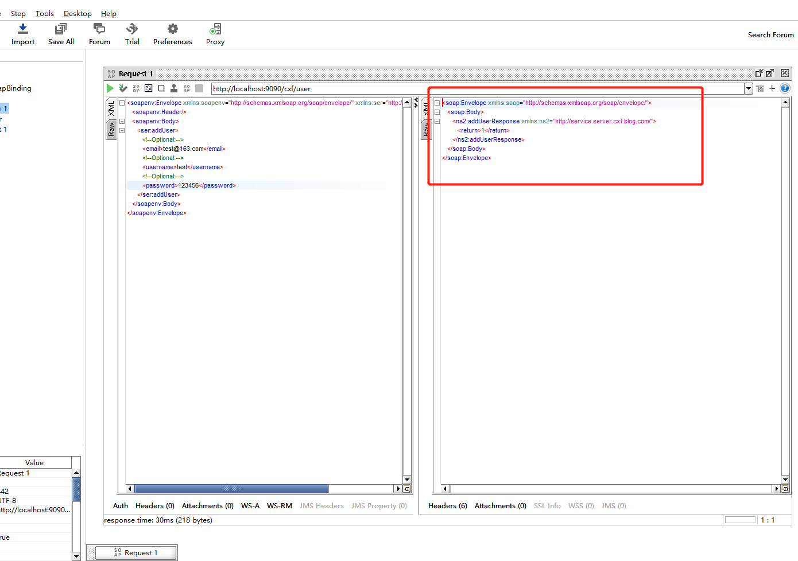
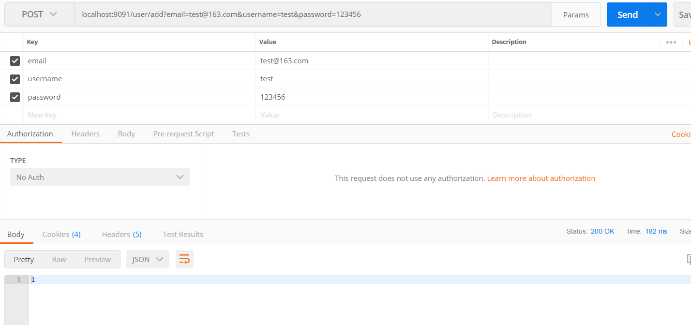
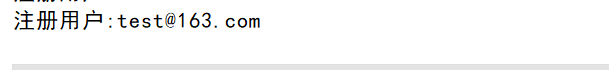

## 一、Apache CXF是什么？
Apache CXF 是一个开源的 Services 框架，CXF 帮助您利用 Frontend 编程 API 来构建和开发 Services ，像 JAX-WS 。这些 Services 可以支持多种协议，比如：SOAP、XML/HTTP、RESTful HTTP 或者 CORBA ，并且可以在多种传输协议上运行，比如：HTTP、JMS 或者 JBI，CXF 大大简化了 Services 的创建，同时它继承了 XFire 传统，一样可以天然地和 Spring 进行无缝集成。
<!--more-->
## 二、SpringBoot整合Apache CXF实践例子
本次例子为Client-Server(客户端-服务端)。还是以我最喜欢的Blog为例。

本次涉及两个项目，一个是blog-cxf-client，另外一个是blog-cxf-server。

### 1.blog-cxf-server

#### (1)导入Maven依赖
```
    <dependencies>
        <!-- SpringBoot Web -->
        <dependency>
            <groupId>org.springframework.boot</groupId>
            <artifactId>spring-boot-starter-web</artifactId>
        </dependency>
        <!-- CXF webservice -->
        <dependency>
            <groupId>org.apache.cxf</groupId>
            <artifactId>cxf-spring-boot-starter-jaxws</artifactId>
            <version>3.2.4</version>
        </dependency>
        <!-- Lombok-->
        <dependency>
            <groupId>org.projectlombok</groupId>
            <artifactId>lombok</artifactId>
            <optional>true</optional>
        </dependency>

        <dependency>
            <artifactId>blog-cxf-server</artifactId>
            <groupId>com.blog.cxf</groupId>
            <version>1.0</version>
        </dependency>

    </dependencies>

```

#### (2)编写相关代码

##### a.编写主类
```
package com.blog.cxf.server;

import org.springframework.boot.SpringApplication;
import org.springframework.boot.autoconfigure.SpringBootApplication;
import org.springframework.boot.autoconfigure.jdbc.DataSourceAutoConfiguration;

/**
 * @description:
 * @author: youcong
 * @time: 2020/10/24 22:30
 */
@SpringBootApplication(exclude = {DataSourceAutoConfiguration.class})
public class BlogCxfServerApplication {

    public static void main(String[] args) {
        SpringApplication.run(BlogCxfServerApplication.class, args);
        System.out.println("====启动Blog Cxf Server====");

    }
}

```

##### b.编写application.yml配置文件
```
# Tomcat
server:
  tomcat:
    uri-encoding: UTF-8
    #最小线程数
    min-spare-threads: 500
    #最大线程数
    max-threads: 2500
    #最大连接数
    max-connections: 5000
    #最大等待队列长度
    accept-count: 1000
    #请求头最大长度kb
    max-http-header-size: 1048576
    #启动APR(非阻塞IO)
    protocol: org.apache.coyote.http11.Http11AprProtocol
  port: 9090

# Spring
spring:
  application:
    # 应用名称
    name: blog-cxf-server
cxf:
  path: /cxf

```

##### c.编写service代码

UserService.java
```
package com.blog.cxf.server.service;

import com.blog.cxf.server.dto.UserReqDto;

import javax.jws.WebParam;
import javax.jws.WebService;

/**
 * @description:
 * @author: youcong
 * @time: 2020/10/24 22:32
 */
@WebService(targetNamespace = "http://service.server.cxf.blog.com/")
public interface UserService {


    /**
     * 添加用户
     * @param email
     * @param username
     * @param password
     * @return
     */
    int addUser(@WebParam(name = "email") String email, @WebParam(name = "username") String username, @WebParam(name = "password") String password);


    /**
     * 更新用户信息
     * @param userReqDto
     * @return
     */
    int updateUser(@WebParam(name="user")UserReqDto userReqDto);
}


```

UserServiceImpl.java
```
package com.blog.cxf.server.service.impl;

import com.blog.cxf.server.dto.UserReqDto;
import com.blog.cxf.server.service.UserService;
import org.springframework.stereotype.Component;

import javax.jws.WebService;

/**
 * @description:
 * @author: youcong
 * @time: 2020/10/24 22:35
 */
@WebService(serviceName = "userService",//对外发布的服务名
        targetNamespace = "http://service.server.cxf.blog.com/",//指定你想要的名称空间，通常使用使用包名反转
        endpointInterface = "com.blog.cxf.server.service.UserService")
@Component
public class UserServiceImpl implements UserService {
    public int addUser(String email, String username, String password) {
        System.out.println("注册用户:"+email);
        return 1;
    }

    public int updateUser(UserReqDto userReqDto) {
        return 1;
    }
}


```

数据传输类(UserReqDto.java):
```
package com.blog.cxf.server.dto;

import lombok.Data;

/**
 * @description:
 * @author: youcong
 * @time: 2020/10/24 22:49
 */
@Data
public class UserReqDto {

    private Long ID;

    private String email;

    private String username;

    private String password;
}


```

##### c.编写配置类(服务发布)
```
package com.blog.cxf.server.config;
import com.blog.cxf.server.service.UserService;
import com.blog.cxf.server.service.impl.UserServiceImpl;
import org.apache.cxf.Bus;
import org.apache.cxf.bus.spring.SpringBus;
import org.apache.cxf.jaxws.EndpointImpl;
import org.springframework.context.annotation.Bean;
import org.springframework.context.annotation.Configuration;

/**
 * @description:
 * @author: youcong
 * @time: 2020/10/24 22:37
 */
@Configuration
public class CxfConfig {


    @Bean(name = Bus.DEFAULT_BUS_ID)
    public SpringBus springBus() {
        return new SpringBus();
    }

    @Bean
    public UserService userService() {
        return new UserServiceImpl();
    }


    /**
     * 发布服务并指定访问URL
     * @return
     */
    @Bean
    public EndpointImpl userEnpoint() {
        EndpointImpl endpoint = new EndpointImpl(springBus(), userService());
        endpoint.publish("/user");
        return endpoint;
    }

    
}

```

#### (3)启动BlogCxfServerApplication主类并访问对应的WSDL

访问路径:
http://localhost:9090/cxf/user?wsdl

截图效果:


使用SOAP-UI工具进行测试:




### 2.blog-cxf-client

#### (1)导入Maven依赖
```
<?xml version="1.0" encoding="UTF-8"?>
<project xmlns="http://maven.apache.org/POM/4.0.0"
         xmlns:xsi="http://www.w3.org/2001/XMLSchema-instance"
         xsi:schemaLocation="http://maven.apache.org/POM/4.0.0 http://maven.apache.org/xsd/maven-4.0.0.xsd">
    <parent>
        <artifactId>blog-cxf</artifactId>
        <groupId>com.blog.cxf</groupId>
        <version>1.0</version>
    </parent>
    <modelVersion>4.0.0</modelVersion>

    <artifactId>blog-cxf-client</artifactId>
    <dependencies>
        <!-- SpringBoot Web -->
        <dependency>
            <groupId>org.springframework.boot</groupId>
            <artifactId>spring-boot-starter-web</artifactId>
        </dependency>
        <!-- CXF webservice -->
        <dependency>
            <groupId>org.apache.cxf</groupId>
            <artifactId>cxf-spring-boot-starter-jaxws</artifactId>
            <version>3.2.4</version>
        </dependency>
        <!-- Lombok-->
        <dependency>
            <groupId>org.projectlombok</groupId>
            <artifactId>lombok</artifactId>
            <optional>true</optional>
        </dependency>

        <dependency>
            <artifactId>blog-cxf-server</artifactId>
            <groupId>com.blog.cxf</groupId>
            <version>1.0</version>
        </dependency>

    </dependencies>

</project>

```
#### (2)编写主类
```
package com.blog.cxf.client;

import org.springframework.boot.SpringApplication;
import org.springframework.boot.autoconfigure.SpringBootApplication;
import org.springframework.boot.autoconfigure.jdbc.DataSourceAutoConfiguration;

/**
 * @description:
 * @author: youcong
 * @time: 2020/10/24 23:35
 */
@SpringBootApplication(exclude = {DataSourceAutoConfiguration.class})
public class BlogCxfClientApplication {

    public static void main(String[] args) {
        SpringApplication.run(BlogCxfClientApplication.class, args);
        System.out.println("====启动Blog Cxf Client====");

    }
}


```

#### (3)编写application.yml
```
# Tomcat
server:
  tomcat:
    uri-encoding: UTF-8
    #最小线程数
    min-spare-threads: 500
    #最大线程数
    max-threads: 2500
    #最大连接数
    max-connections: 5000
    #最大等待队列长度
    accept-count: 1000
    #请求头最大长度kb
    max-http-header-size: 1048576
    #启动APR(非阻塞IO)
    protocol: org.apache.coyote.http11.Http11AprProtocol
  port: 9091

# Spring
spring:
  application:
    # 应用名称
    name: blog-cxf-client

```

#### (4)编写Controller
```
package com.blog.cxf.client.controller;

import com.blog.cxf.server.dto.UserReqDto;
import com.blog.cxf.server.service.UserService;
import org.apache.cxf.jaxws.JaxWsProxyFactoryBean;
import org.springframework.web.bind.annotation.*;

/**
 * @description:
 * @author: youcong
 * @time: 2020/10/24 23:37
 */
@RestController
@RequestMapping("/user")
public class UserApiController {


    @PostMapping("/add")
    public int add(@RequestParam String email, @RequestParam String username, @RequestParam String password) {

        try {
            // 接口地址
            String address = "http://127.0.0.1:9090/cxf/user?wsdl";
            // 代理工厂
            JaxWsProxyFactoryBean jaxWsProxyFactoryBean = new JaxWsProxyFactoryBean();
            // 设置代理地址
            jaxWsProxyFactoryBean.setAddress(address);
            // 设置接口类型
            jaxWsProxyFactoryBean.setServiceClass(UserService.class);
            // 创建一个代理接口实现
            UserService userService = (UserService) jaxWsProxyFactoryBean.create();

            return userService.addUser(email, username, password);
        } catch (Exception e) {
            e.printStackTrace();
            return -1;
        }
    }
}


```

**注意:**
实际中这段代码应该放在blog-cxf-server里面的Controller，然后客户端通过http-client或者其它http工具包进行请求。

还有如果是服务是都在一起，可按照maven依赖导入的方式来实现两个不同项目进行调用。

#### (5)使用PostMan测试


接着服务端控制台会打印如下:


## 三、代码例子
代码例子已上传到我的GitHub上。

代码地址:
https://github.com/developers-youcong/blog-cxf
