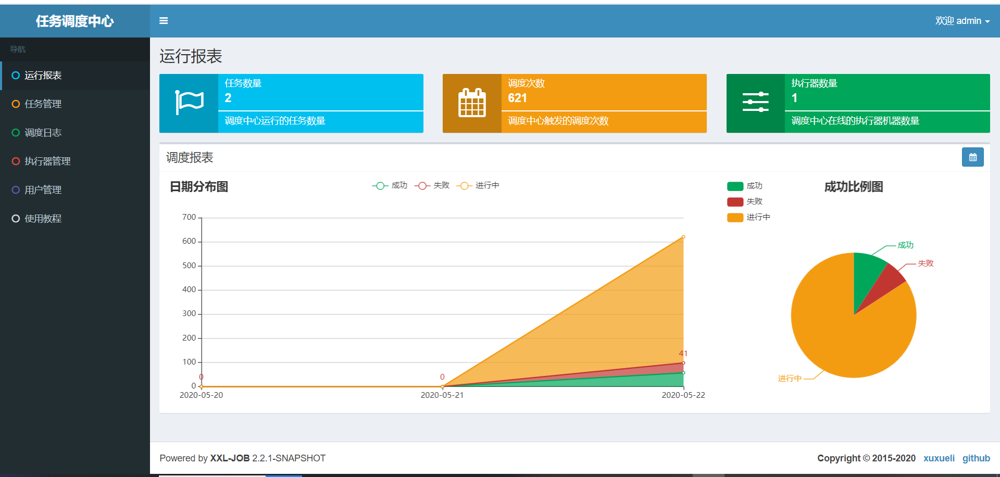
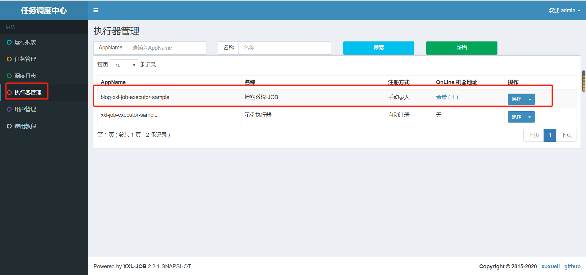
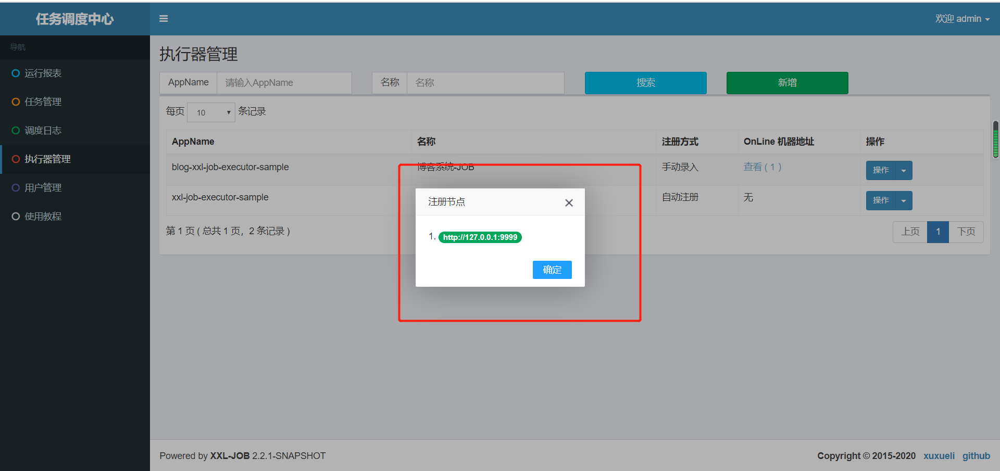
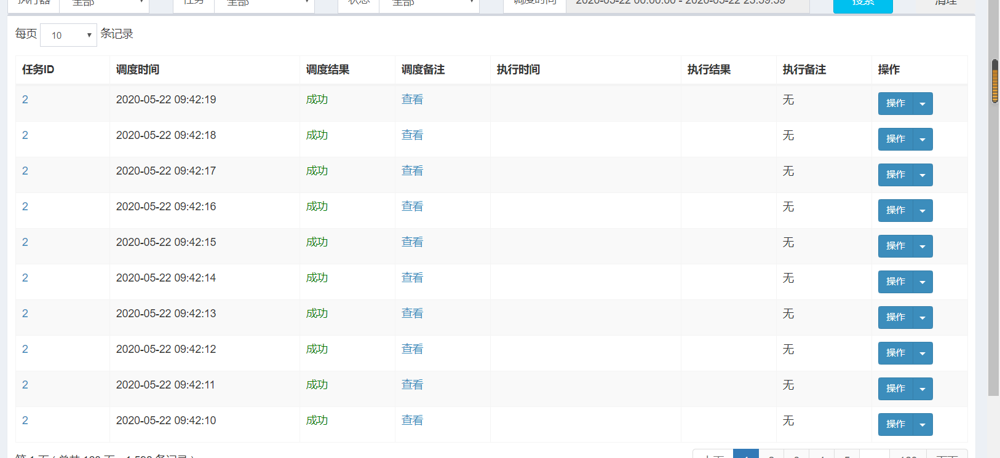

## 一、下载Xxl-Job源代码并导入本地并运行

Github地址:
https://github.com/xuxueli/xxl-job

中文文档地址:
https://www.xuxueli.com/xxl-job/
<!--more-->

### 1.使用Idea或Eclipse导入

### 2.执行sql脚本(红色标记处)


### 3.运行xxl-job-admin(xxl-job后台管理，主要方便管理各种各样的任务)

注意:在运行之前，需要把2的sql脚本执行完毕，并修改数据库连接池。

正常启动，访问地址为:
http://localhost:8080/xxl-job-admin

效果图，如下所示:


用户名默认为admin
密码为123456

输入后，进入这个界面，如图:



这样就表示Xxl-Job成功运行了。确保运行没问题后，就可以开始下一步。


## 二、添加执行器(Xxl-Job源代码就一个Example，可以复用过来，你也可以选择自己新建项目，新建项目可以在Xxl-Job基础上，也可以放在其它项目中)

### 1.新建一个Maven项目，命名为blog-xxl-job。

### 2.导入Maven依赖
```
 <!-- https://mvnrepository.com/artifact/com.xuxueli/xxl-job-core -->
        <dependency>
            <groupId>com.xuxueli</groupId>
            <artifactId>xxl-job-core</artifactId>
            <version>2.2.0</version>
        </dependency>
        <dependency>
            <groupId>org.springframework.cloud</groupId>
            <artifactId>spring-cloud-starter-netflix-eureka-client</artifactId>
        </dependency>
        <dependency>
            <groupId>org.springframework.boot</groupId>
            <artifactId>spring-boot-starter-web</artifactId>
        </dependency>


```

### 3.新建application.yml配置文件并添加如下内容
```
#eureka
eureka.client.serviceUrl.defaultZone=http://localhost:8761/eureka/
# web port
server.port=8081
# no web
#spring.main.web-environment=false
# log config
logging.config=classpath:logback.xml
### xxl-job admin address list, such as "http://address" or "http://address01,http://address02"
xxl.job.admin.addresses=http://127.0.0.1:8080/xxl-job-admin
### xxl-job, access token
xxl.job.accessToken=
### xxl-job executor appname
xxl.job.executor.appname=blog-xxl-job-executor
### xxl-job executor registry-address: default use address to registry , otherwise use ip:port if address is null
xxl.job.executor.address=
### xxl-job executor server-info
xxl.job.executor.ip=
xxl.job.executor.port=9999
### xxl-job executor log-path
xxl.job.executor.logpath=/data/applogs/xxl-job/jobhandler
### xxl-job executor log-retention-days
xxl.job.executor.logretentiondays=30


```

可以不用eureka，这里我的项目中用到eureka所以增加该配置。


增加logback.xml配置:
```
<?xml version="1.0" encoding="UTF-8"?>
<configuration debug="false" scan="true" scanPeriod="1 seconds">

    <contextName>logback</contextName>
    <property name="log.path" value="/data/applogs/xxl-job/xxl-job-executor-sample-springboot.log"/>

    <appender name="console" class="ch.qos.logback.core.ConsoleAppender">
        <encoder>
            <pattern>%d{HH:mm:ss.SSS} %contextName [%thread] %-5level %logger{36} - %msg%n</pattern>
        </encoder>
    </appender>

    <appender name="file" class="ch.qos.logback.core.rolling.RollingFileAppender">
        <file>${log.path}</file>
        <rollingPolicy class="ch.qos.logback.core.rolling.TimeBasedRollingPolicy">
            <fileNamePattern>${log.path}.%d{yyyy-MM-dd}.zip</fileNamePattern>
        </rollingPolicy>
        <encoder>
            <pattern>%date %level [%thread] %logger{36} [%file : %line] %msg%n
            </pattern>
        </encoder>
    </appender>

    <root level="info">
        <appender-ref ref="console"/>
        <appender-ref ref="file"/>
    </root>

</configuration>

```


### 4.编写Application类
```
package com.springcloud.blog.job.execute;

import org.springframework.boot.SpringApplication;
import org.springframework.boot.autoconfigure.SpringBootApplication;
import org.springframework.cloud.client.discovery.EnableDiscoveryClient;
import org.springframework.cloud.netflix.eureka.EnableEurekaClient;

@EnableEurekaClient
@EnableDiscoveryClient
@SpringBootApplication
public class BlogXxlJobExecutorApplication {
    public static void main(String[] args) {
        SpringApplication.run(BlogXxlJobExecutorApplication.class, args);
    }

}


```


### 5.编写Job执行器
```
package com.springcloud.blog.job.execute.jobhandler;

import com.xxl.job.core.biz.model.ReturnT;
import com.xxl.job.core.handler.IJobHandler;
import com.xxl.job.core.handler.annotation.XxlJob;
import com.xxl.job.core.log.XxlJobLogger;
import com.xxl.job.core.util.ShardingUtil;
import org.slf4j.Logger;
import org.slf4j.LoggerFactory;
import org.springframework.stereotype.Component;

import java.io.BufferedInputStream;
import java.io.BufferedReader;
import java.io.DataOutputStream;
import java.io.InputStreamReader;
import java.net.HttpURLConnection;
import java.net.URL;
import java.util.Arrays;
import java.util.concurrent.TimeUnit;

/**
 * XxlJob开发示例（Bean模式）
 * <p>
 * 开发步骤：
 * 1、在Spring Bean实例中，开发Job方法，方式格式要求为 "public ReturnT<String> execute(String param)"
 * 2、为Job方法添加注解 "@XxlJob(value="自定义jobhandler名称", init = "JobHandler初始化方法", destroy = "JobHandler销毁方法")"，注解value值对应的是调度中心新建任务的JobHandler属性的值。
 * 3、执行日志：需要通过 "XxlJobLogger.log" 打印执行日志；
 *
 * @author xuxueli 2019-12-11 21:52:51
 */
@Component
public class SampleXxlJob {
    private static Logger logger = LoggerFactory.getLogger(SampleXxlJob.class);


    /**
     * 1、简单任务示例（Bean模式）
     */
    @XxlJob("demoJobHandler")
    public ReturnT<String> demoJobHandler(String param) throws Exception {
        XxlJobLogger.log("XXL-JOB, Hello World.");

        for (int i = 0; i < 5; i++) {
            XxlJobLogger.log("beat at:" + i);
            TimeUnit.SECONDS.sleep(2);
        }
        return ReturnT.SUCCESS;
    }


    /**
     * 2、分片广播任务
     */
    @XxlJob("shardingJobHandler")
    public ReturnT<String> shardingJobHandler(String param) throws Exception {

        // 分片参数
        ShardingUtil.ShardingVO shardingVO = ShardingUtil.getShardingVo();
        XxlJobLogger.log("分片参数：当前分片序号 = {}, 总分片数 = {}", shardingVO.getIndex(), shardingVO.getTotal());

        // 业务逻辑
        for (int i = 0; i < shardingVO.getTotal(); i++) {
            if (i == shardingVO.getIndex()) {
                XxlJobLogger.log("第 {} 片, 命中分片开始处理", i);
            } else {
                XxlJobLogger.log("第 {} 片, 忽略", i);
            }
        }

        return ReturnT.SUCCESS;
    }


    /**
     * 3、命令行任务
     */
    @XxlJob("commandJobHandler")
    public ReturnT<String> commandJobHandler(String param) throws Exception {
        String command = param;
        int exitValue = -1;

        BufferedReader bufferedReader = null;
        try {
            // command process
            Process process = Runtime.getRuntime().exec(command);
            BufferedInputStream bufferedInputStream = new BufferedInputStream(process.getInputStream());
            bufferedReader = new BufferedReader(new InputStreamReader(bufferedInputStream));

            // command log
            String line;
            while ((line = bufferedReader.readLine()) != null) {
                XxlJobLogger.log(line);
            }

            // command exit
            process.waitFor();
            exitValue = process.exitValue();
        } catch (Exception e) {
            XxlJobLogger.log(e);
        } finally {
            if (bufferedReader != null) {
                bufferedReader.close();
            }
        }

        if (exitValue == 0) {
            return IJobHandler.SUCCESS;
        } else {
            return new ReturnT<String>(IJobHandler.FAIL.getCode(), "command exit value(" + exitValue + ") is failed");
        }
    }


    /**
     * 4、跨平台Http任务
     * 参数示例：
     * "url: http://www.baidu.com\n" +
     * "method: get\n" +
     * "data: content\n";
     */
    @XxlJob("httpJobHandler")
    public ReturnT<String> httpJobHandler(String param) throws Exception {

        // param parse
        if (param == null || param.trim().length() == 0) {
            XxlJobLogger.log("param[" + param + "] invalid.");
            return ReturnT.FAIL;
        }
        String[] httpParams = param.split("\n");
        String url = null;
        String method = null;
        String data = null;
        for (String httpParam : httpParams) {
            if (httpParam.startsWith("url:")) {
                url = httpParam.substring(httpParam.indexOf("url:") + 4).trim();
            }
            if (httpParam.startsWith("method:")) {
                method = httpParam.substring(httpParam.indexOf("method:") + 7).trim().toUpperCase();
            }
            if (httpParam.startsWith("data:")) {
                data = httpParam.substring(httpParam.indexOf("data:") + 5).trim();
            }
        }

        // param valid
        if (url == null || url.trim().length() == 0) {
            XxlJobLogger.log("url[" + url + "] invalid.");
            return ReturnT.FAIL;
        }
        if (method == null || !Arrays.asList("GET", "POST").contains(method)) {
            XxlJobLogger.log("method[" + method + "] invalid.");
            return ReturnT.FAIL;
        }

        // request
        HttpURLConnection connection = null;
        BufferedReader bufferedReader = null;
        try {
            // connection
            URL realUrl = new URL(url);
            connection = (HttpURLConnection) realUrl.openConnection();

            // connection setting
            connection.setRequestMethod(method);
            connection.setDoOutput(true);
            connection.setDoInput(true);
            connection.setUseCaches(false);
            connection.setReadTimeout(5 * 1000);
            connection.setConnectTimeout(3 * 1000);
            connection.setRequestProperty("connection", "Keep-Alive");
            connection.setRequestProperty("Content-Type", "application/json;charset=UTF-8");
            connection.setRequestProperty("Accept-Charset", "application/json;charset=UTF-8");

            // do connection
            connection.connect();

            // data
            if (data != null && data.trim().length() > 0) {
                DataOutputStream dataOutputStream = new DataOutputStream(connection.getOutputStream());
                dataOutputStream.write(data.getBytes("UTF-8"));
                dataOutputStream.flush();
                dataOutputStream.close();
            }

            // valid StatusCode
            int statusCode = connection.getResponseCode();
            if (statusCode != 200) {
                throw new RuntimeException("Http Request StatusCode(" + statusCode + ") Invalid.");
            }

            // result
            bufferedReader = new BufferedReader(new InputStreamReader(connection.getInputStream(), "UTF-8"));
            StringBuilder result = new StringBuilder();
            String line;
            while ((line = bufferedReader.readLine()) != null) {
                result.append(line);
            }
            String responseMsg = result.toString();

            XxlJobLogger.log(responseMsg);
            return ReturnT.SUCCESS;
        } catch (Exception e) {
            XxlJobLogger.log(e);
            return ReturnT.FAIL;
        } finally {
            try {
                if (bufferedReader != null) {
                    bufferedReader.close();
                }
                if (connection != null) {
                    connection.disconnect();
                }
            } catch (Exception e2) {
                XxlJobLogger.log(e2);
            }
        }

    }

    /**
     * 5、生命周期任务示例：任务初始化与销毁时，支持自定义相关逻辑；
     */
    @XxlJob(value = "demoJobHandler2", init = "init", destroy = "destroy")
    public ReturnT<String> demoJobHandler2(String param) throws Exception {
        XxlJobLogger.log("XXL-JOB, Hello World.");
        return ReturnT.SUCCESS;
    }

    public void init() {
        logger.info("init");
    }

    public void destroy() {
        logger.info("destory");
    }


}


```


### 6.增加XxlJobConfig配置类
```
package com.springcloud.blog.job.execute.core.config;

import com.xxl.job.core.executor.impl.XxlJobSpringExecutor;
import org.slf4j.Logger;
import org.slf4j.LoggerFactory;
import org.springframework.beans.factory.annotation.Value;
import org.springframework.context.annotation.Bean;
import org.springframework.context.annotation.Configuration;

@Configuration
public class XxlJobConfig {
    private Logger logger = LoggerFactory.getLogger(XxlJobConfig.class);

    @Value("${xxl.job.admin.addresses}")
    private String adminAddresses;

    @Value("${xxl.job.accessToken}")
    private String accessToken;

    @Value("${xxl.job.executor.appname}")
    private String appname;

    @Value("${xxl.job.executor.address}")
    private String address;

    @Value("${xxl.job.executor.ip}")
    private String ip;

    @Value("${xxl.job.executor.port}")
    private int port;

    @Value("${xxl.job.executor.logpath}")
    private String logPath;

    @Value("${xxl.job.executor.logretentiondays}")
    private int logRetentionDays;


    @Bean
    public XxlJobSpringExecutor xxlJobExecutor() {
        logger.info(">>>>>>>>>>> xxl-job config init.");
        XxlJobSpringExecutor xxlJobSpringExecutor = new XxlJobSpringExecutor();
        xxlJobSpringExecutor.setAdminAddresses(adminAddresses);
        xxlJobSpringExecutor.setAppname(appname);
        xxlJobSpringExecutor.setAddress(address);
        xxlJobSpringExecutor.setIp(ip);
        xxlJobSpringExecutor.setPort(port);
        xxlJobSpringExecutor.setAccessToken(accessToken);
        xxlJobSpringExecutor.setLogPath(logPath);
        xxlJobSpringExecutor.setLogRetentionDays(logRetentionDays);

        return xxlJobSpringExecutor;
    }


}


```

## 三、结合Xxl-Job后台系统增加定时任务

### 1.配置执行器


执行器地址为(与blog-xxl-job中application.yml配置文件里的执行器地址需要保持一致，否则会注册失败，导致任务执行不了:


### 2.添加任务


### 3.任务执行成功的标志



## 四、为什么选择Xxl-Job
当初选择使用Xxl-Job有这么几个原因:
第一、团队里有好几个人上一家公司或上上家公司用过。
第二、这个生态比较丰富且开源。
第三、确实非常容易上手且轻量化(轻量化的一个体现就是非侵入式)

