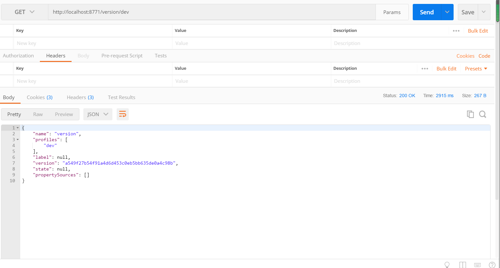

配置中心，也就是SpringCloud中的Config组件，主要应用在哪些方面?
- 配置文件方便维护
- 配置文件内容安全和权限
- 更新项目配置不需要重启


本文主要围绕两个方面，一个是Config Server，另一个是Config Client。还是以我个人博客系统其中的一个模块为例。
<!--more-->
## 一、搭建Config Server

### 1.Maven依赖
```
 <dependencies>
        <dependency>
            <groupId>org.springframework.cloud</groupId>
            <artifactId>spring-cloud-starter-netflix-eureka-client</artifactId>
        </dependency>
        <dependency>
            <groupId>org.springframework.boot</groupId>
            <artifactId>spring-boot-starter-web</artifactId>
        </dependency>
        <dependency>
            <groupId>org.springframework.cloud</groupId>
            <artifactId>spring-cloud-config-server</artifactId>
        </dependency>
    </dependencies>

```

### 2.添加主类
```
package com.springcloud.blog;

import org.springframework.boot.SpringApplication;
import org.springframework.boot.autoconfigure.SpringBootApplication;
import org.springframework.cloud.client.discovery.EnableDiscoveryClient;
import org.springframework.cloud.config.server.EnableConfigServer;
import org.springframework.cloud.netflix.eureka.EnableEurekaClient;

@SpringBootApplication
@EnableConfigServer
@EnableDiscoveryClient
@EnableEurekaClient
public class BlogConfigServerApplication {


    public static void main(String[] args) {
        SpringApplication.run(BlogConfigServerApplication.class, args);
    }


}


```

### 3.application.yml配置文件修改
```
spring.application.name=blog-config-server
server.port=8771
spring.cloud.config.server.git.uri=https://github.com/developers-youcong/blog-springcloud-config
spring.cloud.config.server.git.searchPaths=respo
spring.cloud.config.label=master
spring.cloud.config.server.git.username=
spring.cloud.config.server.git.password=
eureka.client.serviceUrl.defaultZone=http://localhost:8761/eureka/

```

### 4.启动测试



## 二、搭建Config Client

### 1.Maven依赖
```
  <dependencies>
        <dependency>
            <groupId>org.springframework.cloud</groupId>
            <artifactId>spring-cloud-starter-config</artifactId>
        </dependency>

        <dependency>
            <groupId>org.springframework.boot</groupId>
            <artifactId>spring-boot-starter-web</artifactId>
        </dependency>

        <dependency>
            <groupId>org.springframework.cloud</groupId>
            <artifactId>spring-cloud-starter-netflix-eureka-client</artifactId>
        </dependency>
    </dependencies>

```

### 2.添加主类
```
package com.springcloud.blog;

import org.springframework.beans.factory.annotation.Value;
import org.springframework.boot.SpringApplication;
import org.springframework.boot.autoconfigure.SpringBootApplication;
import org.springframework.cloud.client.discovery.EnableDiscoveryClient;
import org.springframework.cloud.context.config.annotation.RefreshScope;
import org.springframework.cloud.netflix.eureka.EnableEurekaClient;
import org.springframework.web.bind.annotation.RequestMapping;
import org.springframework.web.bind.annotation.RestController;

@SpringBootApplication
@EnableEurekaClient
@EnableDiscoveryClient
@RestController
@RefreshScope
public class BlogConfigClientApplication {


    public static void main(String[] args) {
        SpringApplication.run(BlogConfigClientApplication.class, args);
    }

    @Value("${version}")
    String version;

    @RequestMapping("/getVersion")
    public String getVersion() {
        return version;
    }

}

```

### 3.bootstrap.properites配置文件
```
spring.application.name=blog-config-client
spring.cloud.config.label=master
spring.cloud.config.profile=dev
eureka.client.serviceUrl.defaultZone=http://localhost:8761/eureka/
spring.cloud.config.discovery.enabled=true
spring.cloud.config.uri= http://localhost:8771/
spring.cloud.config.discovery.serviceId=blog-config-server
server.port=8772


```

### 4.测试验证
浏览器输入:http://localhost:8772/getVersion,输出结果如下:
```
get version 1
```