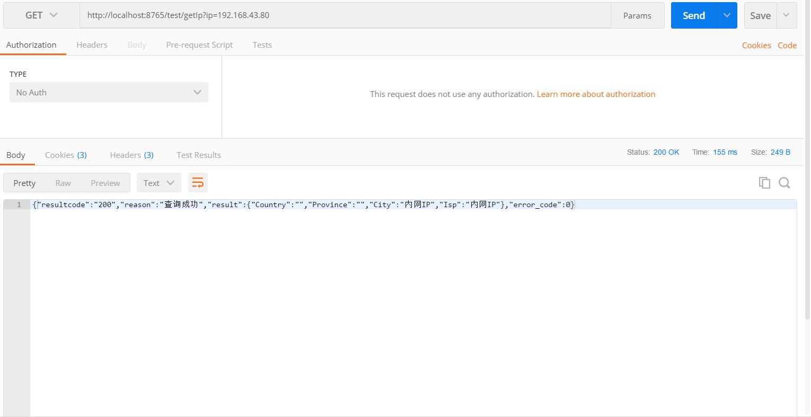

以我个人写的博客系统为例，请求其它微服务API。
<!--more-->
## 一、添加Maven依赖
```
        <dependency>
            <groupId>org.springframework.cloud</groupId>
            <artifactId>spring-cloud-starter-openfeign</artifactId>
        </dependency>

```

## 二、启动类增加@EnableFeignClients
```
package com.springcloud.blog;

import org.springframework.boot.SpringApplication;
import org.springframework.boot.autoconfigure.SpringBootApplication;
import org.springframework.cloud.netflix.eureka.EnableEurekaClient;
import org.springframework.cloud.openfeign.EnableFeignClients;
@SpringBootApplication
@EnableEurekaClient
@EnableFeignClients
public class BlogAdminApplication {

    public static void main(String[] args) {
        SpringApplication.run(BlogRibbonClientApplication.class, args);
    }

   
}

```

## 三、编写服务接口类
```
package com.springcloud.blog.example;

import org.springframework.cloud.openfeign.FeignClient;
import org.springframework.web.bind.annotation.GetMapping;
import org.springframework.web.bind.annotation.RequestParam;

@FeignClient("blog-api")
public interface FeignTestService {


     @GetMapping("/juhe/getIpInfo")
     String getIpInfo(@RequestParam String ip);

}


```
**特别注意:**

@FeignClient("blog-api"),其中的blog-api必须是在Eureka Server注册的服务实例。

而对应的@RequestMapping的请求类型必须要写准确，Get请求就写Get，Post请求就写Post，这是其一。

还有就是请求参数是地址栏的形式还是请求体的形式也必须写清楚(记住必须要与对应的微服务URL保持一致，否则请求会出现问题)，使用@RequestParam或@RequestBody或@PathVariable的形式写清楚,这是其二。

## 四、编写Controller
```
package com.springcloud.blog.example;

import org.springframework.beans.factory.annotation.Autowired;
import org.springframework.web.bind.annotation.GetMapping;
import org.springframework.web.bind.annotation.RequestMapping;
import org.springframework.web.bind.annotation.RestController;

@RestController
@RequestMapping(value = "/test")
public class TestController {


    @Autowired
    FeignTestService feignTestService;

    @GetMapping(value="/getIp")
    public String getIp(String ip){

        return feignTestService.getIpInfo(ip);
    }
}


```

## 五、测试

