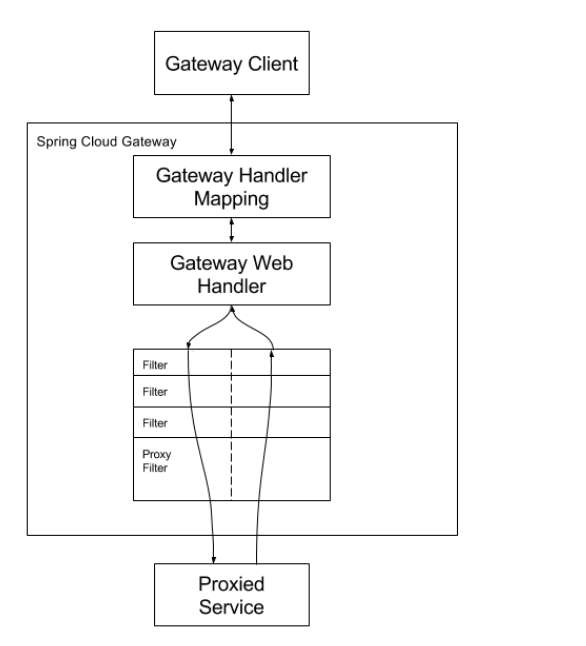
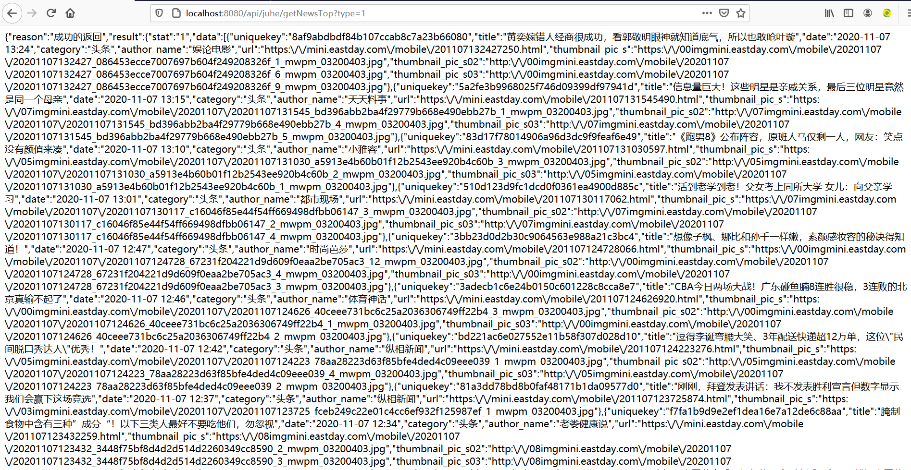

## 一、为什么选择SpringCloud Gateway而不是Zuul?
Gateway和Zuul的职责一样，都承担着请求分发，类似Nginx分发到后端服务器。
<!--more-->

### 1.SpingCloud Gateway 和SpringCloud Zuul对比分析

#### (1)相同点
- 底层都是servlet
- 两者均是web网关，处理的是http请求

#### (2)不同点

##### a.内部实现
gateway对比zuul多依赖了spring-webflux，在spring的支持下，功能更强大，内部实现了限流、负载均衡等，扩展性也更强，但同时也限制了仅适合于Spring Cloud套件；
zuul则可以扩展至其他微服务框架中，其内部没有实现限流、负载均衡等。

##### b.是否支持异步
zuul仅支持同步;
gateway支持异步(理论上gateway则更适合于提高系统吞吐量（但不一定能有更好的性能），最终性能还需要通过严密的压测来决定)。

##### c.框架设计的角度
gateway具有更好的扩展性，并且其已经发布了2.0.0的RELESE版本，稳定性也是非常好的。

##### d.性能
Zuul和Gateway哪个性能更好，有朋友特别做了测试并写下了文章:
[微服务网关选型：spring cloud gateway、zuul 1性能对比测试](https://www.jianshu.com/p/3c40b603673f)

##### e.限流
Zuul2：可通过配置文件或者filter实现；
Gateway:可对IP、用户、集群进行限流，并提供扩展接口。

##### f.鉴权
Zuul2：filter中代码实现；
Gateway：普通鉴权、auth2.0。

##### g.监控
Zuul2：filter中代码实现;
Gateway：Gateway Metrics Filter实现。

##### h.易用性
Zuul2：参考较少;
Gateway：简单易用。

#### (3)架构图

##### a.Zuul2内部架构图


##### b.Gateway内部架构图


### 2.究竟该选Gateway还是Zuul?
我的看法是结合业务场景和实际情况。比方说，如果是一个新的项目可以采用Gateway，如果是二次开发某个项目，而那个项目网关用的是Zuul，建议不要改，保持现状，直到真正搞懂了那个项目和框架底层，可以尝试试验换(最终换不换在于换的成本有多高，如果太高的话，还是不要换)。

## 二、SpringCloud整合Gateway

### 1.导入Maven依赖
```
        <dependency>
            <groupId>org.springframework.cloud</groupId>
            <artifactId>spring-cloud-starter-gateway</artifactId>
        </dependency>

```

### 2.配置文件
```
server:
  port: 8080

spring:
  cloud:
    gateway:
      discovery:
        locator:
          lowerCaseServiceId: true
          enabled: true
      routes:
        # 认证中心
        - id: blog-api
          uri: lb://blog-api
          predicates:
            - Path=/api/**
          filters:
            - StripPrefix=1

application:
  name: blog-gateway-server

eureka:
  client:
    serviceUrl:
      defaultZone: http://localhost:8761/eureka/

```

### 3.启动并测试
整合其实非常简单，关键在于两个:
第一，SpringCloud和SpringBoot版本要兼容；
第二，配置文件要对，否则会遇到这样的问题，能够正常启动，但是通过网关访问不到下面的微服务。

我的测试效果，如图:


如果有朋友对Zuul感兴趣，可以参考我的这篇文章:
[SpringCloud之Zuul](https://developers-youcong.github.io/2020/06/04/SpringCloud%E4%B9%8BZuul/)


本文参考资料如下:
[微服务网关Zuul和Gateway的区别](https://www.cnblogs.com/lgg20/p/12507845.html)
[SpringCloud Gateway 新网关与zuul的对比选型](https://blog.csdn.net/TOP__ONE/article/details/105583331)
[微服务网关选型：spring cloud gateway、zuul 1性能对比测试](https://www.jianshu.com/p/3c40b603673f)
[Zuul和Gateway对比](https://blog.csdn.net/lizz861109/article/details/103575186)
