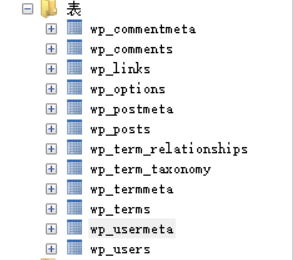
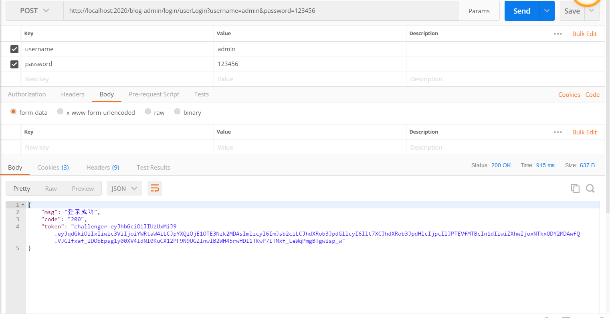

Spring Security是Spring提供的一个安全框架，提供认证和授权功能，最主要的是它提供了简单的使用方式，同时又有很高的灵活性，简单，灵活，强大。

我个人博客系统采用的权限框架就是Spring Security，正好整合到SpringCloud里面。
<!--more-->
一般系统里关于角色方面通常有这么几张表，角色表、用户-角色表、菜单表、角色-菜单表等。

不过我个人博客系统主要以wordpress作为参考，沿用其12张表,如图:



## 一、导入Maven依赖
```
 <properties>
        <jjwt.version>0.9.0</jjwt.version>
        <spring-security-jwt.version>1.0.9.RELEASE</spring-security-jwt.version>
 </properties>
  <!-- springsecurity-->
        <dependency>
            <groupId>org.springframework.boot</groupId>
            <artifactId>spring-boot-starter-security</artifactId>
        </dependency>
        <dependency>
            <groupId>org.springframework.security</groupId>
            <artifactId>spring-security-jwt</artifactId>
            <version>${spring-security-jwt.version}</version>
        </dependency>
        <dependency>
            <groupId>io.jsonwebtoken</groupId>
            <artifactId>jjwt</artifactId>
            <version>${jjwt.version}</version>
        </dependency>

```

## 二、编写Spring Security配置类
```
package com.springcloud.blog.admin.config;
import com.springcloud.blog.admin.security.UserAuthenticationProvider;
import com.springcloud.blog.admin.security.UserPermissionEvaluator;
import com.springcloud.blog.admin.security.handler.*;
import com.springcloud.blog.admin.security.jwt.JWTAuthenticationTokenFilter;
import org.springframework.beans.factory.annotation.Autowired;
import org.springframework.context.annotation.Bean;
import org.springframework.context.annotation.Configuration;
import org.springframework.security.config.annotation.authentication.builders.AuthenticationManagerBuilder;
import org.springframework.security.config.annotation.method.configuration.EnableGlobalMethodSecurity;
import org.springframework.security.config.annotation.web.builders.HttpSecurity;
import org.springframework.security.config.annotation.web.configuration.EnableWebSecurity;
import org.springframework.security.config.annotation.web.configuration.WebSecurityConfigurerAdapter;
import org.springframework.security.config.http.SessionCreationPolicy;
import org.springframework.security.crypto.bcrypt.BCryptPasswordEncoder;
import org.springframework.security.web.access.expression.DefaultWebSecurityExpressionHandler;

/**
 * SpringSecurity配置类
 * @Author youcong
 */
@Configuration
@EnableWebSecurity
@EnableGlobalMethodSecurity(prePostEnabled = true) //开启权限注解,默认是关闭的
public class SecurityConfig extends WebSecurityConfigurerAdapter {
    /**
     * 自定义登录成功处理器
     */
    @Autowired
    private UserLoginSuccessHandler userLoginSuccessHandler;
    /**
     * 自定义登录失败处理器
     */
    @Autowired
    private UserLoginFailureHandler userLoginFailureHandler;
    /**
     * 自定义注销成功处理器
     */
    @Autowired
    private UserLogoutSuccessHandler userLogoutSuccessHandler;
    /**
     * 自定义暂无权限处理器
     */
    @Autowired
    private UserAuthAccessDeniedHandler userAuthAccessDeniedHandler;
    /**
     * 自定义未登录的处理器
     */
    @Autowired
    private UserAuthenticationEntryPointHandler userAuthenticationEntryPointHandler;
    /**
     * 自定义登录逻辑验证器
     */
    @Autowired
    private UserAuthenticationProvider userAuthenticationProvider;

    /**
     * 加密方式
     * @Author youcong
     */
    @Bean
    public BCryptPasswordEncoder bCryptPasswordEncoder(){
        return new BCryptPasswordEncoder();
    }
    /**
     * 注入自定义PermissionEvaluator
     */
    @Bean
    public DefaultWebSecurityExpressionHandler userSecurityExpressionHandler(){
        DefaultWebSecurityExpressionHandler handler = new DefaultWebSecurityExpressionHandler();
        handler.setPermissionEvaluator(new UserPermissionEvaluator());
        return handler;
    }

    /**
     * 配置登录验证逻辑
     */
    @Override
    protected void configure(AuthenticationManagerBuilder auth){
        //这里可启用我们自己的登陆验证逻辑
        auth.authenticationProvider(userAuthenticationProvider);
    }
    /**
     * 配置security的控制逻辑
     * @Author youcong
     * @Param  http 请求
     */
    @Override
    protected void configure(HttpSecurity http) throws Exception {

        http.authorizeRequests()
                // 不进行权限验证的请求或资源(从配置文件中读取)
                .antMatchers(JWTConfig.antMatchers.split(",")).permitAll()
                // .antMatchers("/*").permitAll()
                // 其他的需要登陆后才能访问
                .anyRequest().authenticated()
                .and()
                // 配置未登录自定义处理类
                .httpBasic().authenticationEntryPoint(userAuthenticationEntryPointHandler)
                .and()
                // 配置登录地址
                .formLogin()
                .loginProcessingUrl("/login/userLogin")
                // 配置登录成功自定义处理类
                .successHandler(userLoginSuccessHandler)
                // 配置登录失败自定义处理类
                .failureHandler(userLoginFailureHandler)
                .and()
                // 配置登出地址
                .logout()
                .logoutUrl("/login/userLogout")
                // 配置用户登出自定义处理类
                .logoutSuccessHandler(userLogoutSuccessHandler)
                .and()
                // 配置没有权限自定义处理类
                .exceptionHandling().accessDeniedHandler(userAuthAccessDeniedHandler)
                .and()
                // 开启跨域
                .cors()
                .and()
                // 取消跨站请求伪造防护
                .csrf().disable();
        // 基于Token不需要session
        http.sessionManagement().sessionCreationPolicy(SessionCreationPolicy.STATELESS);
        // 禁用缓存
        http.headers().cacheControl();
        // 添加JWT过滤器
        http.addFilter(new JWTAuthenticationTokenFilter(authenticationManager()));
    }
}

```

## 三、编写JWTConfig和application.yml增加jwt相关配置
```
package com.springcloud.blog.admin.config;
import lombok.Getter;
import org.springframework.boot.context.properties.ConfigurationProperties;
import org.springframework.stereotype.Component;

/**
 * JWT配置类
 * @Author youcong
 */
@Getter
@Component
@ConfigurationProperties(prefix = "jwt")
public class JWTConfig {
    /**
     * 密钥KEY
     */
    public static String secret;
    /**
     * TokenKey
     */
    public static String tokenHeader;
    /**
     * Token前缀字符
     */
    public static String tokenPrefix;
    /**
     * 过期时间
     */
    public static Integer expiration;
    /**
     * 不需要认证的接口
     */
    public static String antMatchers;


    public void setSecret(String secret) {
        this.secret = secret;
    }

    public void setTokenHeader(String tokenHeader) {
        this.tokenHeader = tokenHeader;
    }

    public void setTokenPrefix(String tokenPrefix) {
        this.tokenPrefix = tokenPrefix;
    }

    public void setExpiration(Integer expiration) {
        this.expiration = expiration * 1000;
    }

    public void setAntMatchers(String antMatchers) {
        this.antMatchers = antMatchers;
    }


}

```

application.yml增加如下内容:
```
# JWT配置
jwt:
  # 密匙KEY
  secret: JWTSecret
  # HeaderKEY
  tokenHeader: Authorization
  # Token前缀字符
  tokenPrefix: challenger-
  # 过期时间 单位秒 1天后过期=86400 7天后过期=604800
  expiration: 86400
  # 配置不需要认证的接口
  antMatchers: /index/**,/login/**,/favicon.ico
  # 有效时间
  validTime: 7

```

## 四、编写过滤器处理类

### 1.UserLoginSuccessHandler.java
```
package com.springcloud.blog.admin.security.handler;


import com.springcloud.blog.admin.config.JWTConfig;
import com.springcloud.blog.admin.security.entity.SelfUserEntity;
import com.springcloud.blog.admin.utils.AccessAddressUtil;
import com.springcloud.blog.admin.utils.JWTTokenUtil;
import com.springcloud.blog.admin.utils.RedisUtil;
import com.springcloud.blog.admin.utils.ResultUtil;
import org.springframework.beans.factory.annotation.Autowired;
import org.springframework.security.core.Authentication;
import org.springframework.security.web.authentication.AuthenticationSuccessHandler;
import org.springframework.stereotype.Component;

import javax.servlet.http.HttpServletRequest;
import javax.servlet.http.HttpServletResponse;
import java.util.HashMap;
import java.util.Map;

/**
 * @Description 登录成功处理类
 * @Author youcong
 */
@Component
public class UserLoginSuccessHandler implements AuthenticationSuccessHandler {


    /**
     * 登录成功返回结果
     * @Author youcong
     */
    @Override
    public void onAuthenticationSuccess(HttpServletRequest request, HttpServletResponse response, Authentication authentication){
        // 组装JWT
        SelfUserEntity selfUserEntity =  (SelfUserEntity) authentication.getPrincipal();
        String token = JWTTokenUtil.createAccessToken(selfUserEntity);
        token = JWTConfig.tokenPrefix + token;

        // 封装返回参数
        Map<String,Object> resultData = new HashMap<>();
        resultData.put("code","200");
        resultData.put("msg", "登录成功");
        resultData.put("token",token);
        ResultUtil.responseJson(response,resultData);
    }
}

```

### 2.UserLoginFailureHandler.java
```
package com.springcloud.blog.admin.security.handler;


import com.springcloud.blog.admin.utils.ResultUtil;
import org.springframework.security.authentication.BadCredentialsException;
import org.springframework.security.authentication.LockedException;
import org.springframework.security.core.AuthenticationException;
import org.springframework.security.core.userdetails.UsernameNotFoundException;
import org.springframework.security.web.authentication.AuthenticationFailureHandler;
import org.springframework.stereotype.Component;

import javax.servlet.http.HttpServletRequest;
import javax.servlet.http.HttpServletResponse;

/**
 * @Description 登录失败处理类
 * @Author youcong
 */
@Component
public class UserLoginFailureHandler implements AuthenticationFailureHandler {
    /**
     * 登录失败返回结果
     * @Author youcong
     */
    @Override
    public void onAuthenticationFailure(HttpServletRequest request, HttpServletResponse response, AuthenticationException exception){
        // 这些对于操作的处理类可以根据不同异常进行不同处理
        if (exception instanceof UsernameNotFoundException){
            System.out.println("【登录失败】"+exception.getMessage());
            ResultUtil.responseJson(response,ResultUtil.resultCode(500,"用户名不存在"));
        }
        if (exception instanceof LockedException){
            System.out.println("【登录失败】"+exception.getMessage());
            ResultUtil.responseJson(response,ResultUtil.resultCode(500,"用户被冻结"));
        }
        if (exception instanceof BadCredentialsException){
            System.out.println("【登录失败】"+exception.getMessage());
            ResultUtil.responseJson(response,ResultUtil.resultCode(500,"密码错误"));
        }
        ResultUtil.responseJson(response,ResultUtil.resultCode(500,"登录失败"));
    }
}

```

### 3.UserLogoutSuccessHandler.java
```
package com.springcloud.blog.admin.security.handler;


import com.springcloud.blog.admin.utils.DateUtil;
import com.springcloud.blog.admin.utils.RedisUtil;
import com.springcloud.blog.admin.utils.ResultUtil;
import org.springframework.beans.factory.annotation.Autowired;
import org.springframework.security.core.Authentication;
import org.springframework.security.core.context.SecurityContextHolder;
import org.springframework.security.web.authentication.logout.LogoutSuccessHandler;
import org.springframework.stereotype.Component;

import javax.servlet.http.HttpServletRequest;
import javax.servlet.http.HttpServletResponse;
import java.util.HashMap;
import java.util.Map;

/**
 * 登出成功处理类
 * @Author youcong
 */
@Component
public class UserLogoutSuccessHandler implements LogoutSuccessHandler {
    

    /**
     * 用户登出返回结果
     * 这里应该让前端清除掉Token
     * @Author youcong
     */
    @Override
    public void onLogoutSuccess(HttpServletRequest request, HttpServletResponse response, Authentication authentication){

        Map<String,Object> resultData = new HashMap<>();
        resultData.put("code","200");
        resultData.put("msg", "登出成功");
        SecurityContextHolder.clearContext();
        ResultUtil.responseJson(response,ResultUtil.resultSuccess(resultData));
    }
}

```

### 4.UserAuthAccessDeniedHandler.java

```
package com.springcloud.blog.admin.security.handler;
import com.springcloud.blog.admin.utils.ResultUtil;
import org.springframework.security.access.AccessDeniedException;
import org.springframework.security.web.access.AccessDeniedHandler;
import org.springframework.stereotype.Component;
import javax.servlet.http.HttpServletRequest;
import javax.servlet.http.HttpServletResponse;

/**
 * @Description 暂无权限处理类
 * @Author youcong
 */
@Component
public class UserAuthAccessDeniedHandler implements AccessDeniedHandler {
    /**
     * 暂无权限返回结果
     * @Author youcong
     */
    @Override
    public void handle(HttpServletRequest request, HttpServletResponse response, AccessDeniedException exception){
        ResultUtil.responseJson(response,ResultUtil.resultCode(403,"未授权"));
    }
}

```

### 5.UserAuthenticationEntryPointHandler.java
```
package com.springcloud.blog.admin.security.handler;


import com.springcloud.blog.admin.utils.ResultUtil;
import org.springframework.security.core.AuthenticationException;
import org.springframework.security.web.AuthenticationEntryPoint;
import org.springframework.stereotype.Component;
import javax.servlet.http.HttpServletRequest;
import javax.servlet.http.HttpServletResponse;

/**
 * 用户未登录处理类
 * @Author youcong
 */
@Component
public class UserAuthenticationEntryPointHandler implements AuthenticationEntryPoint {
    /**
     * 用户未登录返回结果
     * @Author youcong
     */
    @Override
    public void commence(HttpServletRequest request, HttpServletResponse response, AuthenticationException exception){
        ResultUtil.responseJson(response,ResultUtil.resultCode(401,"未登录"));
    }
}

```

### 6.UserAuthenticationProvider.java

自定义登录验证这个类，需要根据实际情况重写。通常来说改动不大。
```
package com.springcloud.blog.admin.security;

import com.baomidou.mybatisplus.mapper.EntityWrapper;
import com.springcloud.blog.admin.entity.Usermeta;
import com.springcloud.blog.admin.entity.Users;
import com.springcloud.blog.admin.security.entity.SelfUserEntity;
import com.springcloud.blog.admin.service.UsermetaService;
import com.springcloud.blog.admin.service.UsersService;
import org.springframework.beans.factory.annotation.Autowired;
import org.springframework.security.authentication.AuthenticationProvider;
import org.springframework.security.authentication.BadCredentialsException;
import org.springframework.security.authentication.LockedException;
import org.springframework.security.authentication.UsernamePasswordAuthenticationToken;
import org.springframework.security.core.Authentication;
import org.springframework.security.core.AuthenticationException;
import org.springframework.security.core.GrantedAuthority;
import org.springframework.security.core.authority.SimpleGrantedAuthority;
import org.springframework.security.core.userdetails.UsernameNotFoundException;
import org.springframework.security.crypto.bcrypt.BCryptPasswordEncoder;
import org.springframework.stereotype.Component;
import java.util.HashSet;
import java.util.List;
import java.util.Set;

/**
 * 自定义登录验证
 *
 * @Author youcong
 */
@Component
public class UserAuthenticationProvider implements AuthenticationProvider {


    @Autowired
    private UsersService usersService;

    @Autowired
    private UsermetaService usermetaService;

    @Override
    public Authentication authenticate(Authentication authentication) throws AuthenticationException {
        // 获取表单输入中返回的用户名
        String userName = (String) authentication.getPrincipal();
        // 获取表单中输入的密码
        String password = (String) authentication.getCredentials();
        // 查询用户是否存在
         SelfUserEntity userInfo = usersService.getUserInfo(userName);


        if (userInfo.getUsername() == null || userInfo.getUsername() == "") {
            throw new UsernameNotFoundException("用户名不存在");
        }


        // 我们还要判断密码是否正确，这里我们的密码使用BCryptPasswordEncoder进行加密的
        if (!new BCryptPasswordEncoder().matches(password, userInfo.getPassword())) {
            throw new BadCredentialsException("密码不正确");
        }
        // 还可以加一些其他信息的判断，比如用户账号已停用等判断
        if (userInfo.getStatus().equals("1")) {
            throw new LockedException("该用户已被冻结");
        }
        // 角色集合
        Set<GrantedAuthority> authorities = new HashSet<>();

        EntityWrapper<Usermeta> roleWrapper = new EntityWrapper<>();
        roleWrapper.eq("user_id",userInfo.getUserId());
        roleWrapper.eq("meta_key","wp_user_level");
        // 查询用户角色
        List<Usermeta> sysRoleEntityList = usermetaService.selectList(roleWrapper);
        for (Usermeta sysRoleEntity: sysRoleEntityList){
            authorities.add(new SimpleGrantedAuthority("ROLE_" + sysRoleEntity.getMetaValue()));
        }
        userInfo.setAuthorities(authorities);
        // 进行登录
        return new UsernamePasswordAuthenticationToken(userInfo, password, authorities);
    }

    @Override
    public boolean supports(Class<?> authentication) {
        return true;
    }
}

```
### 7.UserPermissionEvaluator.java
```
package com.springcloud.blog.admin.security;


import com.baomidou.mybatisplus.mapper.EntityWrapper;
import com.springcloud.blog.admin.entity.Usermeta;
import com.springcloud.blog.admin.service.UsermetaService;
import org.apache.catalina.User;
import org.springframework.beans.factory.annotation.Autowired;
import org.springframework.security.access.PermissionEvaluator;
import org.springframework.security.core.Authentication;
import org.springframework.stereotype.Component;
import java.io.Serializable;
import java.util.HashSet;
import java.util.List;
import java.util.Set;

/**
 * 自定义权限注解验证
 * @Author youcong
 */
@Component
public class UserPermissionEvaluator implements PermissionEvaluator {

    @Autowired
    private UsermetaService usermetaService;

    /**
     * hasPermission鉴权方法
     * 这里仅仅判断PreAuthorize注解中的权限表达式
     * 实际中可以根据业务需求设计数据库通过targetUrl和permission做更复杂鉴权
     * 当然targetUrl不一定是URL可以是数据Id还可以是管理员标识等,这里根据需求自行设计
     * @Author youcong
     * @Param  authentication  用户身份(在使用hasPermission表达式时Authentication参数默认会自动带上)
     * @Param  targetUrl  请求路径
     * @Param  permission 请求路径权限
     * @Return boolean 是否通过
     */
    @Override
    public boolean hasPermission(Authentication authentication, Object targetUrl, Object permission) {
        // 获取用户信息
        Usermeta selfUserEntity =(Usermeta) authentication.getPrincipal();
        // 查询用户权限(这里可以将权限放入缓存中提升效率)
        Set<String> permissions = new HashSet<>();
        EntityWrapper<Usermeta> roleWrapper = new EntityWrapper<>();
        roleWrapper.eq("user_id",selfUserEntity.getUserId());
        roleWrapper.eq("meta_key","wp_user_level");
        List<Usermeta> sysMenuEntityList = usermetaService.selectList(roleWrapper);
        for (Usermeta sysMenuEntity:sysMenuEntityList) {
            permissions.add(sysMenuEntity.getMetaValue());
        }
        // 权限对比
        if (permissions.contains(permission.toString())){
            return true;
        }
        return true;
    }
    @Override
    public boolean hasPermission(Authentication authentication, Serializable targetId, String targetType, Object permission) {
        return false;
    }
}

```


## 五、编写实体类
```
package com.springcloud.blog.admin.security.entity;

import org.springframework.security.core.GrantedAuthority;
import org.springframework.security.core.userdetails.UserDetails;

import java.io.Serializable;
import java.util.Collection;
import java.util.Map;

/**
 * SpringSecurity用户的实体
 * 注意:这里必须要实现UserDetails接口
 *
 * @Author youcong
 */
public class SelfUserEntity implements Serializable, UserDetails {

    private static final long serialVersionUID = 1L;

    /**
     * 用户ID
     */
    private Long userId;
    /**
     * 用户名
     */
    private String username;
    /**
     * 密码
     */
    private String password;
    /**
     * 状态
     */
    private String status;


    /**
     * 显示名称
     */
    private String displayName;


    /**
     * 用户参数
     */
    private Map<String, String> userParamMap;


    /**
     * 用户角色
     */
    private Collection<GrantedAuthority> authorities;
    /**
     * 账户是否过期
     */
    private boolean isAccountNonExpired = false;
    /**
     * 账户是否被锁定
     */
    private boolean isAccountNonLocked = false;
    /**
     * 证书是否过期
     */
    private boolean isCredentialsNonExpired = false;
    /**
     * 账户是否有效
     */
    private boolean isEnabled = true;


    public static long getSerialVersionUID() {
        return serialVersionUID;
    }

    public Long getUserId() {
        return userId;
    }

    public void setUserId(Long userId) {
        this.userId = userId;
    }

    @Override
    public String getUsername() {
        return username;
    }

    public void setUsername(String username) {
        this.username = username;
    }

    @Override
    public String getPassword() {
        return password;
    }

    public void setPassword(String password) {
        this.password = password;
    }


    public void setAuthorities(Collection<GrantedAuthority> authorities) {
        this.authorities = authorities;
    }


    public void setEnabled(boolean enabled) {
        isEnabled = enabled;
    }

    public void setStatus(String status) {
        this.status = status;
    }

    public String getStatus() {
        return status;
    }

    public String getDisplayName() {
        return displayName;
    }

    public void setDisplayName(String displayName) {
        this.displayName = displayName;
    }

    public Map<String, String> getUserParamMap() {
        return userParamMap;
    }

    public void setUserParamMap(Map<String, String> userParamMap) {
        this.userParamMap = userParamMap;
    }

    @Override
    public Collection<GrantedAuthority> getAuthorities() {
        return authorities;
    }

    @Override
    public boolean isAccountNonExpired() {
        return isAccountNonExpired;
    }

    @Override
    public boolean isAccountNonLocked() {
        return isAccountNonLocked;
    }

    @Override
    public boolean isCredentialsNonExpired() {
        return isCredentialsNonExpired;
    }

    @Override
    public boolean isEnabled() {
        return isEnabled;
    }


}

```

## 六、编写JWT接口请求拦截器
```
package com.springcloud.blog.admin.security.jwt;

import com.alibaba.fastjson.JSON;
import com.alibaba.fastjson.JSONObject;
import com.springcloud.blog.admin.config.JWTConfig;
import com.springcloud.blog.admin.security.entity.SelfUserEntity;
import com.springcloud.blog.admin.utils.CollectionUtil;
import com.springcloud.blog.admin.utils.JWTTokenUtil;
import com.springcloud.blog.admin.utils.RedisUtil;
import io.jsonwebtoken.Claims;
import io.jsonwebtoken.ExpiredJwtException;
import io.jsonwebtoken.Jwts;
import org.springframework.beans.factory.annotation.Autowired;
import org.springframework.security.authentication.AuthenticationManager;
import org.springframework.security.authentication.UsernamePasswordAuthenticationToken;
import org.springframework.security.core.GrantedAuthority;
import org.springframework.security.core.authority.SimpleGrantedAuthority;
import org.springframework.security.core.context.SecurityContextHolder;
import org.springframework.security.web.authentication.www.BasicAuthenticationFilter;
import org.springframework.util.StringUtils;

import javax.servlet.FilterChain;
import javax.servlet.ServletException;
import javax.servlet.http.HttpServletRequest;
import javax.servlet.http.HttpServletResponse;
import java.io.IOException;
import java.util.ArrayList;
import java.util.List;
import java.util.Map;

/**
 * JWT接口请求校验拦截器
 * 请求接口时会进入这里验证Token是否合法和过期
 *
 * @Author youcong
 */
public class JWTAuthenticationTokenFilter extends BasicAuthenticationFilter {

    public JWTAuthenticationTokenFilter(AuthenticationManager authenticationManager) {
        super(authenticationManager);
    }

    @Override
    protected void doFilterInternal(HttpServletRequest request, HttpServletResponse response, FilterChain filterChain) throws ServletException, IOException {
        // 获取请求头中JWT的Token
        String tokenHeader = request.getHeader(JWTConfig.tokenHeader);

        if (null != tokenHeader && tokenHeader.startsWith(JWTConfig.tokenPrefix)) {
            try {


                // 截取JWT前缀
                String token = tokenHeader.replace(JWTConfig.tokenPrefix, "");
                // 解析JWT
                Claims claims = Jwts.parser()
                        .setSigningKey(JWTConfig.secret)
                        .parseClaimsJws(token)
                        .getBody();
                // 获取用户名
                String username = claims.getSubject();
                String userId = claims.getId();


                if (!StringUtils.isEmpty(username) && !StringUtils.isEmpty(userId)) {
                    // 获取角色
                    List<GrantedAuthority> authorities = new ArrayList<>();
                    String authority = claims.get("authorities").toString();
                    if (!StringUtils.isEmpty(authority)) {
                        List<Map<String, String>> authorityMap = JSONObject.parseObject(authority, List.class);
                        for (Map<String, String> role : authorityMap) {
                            if (!StringUtils.isEmpty(role)) {
                                authorities.add(new SimpleGrantedAuthority(role.get("authority")));
                            }
                        }
                    }
                    //组装参数
                    SelfUserEntity selfUserEntity = new SelfUserEntity();
                    selfUserEntity.setUsername(claims.getSubject());
                    selfUserEntity.setUserId(Long.parseLong(claims.getId()));
                    selfUserEntity.setAuthorities(authorities);
                    UsernamePasswordAuthenticationToken authentication = new UsernamePasswordAuthenticationToken(selfUserEntity, userId, authorities);
                    SecurityContextHolder.getContext().setAuthentication(authentication);
                }
            } catch (ExpiredJwtException e) {
                System.out.println("Token过期");
            } catch (Exception e) {
                System.out.println("Token无效");
            }
        }
        filterChain.doFilter(request, response);
        return;
    }
}

```

## 七、SpringSecurity用户的业务实现
```
package com.springcloud.blog.admin.security.service;


import com.baomidou.mybatisplus.mapper.EntityWrapper;
import com.springcloud.blog.admin.entity.Users;
import com.springcloud.blog.admin.security.entity.SelfUserEntity;
import com.springcloud.blog.admin.service.UsersService;
import org.springframework.beans.BeanUtils;
import org.springframework.beans.factory.annotation.Autowired;
import org.springframework.security.core.userdetails.UserDetailsService;
import org.springframework.security.core.userdetails.UsernameNotFoundException;
import org.springframework.stereotype.Component;

/**
 * SpringSecurity用户的业务实现
 *
 * @Author youcong
 */
@Component
public class SelfUserDetailsService implements UserDetailsService {

    @Autowired
    private UsersService usersService;

    /**
     * 查询用户信息
     *
     * @Author youcong
     * @Param username  用户名
     * @Return UserDetails SpringSecurity用户信息
     */
    @Override
    public SelfUserEntity loadUserByUsername(String username) throws UsernameNotFoundException {

        EntityWrapper<Users> wrapper = new EntityWrapper<>();


        //邮箱正则表达式
        String expr = "^([a-zA-Z0-9_\\-\\.]+)@((\\[[0-9]{1,3}\\.[0-9]{1,3}\\.[0-9]{1,3}\\.)|(([a-zA-Z0-9\\-]+\\.)+))([a-zA-Z]{2,4}|[0-9]{1,3})$";

        //是否为邮箱
        if (username.matches(expr)) {
            wrapper.eq("user_email", username);
        } else {
            wrapper.eq("user_login", username);
        }

        // 查询用户信息
        Users sysUserEntity = usersService.selectOne(wrapper);
        if (sysUserEntity != null) {
            // 组装参数
            SelfUserEntity selfUserEntity = new SelfUserEntity();
            BeanUtils.copyProperties(sysUserEntity, selfUserEntity);
            return selfUserEntity;
        }
        return null;
    }
}

```


## 八、Spring Security常用注解

### 1.@Secured
当@EnableGlobalMethodSecurity(securedEnabled=true)的时候，@Secured可以使用。

```
@PostMapping("/helloUser")
@Secured({"ROLE_normal","ROLE_admin"})
public Map<String, Object> initDashboard() {
        Map<String, Object> result = new HashMap<>();
        result.put(ResponseDict.RESPONSE_TITLE_KEY, "仪表盘初始化");
        result.put(ResponseDict.RESPONSE_DATA_KEY, dashboardService.initDashboard());
        return ResultUtil.resultSuccess(result);
    }

```
说明：拥有normal或者admin角色的用户都可以方法helloUser()方法。另外需要注意的是这里匹配的字符串需要添加前缀“ROLE_“。


### 2.@PreAuthorize
Spring的 @PreAuthorize/@PostAuthorize 注解更适合方法级的安全,也支持Spring 表达式语言，提供了基于表达式的访问控制。

当@EnableGlobalMethodSecurity(prePostEnabled=true)的时候，@PreAuthorize可以使用：
```
    @PostMapping("/initDashboard")
    @PreAuthorize("hasRole('100')")
    public Map<String, Object> initDashboard() {
        Map<String, Object> result = new HashMap<>();
        result.put(ResponseDict.RESPONSE_TITLE_KEY, "仪表盘初始化");
        result.put(ResponseDict.RESPONSE_DATA_KEY, dashboardService.initDashboard());
        return ResultUtil.resultSuccess(result);
    }

```
### 3.@PostAuthorize
 @PostAuthorize 注解使用并不多，在方法执行后再进行权限验证，适合验证带有返回值的权限，Spring EL 提供 返回对象能够在表达式语言中获取返回的对象returnObject。

当@EnableGlobalMethodSecurity(prePostEnabled=true)的时候，@PostAuthorize可以使用：
```
@GetMapping("/getUserInfo")
@PostAuthorize(" returnObject!=null &&  returnObject.username == authentication.name")
public User getUserInfo() {
        Object pricipal = SecurityContextHolder.getContext().getAuthentication().getPrincipal();
        User user;
        if("anonymousUser".equals(pricipal)) {
            user = null;
        }else {
            user = (User) pricipal;
        }
        return user;
}

```


## 九、测试

(1)登录测试，拿到token,如图:


(2)请求中如果不携带token的话，请求其它接口就会显示没有登录的提示，如图:


(3)正确的请求应当携带token，就像下面这样，如图:


(4)没有权限请求，如图:


