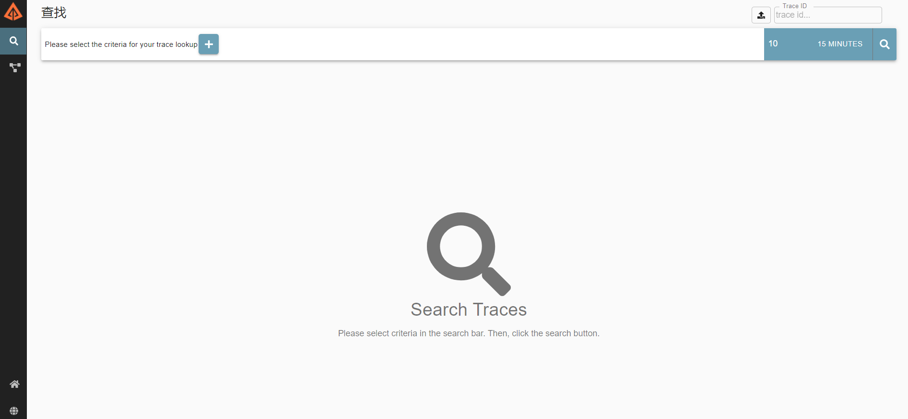

## 一、为什么要有分布式链路追踪
链路追踪的主要目的在于让我们知道A微服务调用B微服务，B微服务调用C微服务，C微服务调用D微服务，D微服务调用A微服务等整个流程是怎样的。
<!--more-->
## 二、SpringCloud整合Sleuth+Zipkin

### 1.Maven依赖
```

        <!-- SpringCloud Sleuth -->
        <dependency>
            <groupId>org.springframework.cloud</groupId>
            <artifactId>spring-cloud-starter-sleuth</artifactId>
        </dependency>

        <!-- SpringCloud ZipKin-->
        <dependency>
            <groupId>org.springframework.cloud</groupId>
            <artifactId>spring-cloud-sleuth-zipkin</artifactId>
        </dependency>

```

### 2.核心配置文件
```
spring:
  application:
    name: blog-api
  zipkin:
    base-url: http://127.0.0.1:9411
  sleuth:
    sampler:
      probability: 1

```
**注意:**
实际probability的值应该设置为0.1,1的话主要用于调试查看详细信息。
### 3.测试接口，效果如下


## 三、编译运行zipkin
这里我推荐看官网:
https://zipkin.io/pages/quickstart.html

按照官网流程，执行如下即可(我做了适当修改，主要讲./mvnw改为mvn):
```
# get the latest source
git clone https://github.com/openzipkin/zipkin
cd zipkin
# Build the server and also make its dependencies
mvn -DskipTests --also-make -pl zipkin-server clean install
# Run the server
java -jar ./zipkin-server/target/zipkin-server-*exec.jar

```

运行成功，效果图，如下:


## 四、注意事项
注意重要一点，SpringBoot和SpringCloud版本要匹配，否则即便按照上面的配置，但是仍无法看到调用的效果。