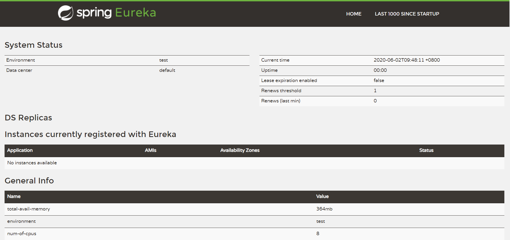
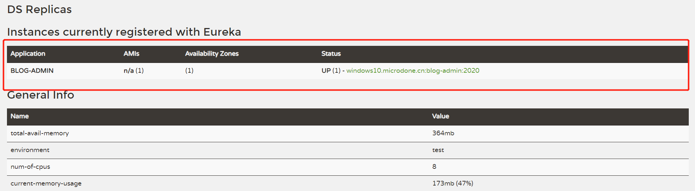

# 一、使用Eureka Server搭建服务注册中心

<!--more-->

## 1.Maven依赖
```

    <dependencies>
        <dependency>
            <groupId>org.springframework.cloud</groupId>
            <artifactId>spring-cloud-starter-netflix-eureka-server</artifactId>
        </dependency>
    </dependencies>

```

## 2.配置文件(application.yml)
```
server:
  port: 8761

eureka:
  evictionIntervalTimerInMs: 6000
  instance:
    hostname: localhost
  client:
    registerWithEureka: false
    fetchRegistry: false
    serviceUrl:
      defaultZone: http://${eureka.instance.hostname}:${server.port}/eureka/

spring:
  application:
    name: blog-eureka-server

```

## 3.启动类
```
package com.springcloud.blog;

import org.springframework.boot.SpringApplication;
import org.springframework.boot.autoconfigure.SpringBootApplication;
import org.springframework.cloud.netflix.eureka.server.EnableEurekaServer;

@SpringBootApplication
@EnableEurekaServer
public class BlogEurekaServerApplication {


    public static void main(String[] args) {
        SpringApplication.run( BlogEurekaServerApplication.class, args );
    }
}


```

## 4.启动效果


# 一、使用Eureka Client搭建服务提供者

## 1.Maven依赖
```
    <dependency>
            <groupId>org.springframework.cloud</groupId>
            <artifactId>spring-cloud-starter-netflix-eureka-client</artifactId>
    </dependency>


```

## 2.配置文件(application.yml)
```
# Tomcat
server:
  tomcat:
    uri-encoding: UTF-8
    max-threads: 1000
    min-spare-threads: 30
  port: 2020
  servlet:
    context-path: /blog-admin

## spring相关配置
spring:
  application:
    name: blog-admin
  profiles:
    active: dev
  jackson:
    date-format: yyyy-MM-dd HH:mm:ss
    time-zone: GMT+8
  servlet:
    multipart:
      max-file-size: 100MB
      max-request-size: 100MB
      enabled: true

eureka:
  client:
    serviceUrl:
      defaultZone: http://localhost:8761/eureka/
```

## 3.启动类
```
package com.springcloud.blog.admin;


import com.alibaba.druid.spring.boot.autoconfigure.DruidDataSourceAutoConfigure;
import org.springframework.boot.SpringApplication;
import org.springframework.boot.autoconfigure.SpringBootApplication;
import org.springframework.cloud.netflix.eureka.EnableEurekaClient;

@SpringBootApplication(exclude = DruidDataSourceAutoConfigure.class)
@EnableEurekaClient
public class BlogAdminApplication{


    public static void main(String[] args) {
   
        SpringApplication.run(BlogAdminApplication.class, args);

    }

}


```

## 4.启动后，回过头看服务注册中心，增加了一个服务提供者


# 三、相关解释

## 1.配置文件内容
- eureka.client.register-with-eureka:由于该应用为注册中心，所以设置为false，代表不向注册中心注册自己。
- eureka.client.fetch-registry:由于注册中心的职责就是维护服务实例，它并不需要去检索实例，所以也设置为为false。
- eureka.client.serviceUrl.defaultZone:注册中心地址
- eureka.instance.lease-renewal-interval-in-seconds=30:定义服务续约任务的调用间隔时间，默认为30秒
- eureka.instance.lease-expiration-duration-in-seconds=90:用于定义服务时效时间，默认为90秒

## 2.基础架构
Eureka服务治理基础架构的三个核心要素。
- 服务注册中心:Eureka提供的服务端，提供服务注册与发现的功能
- 服务提供者:提供服务的应用，可以是SpringBoot应用，也可以是其他技术平台且遵循Eureka通信机制的应用。
- 服务消费者:消费者应用从服务注册中心获取服务列表，从而使消费者可以知道去何处调用其所需要的服务(很多时候服务提供者既是服务提供者也是服务消费者)

## 3.服务治理机制

### 服务提供者
(1)服务注册
"服务提供者"在启动的时候会通过发送REST请求的方式将自己注册到Eureka Server上，同时带上了自身服务的一些元数据信息。Eureka Server 接收到这个REST请求之后，将元数据信息存储在一个双层结构Map中，其中第一层的key是服务名，第二层的key是具体服务的实例名。
在服务注册是，需要确认一下 eureka.client.register-with-eureka=true参数是否正确，该值默认为true。若设置为false将不会启动注册操作。

(2)服务同步
比方说两个服务提供者分别注册到两个不同的服务注册中心上，也就是说，它们的信息分别被两个服务注册中心所维护。此时，由于服务注册中心之间因为互相注册为服务，当服务提供者发送注册请求到一个服务注册中心是，它会将该请求转发给集群中相连的其他注册中心，从而实现注册中心之间的服务同步。通过服务同步，两个服务提供者的服务信息就可以通过这两台服务注册中心中的任意一台获取到。

(3)服务续约
在注册完服务之后，服务提供者会维护一个心跳用来持续告诉Eureka Server:"我还活着",以防止Eureka Server的"剔除任务"将该服务实例从服务列表中排除出去，我们称该操作作为服务续约。

### 服务消费者
(1)获取服务
当我们启动服务消费者的时候，它会发送一个REST请求给服务注册中心，来获取上面注册的服务清单。为了性能考虑，Eureka Server会维护一份只读的服务清单来返回给客户端，同时该缓存清单会每隔30秒更新一次。
获取服务是服务消费者的基础，所以必须确保eureka.client.fetch-registry=true参数没有被修改成false,该值默认为true。若希望修改缓存清单的更新时间，可以通过eureka.client.registry-fetch-interval-seconds=30参数进行修改，该参数默认值为30，单位为秒。

(2)服务调用
服务消费者在获取服务清单后，通过服务名可以获得具体提供服务的实例名和该实例的元数据信息。因为有了这些服务实例的详细信息，所以客户端可以根据自己的需求决定具体调用哪个实例，在Ribbon中会默认采用轮询的方式进行调用，从而实现客户端的负载均衡。
对于访问实例的选择，Eureka中有Region和Zone的概念，一个Region中可以包含多个Zone，每个服务客户端需要被注册到一个Zone中，所以每个客户端对应一个Region和一个Zone。在进行服务调用的时候，优先访问同处一个Zone中的服务提供方，若访问不到，就访问其他的Zone。

(3)服务下线
在系统运行过程中比如会面临关闭或重启服务的某个实例的情况，在服务关闭期间，我们自然不希望客户端会继续关闭了的实例。所以在客户端程序中，当服务实例进行正常的关闭操作，它会触发一个服务下线的REST请求给Eureka Server，告诉服务注册中心:"我要下线了"。服务端在接收到请求之后，将该服务状态置为下线，并把该下线事件传播出去。


### 服务注册中心

(1)失效剔除
有些时候，我们的服务实例并不一定会正常下线，可能由于内存溢出、网络故障灯原因使得服务不能正常工作，而服务注册中心并未收到"服务下线"的请求。为了从服务列表中将这些无法提供服务的实例剔除，Eureka Server在启动的时候会创建一个定时任务，默认每隔一段时间(默认为60秒)将当前清单中超时(默认为90秒)没有续约的服务剔除出去。

(2)自我保护
当我们在本地调试基于Eureka的程序时，基本上都会碰到这样一个问题，在服务注册中心的信息面板中出现类似下面的红色警告信息:
```
EMERGENCY! EUREKA MAY BE INCORRECTLY CLAIMING INSTANCES ARE UP WHEN THEY'RE NOT. RENEWALS ARE LESSER THAN THRESHOLD AND HENCE THE INSTANCES ARE NOT BEING EXPIRED JUST TO BE SAFE.

```

实际上，该警告触发了Eureka Server的自我保护机制。

服务注册到Eureka Server之后，会维护一个心跳连接，告诉Eureka Server自己还活着。Eureka Server在运行期间，会统计心跳失败的比例在15分钟之内是否低于85%，如果出现低于的情况(在单机调试的时候很容易满足，实际在生产环境上通常是由于网络不稳定导致)，Eureka Server 会将当前的实例注册信息保护起来，让这些实例不会过期，尽可能保护这些注册信息。但是，在这段保护期间内实例若出现问题，那么客户端很容易拿到实际上不存在的服务实例，会出现调用失败的情况，所以客户端必须要有容错机制，比如可以使用请求重试、断路器等机制。

由于本地调试很容易触发注册中心的保护机制，这回使得注册中心维护的服务实例不那么准确。所以，我们在本地进行开发的时候，可以使用eureka.server.enable-self-preservation=false 参数来关闭保护机制，以确保注册中心可以将不可用的实例正确剔除。