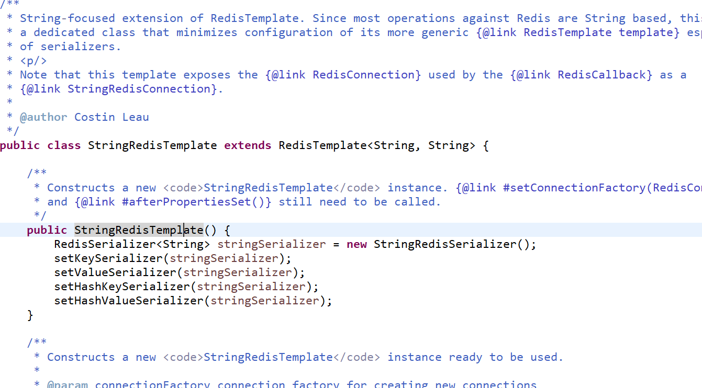

在说到StringRedisTemplate操作Redis数据的时候，我们顺便谈谈StringRedisTemplate和RedisTemplate的区别。

## 一、StringRedisTemplate和RedisTemplate的区别

区别如下:
1.两者关系是StringRedisTemplate继承RedisTemplate。

从StringRedisTemplate源码即可看出，如下图所示:


2.两者的数据是不共通的，也就是说StringRedisTemplate只能管理StringRedisTemplate里面的数据，RedisTemplate只能管理RedisTemplate中的数据。

3.使用的序列化类不同。
使用的序列化哪里不同?如下所示:
(1)RedisTemplate使用的是JdkSerializationRedisSerializer 存入数据会将数据先序列化成字节组然后再存入Redis数据库。
(2)StringRedisTemplate使用的是StringRedisSerializer。

<!--more-->

使用时注意事项:
(1)当你的Redis数据库里面本来存的是字符串数据或者是你要存取的数据就是字符串类型数据的时候，那么你就使用StringRedisTemplate即可;
(2)但是如果你的数据是复杂的对象类型，而取出的时候又不想做任何数据转换，直接从Redis里面取出一个对象，那么使用RedisTemplate是更好的选择;
(3)RedisTemplate中存取数据都是字节数组。当Redis职工存入的数据是可读形式而非字节数组时，使用RedisTemplate取值的时候会无法获取导出数据，获得的值为null。可以使用StringRedisTemplate试试;


## 二、RedisTemplate定义了5种数据结构操作
```
redisTemplate.opsForValue();//操作字符串
redisTemplate.opsForHash();//操作hash
redisTemplate.opsForList();//操作list
redisTemplate.opsForSet();//操作set
redisTemplate.opsForZSet();//操作有序set

```

## 三、StringRedisTemplate常用操作

```
stringRedisTemplate.opsForValue().set("test", "100",60*10,TimeUnit.SECONDS);//向redis里存入数据和设置缓存时间  

stringRedisTemplate.boundValueOps("test").increment(-1);//val做-1操作

stringRedisTemplate.opsForValue().get("test")//根据key获取缓存中的val

stringRedisTemplate.boundValueOps("test").increment(1);//val +1

stringRedisTemplate.getExpire("test")//根据key获取过期时间

stringRedisTemplate.getExpire("test",TimeUnit.SECONDS)//根据key获取过期时间并换算成指定单位 

stringRedisTemplate.delete("test");//根据key删除缓存

stringRedisTemplate.hasKey("546545");//检查key是否存在，返回boolean值 

stringRedisTemplate.opsForSet().add("red_123", "1","2","3");//向指定key中存放set集合

stringRedisTemplate.expire("red_123",1000 , TimeUnit.MILLISECONDS);//设置过期时间

stringRedisTemplate.opsForSet().isMember("red_123", "1")//根据key查看集合中是否存在指定数据

stringRedisTemplate.opsForSet().members("red_123");//根据key获取set集合
```

单测示例:
```
package cn.test;

import static org.junit.Assert.*;
import org.junit.Test;
import org.junit.runner.RunWith;
import org.springframework.beans.factory.annotation.Autowired;
import org.springframework.boot.test.context.SpringBootTest;
import org.springframework.data.redis.core.StringRedisTemplate;
import org.springframework.test.context.junit4.SpringRunner;
import com.blog.springboot.Application;

@RunWith(SpringRunner.class)
@SpringBootTest(classes = Application.class, webEnvironment = SpringBootTest.WebEnvironment.RANDOM_PORT)
public class PracticeJunitTest {
	@Autowired
    private StringRedisTemplate stringRedisTemplate;


	@Test
	public void testConnectionRedis() throws Exception {

		stringRedisTemplate.opsForValue().set("youcong", "ok");

		System.out.println(stringRedisTemplate.opsForValue().get("youcong"));
	}


}

```

参考链接如下:
[StringRedisTemplate操作redis数据](http://www.cnblogs.com/slowcity/p/9002660.html)