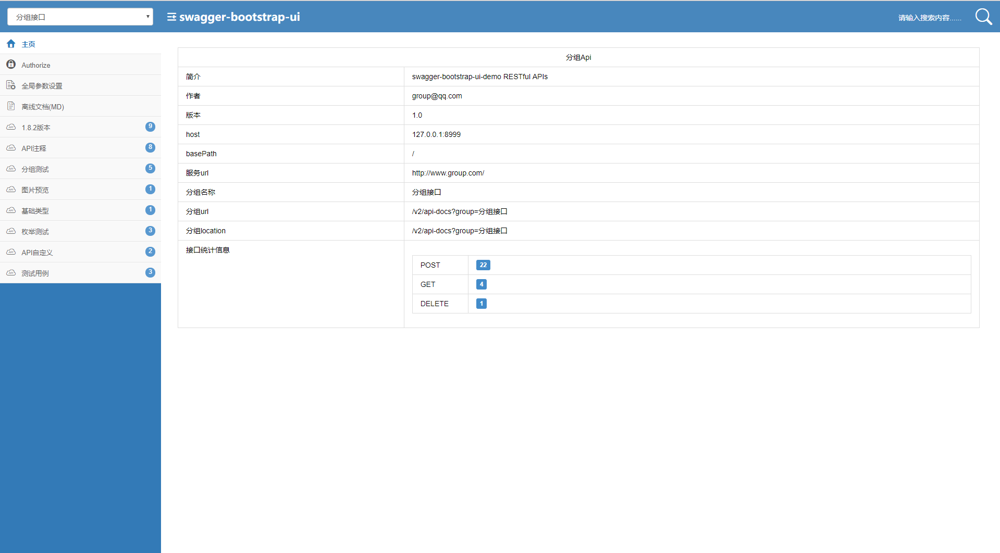

首先我们来看看swagger-bootstrap-ui的效果，如图所示:

看起来是不是比Swagger要大气的多。

 

回到重点上，为什么要给接口文档加密呢？

只对内开放，不对外开放，防止被第三方非公司人员进行非法窃取。

<!--more--> 

那么我们如何给它加Basic校验呢？

首先声明，为什么要给它加Basic而不是oAuth2.0之类的验证？

其实道理很简单，避免重复造轮子，swagger-bootstrap里面集成有的，我们又何必为其多此一举呢。

 

当然了，生产环境下，我们尽可能还是不要将其对外开放好一些，具体，swagger-bootstrap也提供对应的配置，如下所示:

application.properties:
```
swagger.production=true

```
application.yml:
```
swagger:
    production: true


```

以使用SpringBoot为例

参考链接:https://doc.xiaominfo.com/guide/accessControl.html#%E8%AE%BF%E9%97%AE%E9%A1%B5%E9%9D%A2%E5%8A%A0%E6%9D%83%E6%8E%A7%E5%88%B6

只需在application.yml配置如下内容即可:
```
swagger:
    basic:
      enable: true
      username: test
      password: test
```

如果是application.properties:
```
## 开启Swagger的Basic认证功能,默认是false
swagger.basic.enable=true
## Basic认证用户名
swagger.basic.username=test
## Basic认证密码
swagger.basic.password=test

```

效果图，如下:

https://doc.xiaominfo.com/images/ac-pwd.png

更多资料，可以参考官方文档:https://doc.xiaominfo.com/