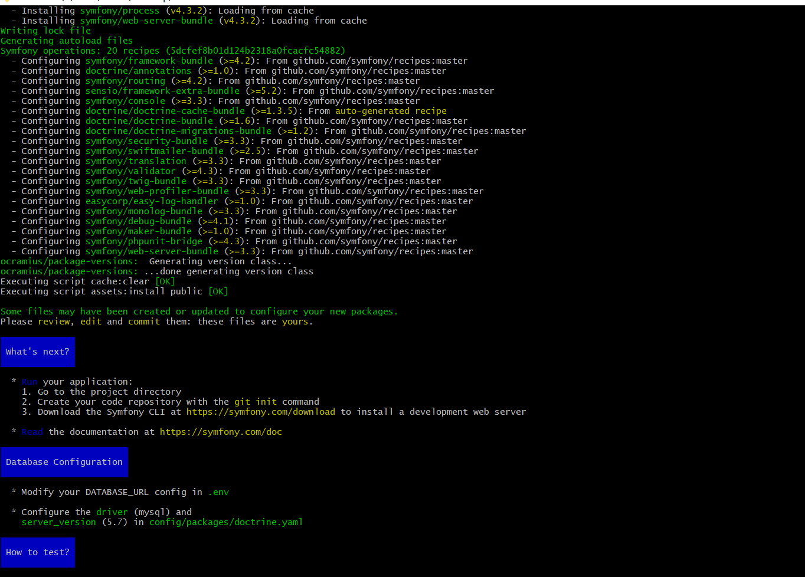
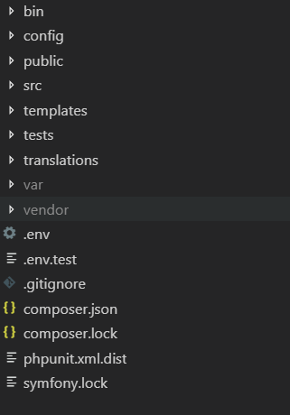
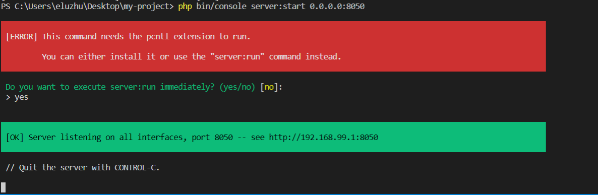
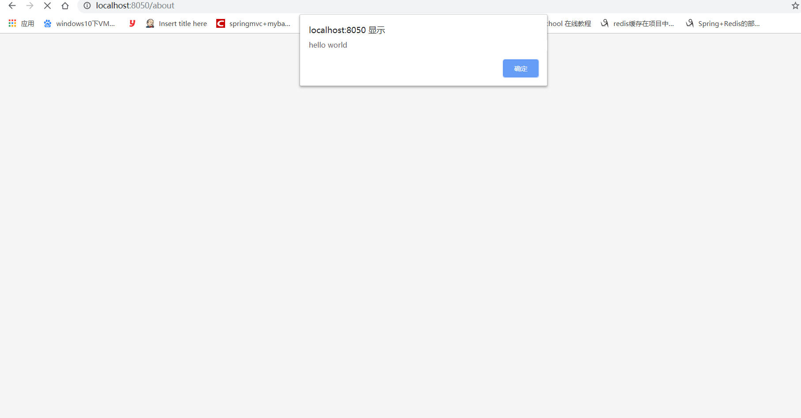

最近因业务需要，主要针对Edusoho进行二次开发。但是对于Symfony，我并不熟悉，我所了解的是，它的那套与我在Java中常用的开发模式MVC，本质上并不多大差异，就是所使用的语言不一样而已。下面开始Symfony从无到有的脚手架搭建。
<!--more-->
本文中需要compoer和php，

关于composer下载和安装(windows)，可参考该链接:
https://getcomposer.org/download/

关于php下载和安装，可参考该链接:
https://www.php.net/


## 安装和设置Symfony框架(请确保网速足够好，需要下载Symfony很多库)

```
 composer create-project symfony/website-skeleton project_name

```
或者是如果你需要构建微服务，可执行该命令:
```
composer create-project symfony/skeleton my-project

```


框架搭建成功,如图:



项目结构，如图:



## 安装Web服务器软件包
```
 composer require --dev symfony/web-server-bundle

```

## 运行Symfony应用程序
```
php bin/console server:start(默认端口为8000)

```
或者也可以指定端口，如下:
```
php bin/console server:start 0.0.0.0:8050

```

效果图(运行正常如下):



## 创建页面路由
通常是在Controller(controller目录)里面创建

CompanyController.java
```
<?php
namespace App\Controller;

use Symfony\Bundle\FrameworkBundle\Controller\AbstractController;
use Symfony\Component\Routing\Annotation\Route;

class CompanyController extends AbstractController
{
/**
     * Matches /about exactly
     *
     * @Route("/about", name="about")
     */
    public function about()
    {
        return $this->render('blog/about.html.twig');
    }
}

```

模板语言(通常放在template目录下):
about.html.twing
```
<h1>About Me</h1>
<script>
alert("hello world");
</script>

```

配置该路由就不需要每次都要重复配置:
编辑该文件 config\routes\annotations.yaml
内容修改为如下:
```
controllers:
    resource: ../../src/Controller/
    type: annotation


```

最后执行如下命令，相当于重新启动
```
php bin/console server:start 0.0.0.0:8050

```

访问:http://localhost:8050/about ， 效果图如下:




本次示例代码，我已经放到我的github，欢迎朋友们git clone或者提相关的issue。

Symfondy示例代码:https://github.com/developers-youcong/SymfonyLearning

关于Symfony学习可参考资料如下:
[Symfony官方文档](https://symfony.com/doc/current/index.html)