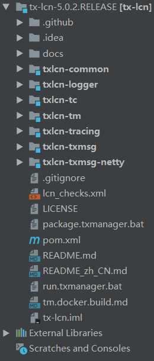
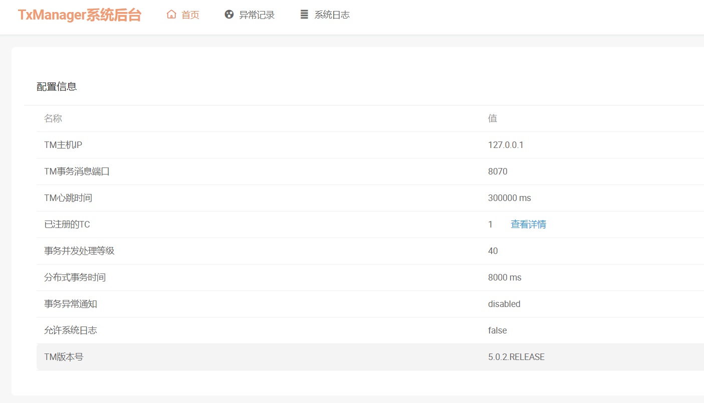

官方文档相关:

GitHub地址:
https://github.com/codingapi/tx-lcn

官方文档:
https://www.codingapi.com/docs/txlcn-preface/

## 一、运行TX-LCN分布式事务框架
<!--more-->
### 1.下载合适版本(这里我用的是5.0.2)

下载地址:
https://github.com/codingapi/tx-lcn/releases/tag/5.0.2.RELEASE


### 2.下载并解压

### 3.导入Idea
导入成功后的项目结构，如图所示:


### 4.配置数据库连接和新建库

数据库脚本(项目中存在，以项目中存在的SQL脚本为主)
```

/*
 Navicat Premium Data Transfer

 Source Server         : local
 Source Server Type    : MySQL
 Source Server Version : 100309
 Source Host           : localhost:3306
 Source Schema         : tx-manager

 Target Server Type    : MySQL
 Target Server Version : 100309
 File Encoding         : 65001

 Date: 29/12/2018 18:35:59
*/
CREATE DATABASE IF NOT EXISTS  `tx-manager` DEFAULT CHARSET utf8 COLLATE utf8_general_ci;
USE `tx-manager`;

SET NAMES utf8mb4;
SET FOREIGN_KEY_CHECKS = 0;

-- ----------------------------
-- Table structure for t_tx_exception
-- ----------------------------
DROP TABLE IF EXISTS `t_tx_exception`;
CREATE TABLE `t_tx_exception`  (
  `id` bigint(20) NOT NULL AUTO_INCREMENT,
  `group_id` varchar(64) CHARACTER SET utf8mb4 COLLATE utf8mb4_general_ci NULL DEFAULT NULL,
  `unit_id` varchar(32) CHARACTER SET utf8mb4 COLLATE utf8mb4_general_ci NULL DEFAULT NULL,
  `mod_id` varchar(128) CHARACTER SET utf8mb4 COLLATE utf8mb4_general_ci NULL DEFAULT NULL,
  `transaction_state` tinyint(4) NULL DEFAULT NULL,
  `registrar` tinyint(4) NULL DEFAULT NULL,
  `ex_state` tinyint(4) NULL DEFAULT NULL COMMENT '0 待处理 1已处理',
  `remark` varchar(10240) NULL DEFAULT NULL COMMENT '备注',
  `create_time` datetime(0) NULL DEFAULT NULL,
  PRIMARY KEY (`id`) USING BTREE
) ENGINE = InnoDB AUTO_INCREMENT = 967 CHARACTER SET = utf8mb4 COLLATE = utf8mb4_general_ci ROW_FORMAT = Dynamic;

SET FOREIGN_KEY_CHECKS = 1;


```
application.properties配置内容如下(一般都有，通常改下库名和用户名、密码即可):
```
spring.datasource.driver-class-name=com.mysql.jdbc.Driver
spring.datasource.url=jdbc:mysql://127.0.0.1:3306/tx-manager?characterEncoding=UTF-8&useSSL=false
spring.datasource.username=root
spring.datasource.password=1234

```


### 5.运行txlcn-tm项目

主要启动主类(TMApplication.java)
运行成功后，访问地址为:
http://IP:7970/admin

效果图，如下:


默认密码是codingapi，支持修改(通常改配置文件即可)，主要修改application.properties，添加如下内容，即可实现自定义:
```
tx-lcn.manager.admin-key=tx-lcn-test

```

登录成功后的效果图如下:



## 二、微服务中使用分布式事务

### 1.添加Maven依赖
```
        <dependency>
            <groupId>com.codingapi.txlcn</groupId>
            <artifactId>txlcn-tc</artifactId>
            <version>5.0.2.RELEASE</version>
        </dependency>
        <dependency>
            <groupId>com.codingapi.txlcn</groupId>
            <artifactId>txlcn-txmsg-netty</artifactId>
            <version>5.0.2.RELEASE</version>
        </dependency>   

```

### 2.application.yml或bootstrap.yml配置如下内容
```
tx-lcn:
  client:
    manager-address: 127.0.0.1:8070
  logger:
    enabled: true
    driver-class-name: com.mysql.cj.jdbc.Driver
    jdbc-url: jdbc:mysql://127.0.0.1:3306/tx-manager?useUnicode=true&characterEncoding=UTF-8&zeroDateTimeBehavior=convertToNull&serverTimezone=Asia/Shanghai&useSSL=false
    username: root
    password: 1234

```

### 3.启动类增加注解
```
@EnableDistributedTransaction

```

### 4.对应的Controller中的方法或者Service方法添加对应的注解
```
@LcnTransaction
@Transactional

```